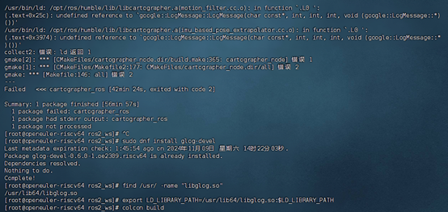

# 问题
```
/usr/bin/ld: /opt/ros/humble/lib/libcartographer.a(ordered_multi_queue.cc.o): in function `.L0 ': (.text+0x8b8): undefined reference to `google::LogMessage::LogMessage(char const*, int, int, int, void (google::LogMessage::*)())' /usr/bin/ld: (.text+0x22b0): undefined reference to `google::LogMessage::LogMessage(char const*, int, int, int, void (google::LogMessage::*)())' /usr/bin/ld: /opt/ros/humble/lib/libcartographer.a(motion_filter.cc.o): in function `.L0 ': (.text+0x25c): undefined reference to `google::LogMessage::LogMessage(char const*, int, int, int, void (google::LogMessage::*)())' /usr/bin/ld: /opt/ros/humble/lib/libcartographer.a(imu_based_pose_extrapolator.cc.o): in function `.L0 ': (.text+0x3974): undefined reference to `google::LogMessage::LogMessage(char const*, int, int, int, void (google::LogMessage::*)())' collect2: 错误：ld 返回 1 gmake[2]: *** [CMakeFiles/cartographer_node.dir/build.make:365：cartographer_node] 错误 1 +gmake[1]: *** [CMakeFiles/Makefile2:177：CMakeFiles/cartographer_node.dir/all] 错误 2 gmake: *** [Makefile:146：all] 错误 2 --- Failed <<< cartographer_ros [42min 24s, exited with code 2]
```

# 解决

```
错误提示表明链接器（ld）在编译过程中找不到 google::LogMessage 的定义。这通常是因为缺少了 Google glog 库的链接。glog 是 Google 的一个日志库，Cartographer 依赖于它来进行日志记录。
```



# 问题2

```
during RTL pass: no-opt dfinit
In file included from /opt/ros/humble/include/rclcpp/rclcpp/client.hpp:28,
                 from /opt/ros/humble/include/rclcpp/rclcpp/callback_group.hpp:24,
                 from /opt/ros/humble/include/rclcpp/rclcpp/any_executable.hpp:20,
                 from /opt/ros/humble/include/rclcpp/rclcpp/memory_strategy.hpp:25,
                 from /opt/ros/humble/include/rclcpp/rclcpp/memory_strategies.hpp:18,
                 from /opt/ros/humble/include/rclcpp/rclcpp/executor_options.hpp:20,
                 from /opt/ros/humble/include/rclcpp/rclcpp/executor.hpp:37,
                 from /opt/ros/humble/include/rclcpp/rclcpp/executors/multi_threaded_executor.hpp:25,
                 from /opt/ros/humble/include/rclcpp/rclcpp/executors.hpp:21,
                 from /opt/ros/humble/include/rclcpp/rclcpp/rclcpp.hpp:155,
                 from /root/ros2_ws/src/cartographer_ros/ros-humble-cartographer-ros-2.0.9000/include/cartographer_ros/time_conversion.h:22,
                 from /root/ros2_ws/src/cartographer_ros/ros-humble-cartographer-ros-2.0.9000/include/cartographer_ros/tf_bridge.h:23,
                 from /root/ros2_ws/src/cartographer_ros/ros-humble-cartographer-ros-2.0.9000/include/cartographer_ros/sensor_bridge.h:28,
                 from /root/ros2_ws/src/cartographer_ros/ros-humble-cartographer-ros-2.0.9000/include/cartographer_ros/map_builder_bridge.h:31,
                 from /root/ros2_ws/src/cartographer_ros/ros-humble-cartographer-ros-2.0.9000/include/cartographer_ros/node.h:31,
                 from /root/ros2_ws/src/cartographer_ros/ros-humble-cartographer-ros-2.0.9000/src/node.cpp:17:
/usr/include/c++/12/variant: 在构造函数‘constexpr std::__detail::__variant::_Variadic_union<_First, _Rest ...>::_Variadic_union(std::in_place_index_t<_Np>, _Args&& ...) [with long unsigned int _Np = 4; _Args = {const std::function<void(const std::shared_ptr<const rclcpp::SerializedMessage>&)>&}; _First = std::function<void(std::shared_ptr<const rclcpp::SerializedMessage>)>;
```

# 原因

```
编译出错
```

