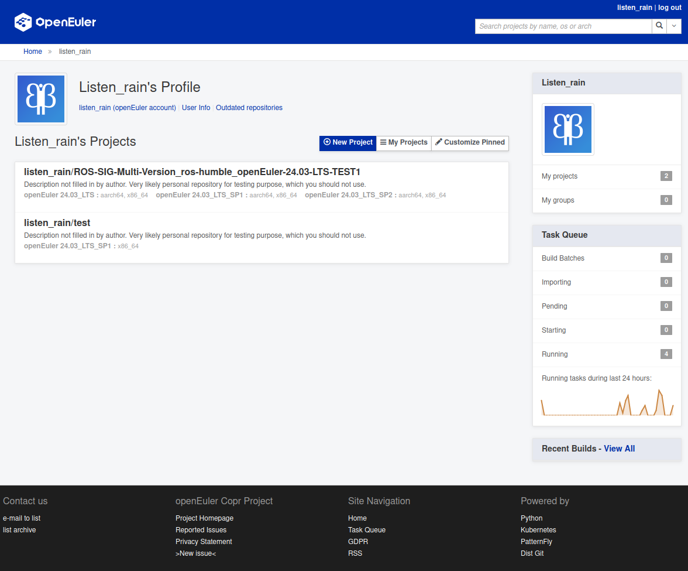
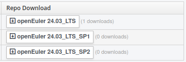
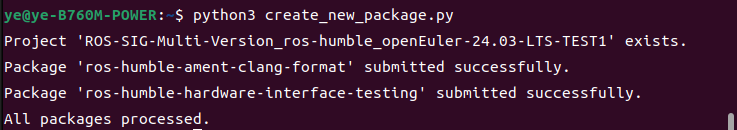
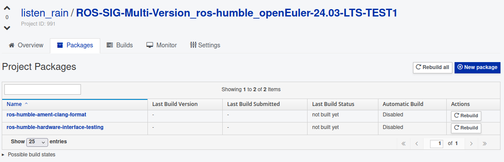
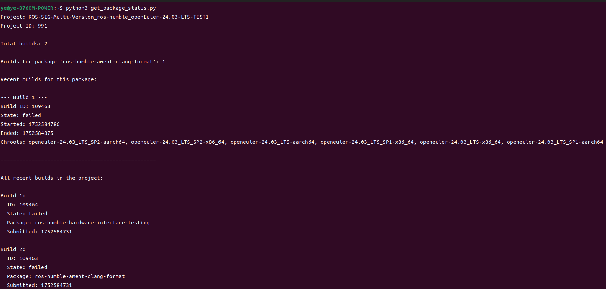

# openEuler ROS SIG 使用 EUR 工具提交新包全流程指南

## 1. 前言

本指南旨在为 openEuler ROS SIG 的实习生提供一个使用 EUR (openEuler User Repository) 工具进行 ROS Humble 新包适配、构建、测试和提交的完整流程。通过本指南，实习生可以系统地学习 EUR 的使用方法，并将其应用于实际的 ROS Humble 包引入工作中。

## 2. EUR (openEuler User Repository) 简介

EUR (openEuler User Repository) 是由 openEuler 社区 Infrastructure SIG 开发和维护的开发者、用户软件仓库。它提供了端到端的 openEuler 软件包适配、验证和分发功能。相较于社区 ISO、EPOL 等软件仓库，EUR 具有更灵活、易用的优势，对提高开发效率有显著帮助。

**主要优势包括：**

* **快速获取和验证：** 软件包构建完成后，即可通过 DNF 命令一键获取个人在 EUR 上适配、构建的软件包，进行全面的验证和进一步开发使用。这对于推动上游社区对 openEuler 的支持至关重要，能够快速证明 openEuler 对其开发分支的支持能力，并展示验证成果。
* **支持历史版本构建：** EUR 支持 openEuler 所有历史版本的构建，这对于存量用户引入新软件包或不同版本软件包，同时避免影响老版本中的其他软件非常有价值。
* **便捷提交社区仓库：** EUR 提供将软件包一键提交到 openEuler 社区其他仓库的功能，提高了社区引入新包的效率和质量。

**基本概念：**

* **用户：** 系统的主要使用者和所有操作的发起者。
* **项目：** 每个用户可创建多个项目，用于组织一个或多个软件包。每个项目可以针对这组软件包生成针对不同 openEuler 版本的软件包仓库。
* **软件包：** 代表一个源码包。
* **构建：** RPM 包的一次构建上下文，包括 SRPM 包和其构建生成的一些 RPM 包。
* **仓库：** 针对特定 openEuler 版本构建的软件包仓库。

## 3. EUR 使用流程

使用 EUR 无需任何门槛，只需注册一个 openEuler 账号即可。

* openEuler 账号中心：[https://id.openeuler.org/register](https://id.openeuler.org/register)
* 用户软件仓首页：[https://eur.openeuler.openatom.cn/](https://eur.openeuler.openatom.cn/)

### 3.1. Step 1: 创建自己的仓库项目

1. 登录 EUR 用户软件仓首页。

2. 点击 **"New Project"** 按钮，创建一个新项目。

   

3. 填写项目信息：

   * **项目名称：** 一旦创建后无法修改。
   * **项目描述、指南、主页、联系人：** 可选配置，创建后支持修改。
   * **Chroots：** 必须配置，选择所需的软件包构建环境（openEuler 版本和架构）。创建后支持修改，可选择众多 openEuler 版本及架构进行构建。
   * **External Repositories：** 可选配置，如果构建过程中依赖其他软件仓库，可以在此处填写。

   对于 ROS Humble 包，可以添加 openEuler 24.03 ROS Humble 源：

   ```
   https://eulermaker.compass-ci.openeuler.openatom.cn/api/ems2/repositories/openEuler_24.03_LTS_Epol_Multi-Version_ROS_humble/$basearch
   ```

   或者添加个人名下维护的 ROS Humble 源（更新可能更快）：

   ```
   https://eulermaker.compass-ci.openeuler.openatom.cn/api/ems1/repositories/ROS-SIG-Multi-Version_ros-humble_openEuler-24.03-LTS-TEST4/openEuler%3A24.03-LTS/$basearch
   ```

   例如，已经创建好的 `ROS-SIG-Multi-Version_ros-humble_openEuler-24.03-LTS-TEST1`。

   

4. 项目创建后，在 "Repo Download" 处即可下载对应版本的仓库配置文件。  

   

### 3.2. Step 2: 使用 Copr 进行批量创建 Package

本节将介绍如何使用 Copr 工具批量创建和管理软件包。Copr 是一个 RPM 仓库管理系统，EUR 借鉴了其部分功能和理念。

#### 3.2.1. 在 Ubuntu 上安装 Copr 命令行工具

```bash
pip3 install copr -i https://pypi.tuna.tsinghua.edu.cn/simple/
pip3 install copr-cli -i https://pypi.tuna.tsinghua.edu.cn/simple/
```

#### 3.2.2. 确认本机的 Token

访问 [https://eur.openeuler.openatom.cn/api/](https://eur.openeuler.openatom.cn/api/) 获取您的 API Token。此 Token 将用于 Copr 命令行工具的认证。

#### 3.2.3. 同一个 Gitee 仓库多包构建的方法

与 Eulermark 不同，EUR 的最小单位是 Package，一个 Package 对应一个构建任务。这意味着如果一个 Gitee 仓库包含多个软件包 (例如，`ament_lint` 仓库包含 `ament-clang-format.spec` 和 `ament-clang-tidy.spec` 等)，则需要为每个 `spec` 文件单独创建 Package 并指定其名称。

编写 Python 脚本来批量创建新包，例如 `create_new_package.py`：

* **准备 `copr-cli` 配置文件：**
  在 `~/.config/copr` 目录下创建 `config` 文件，内容如下：

  ```
  [copr-cli]
  # Replace with your EUR API URL
  copr_url = https://eur.openeuler.openatom.cn/api/
  # Replace with your API token obtained from https://eur.openeuler.openatom.cn/api/
  username = your_openeuler_username
  token = your_api_token
  ```

  请将 `your_openeuler_username` 替换为您的 openEuler 用户名，将 `your_api_token` 替换为实际获取的 API Token。

* **示例 `create_new_package.py` 脚本：**

  ```python
  from copr.v3 import Client, CoprNoResultException

  # 创建客户端，从配置文件读取 (~/.config/copr)
  client = Client.create_from_config_file()

  # 定义您的用户名和项目名称
  ownername = "listen_rain"  # 替换为您的实际用户名
  project_name = "ROS-SIG-Multi-Version_ros-humble_openEuler-24.03-LTS-TEST1"  # 示例项目名称，根据需要修改

  # 定义多个包的列表，每个包是一个字典
  packages = [
      {
          "name": "ros-humble-ament-clang-format",
          "source_type": "scm",
          "source_dict": {
              "clone_url": "https://gitee.com/davidhan008/ament_lint.git",
              "commitish": "humble",
              "subdirectory": "",
              "spec": "ament-clang-format.spec",
              "scm_type": "git"
          }
      },
      # 添加更多包，例如第二个包
      {
          "name": "another-package",
          "source_type": "scm",
          "source_dict": {
              "clone_url": "https://gitee.com/yourrepo/another_package.git",
              "commitish": "",
              "subdirectory": "",
              "spec": "another-package.spec",
              "scm_type": "git"
          }
      },
      # 可以继续添加更多包...
  ]

  # 检查项目是否存在，如果不存在则创建
  try:
      project = client.project_proxy.get(ownername=ownername, projectname=project_name)
      print(f"Project '{project_name}' exists.")
  except CoprNoResultException:
      print(f"Creating project '{project_name}'...")
      # 指定 chroots，根据 openEuler EUR 支持的构建目标修改
      # 示例 chroot：假设为 openEuler 24.03 LTS SP1 x86_64
      client.project_proxy.add(
          name=project_name,
          chroots=["openeuler-24.03-lts-sp1-x86_64"],  # 确认实际 chroot 名称，可在 web 界面查看
          description="Multi-package build test for ROS humble on openEuler",
          instructions="Build multiple ROS packages."
      )
      print(f"Project '{project_name}' created successfully.")

  # 循环添加每个包
  for package in packages:
      try:
          client.package_proxy.add(
              ownername=ownername,
              projectname=project_name,
              packagename=package["name"],
              source_type=package["source_type"],
              source_dict=package["source_dict"]  
          )
          print(f"Package '{package['name']}' submitted successfully.")
      except Exception as e:  # 捕获一般异常，包括已存在等
          print(f"Error submitting package '{package['name']}': {e}")

  print("All packages processed.")
  ```

  运行脚本：

  ```bash
  python3 create_new_package.py
  ```

  

  

  **注意：** 您在实际操作时需要根据您的 Gitee 仓库结构和 EUR 的具体要求调整 `scm-type`、`--spec` 参数以及 `--vcs-branch`。文档中提到 "不同于eulermark， eur的方式只最小单位是package，一个package对应一个构建任务"，并且展示了在同一个 Gitee 仓库中指定 `spec` 文件名称的截图，这表明 EUR 的构建系统支持在 SCM 模式下通过某种方式指定 `spec` 文件。如果上述 `copr-cli` 命令中的 `--spec` 参数无法直接工作，可能需要查阅最新的 EUR 文档或社区支持获取针对子目录 `spec` 文件的 SCM 构建方法，或者考虑为每个 ROS 包创建独立的 Gitee 仓库以简化构建流程。

#### 3.2.4. 包的 Build 构建

在 EUR 网页界面中，您可以手动触发构建：

* 点击 **"Rebuild all"** 按钮，可以构建所有包。
* 点击单个包旁边的 **"Rebuild"** 按钮，可以构建单个包。


#### 3.2.5. 获取包 Build 状态

编写 Python 脚本来获取当前包的编译状态，例如 `get_package_status.py`：

* **示例 `get_package_status.py` 脚本：**

  ```python
  from copr.v3 import Client, CoprNoResultException

  # 创建客户端
  client = Client.create_from_config_file()

  # 配置
  ownername = "listen_rain"
  project_name = "ROS-SIG-Multi-Version_ros-humble_openEuler-24.03-LTS-TEST1"
  package_name = "ros-humble-ament-clang-format"

  try:
      # 获取项目信息
      project = client.project_proxy.get(ownername=ownername, projectname=project_name)
      print(f"Project: {project_name}")
      print(f"Project ID: {project.id}")
      
      # 获取该项目的所有构建
      builds = client.build_proxy.get_list(ownername=ownername, projectname=project_name)
      
      print(f"\nTotal builds: {len(builds)}")
      
      # 过滤特定包的构建
      package_builds = []
      for build in builds:
          if hasattr(build, 'source_package') and build.source_package:
              if package_name in build.source_package.get('name', ''):
                  package_builds.append(build)
      
      print(f"\nBuilds for package '{package_name}': {len(package_builds)}")
      
      # 显示最近的构建状态
      if package_builds:
          print("\nRecent builds for this package:")
          for i, build in enumerate(package_builds[:5]):  # 显示最近5个构建
              print(f"\n--- Build {i+1} ---")
              print(f"Build ID: {build.id}")
              print(f"State: {build.state}")
              print(f"Started: {build.started_on}")
              print(f"Ended: {build.ended_on}")
              if hasattr(build, 'chroots'):
                  print(f"Chroots: {', '.join(build.chroots)}")
      else:
          print(f"\nNo builds found for package '{package_name}'")
      
      # 显示所有最近的构建（不限于特定包）
      print("\n" + "="*50)
      print("\nAll recent builds in the project:")
      for i, build in enumerate(builds[:10]):  # 显示最近10个构建
          print(f"\nBuild {i+1}:")
          print(f"  ID: {build.id}")
          print(f"  State: {build.state}")
          if hasattr(build, 'source_package') and build.source_package:
              print(f"  Package: {build.source_package.get('name', 'Unknown')}")
          print(f"  Submitted: {build.submitted_on}")
          
  except CoprNoResultException:
      print(f"Project '{project_name}' not found for owner '{ownername}'")
  except Exception as e:
      print(f"Error: {e}")
  ```

  运行脚本：

  ```bash
  python3 get_package_status.py
  ```

  

#### 3.2.6. 编译 Log 的查看

当构建失败时，您可以查看编译日志来诊断问题。在 EUR 网页界面中，点击构建任务即可查看详细日志。例如，日志可能会显示 "未找到宏定义" 这样的错误信息。

#### 3.2.7. 包的下载和安装

软件包构建成功后，可以通过 DNF 命令非常便捷地使用：

1. 在 EUR 项目页面，找到 **"Repo Download"** 处下载对应的仓库配置文件（通常是 `.repo` 文件）。
2. 使用 `curl -OL <上面复制得到的url>` 直接下载仓库配置。
3. 将下载的 `.repo` 文件放到 `/etc/yum.repos.d/` 目录下。
4. 执行 `dnf update` 更新软件包列表。
5. 使用 `dnf install <对应的包名>` 安装对应仓库中的软件包。

EUR 中每个项目都有独立的 GPG 密钥对 RPM 包进行签名，确保软件包的完整性和来源可信。

### 3.3. 扩展学习使用更多 Copr 接口

为了更高效地管理软件包，建议深入学习 Copr 命令行工具的更多接口，例如批量删除包、重新构建包等功能。

* Copr 官方文档：[https://python-copr.readthedocs.io/en/latest/index.html](https://python-copr.readthedocs.io/en/latest/index.html)
* Copr ClientV3 文档：[https://python-copr.readthedocs.io/en/latest/ClientV3.html](https://python-copr.readthedocs.io/en/latest/ClientV3.html)

## 4. Copr CLI 教学：常用命令及使用方法

### 项目管理

#### 创建项目
- **语法**：`copr-cli create [--chroot CHROOTS] [--repo REPOS] [--initial-pkgs PKGS] [--description DESCRIPTION] [--instructions INSTRUCTIONS] [--disable_createrepo {true,false}] [--enable-net {on,off}] [--unlisted-on-hp {on,off}] [--persistent] [--auto-prune {on,off}] [--isolation {default,nspawn,simple}] name`
- **关键选项**：`--chroot` 指定构建环境（至少一个）；`--description` 项目描述；`--enable-net` 启用/禁用网络。
- **示例**：`copr-cli create --chroot fedora-40-x86_64 --description "测试项目" myproject`

#### 列出项目
- **语法**：`copr-cli list [username|@groupname]`
- **描述**：列出用户或组的项目（未指定则列出自己的）。
- **关键选项**：无。
- **示例**：`copr-cli list msuchy`

#### 修改项目
- **语法**：`copr-cli modify [--repo REPOS] [--chroot CHROOTS] [--description DESCRIPTION] [--instructions INSTRUCTIONS] [--disable_createrepo {true,false}] [--enable-net {on,off}] [--unlisted-on-hp {on,off}] [--auto-prune {on,off}] [--isolation {default,nspawn,simple}] name`
- **描述**：修改项目属性。
- **关键选项**：`--chroot` 指定构建环境；`--description` 项目描述；`--enable-net` 启用/禁用网络。
- **示例**：`copr-cli modify --description "更新描述" myproject`

#### 删除项目
- **语法**：`copr-cli delete name`
- **描述**：删除整个项目。
- **关键选项**：无。
- **示例**：`copr-cli delete myproject`

### 包管理

#### 列出包
- **语法**：`copr-cli list-packages [--with-latest-build] [--with-latest-succeeded-build] [--with-all-builds] [--output-format {json,text,text-row}] project`
- **描述**：列出项目中的包（默认json格式）。
- **关键选项**：`--with-latest-build` 显示最新构建数据；`--output-format` 输出格式。
- **示例**：`copr-cli list-packages --output-format json myproject`

#### 添加包
- **语法**：`copr-cli add-package-<type> [类型特定选项] --name PKGNAME project`（类型如pypi、scm等）。
- **描述**：添加新包（支持PyPI、SCM等源）。
- **关键选项**：`--packagename` PyPI包名；`--clone-url` SCM仓库URL；`--webhook-rebuild` 启用webhook重构建。
- **示例**：`copr-cli add-package-pypi --packagename mypkg --name mypkg --webhook-rebuild on myproject`

#### 删除包
- **语法**：`copr-cli delete-package --name PKGNAME project`
- **描述**：删除包及其构建。
- **关键选项**：`--name` 包名。
- **示例**：`copr-cli delete-package --name mypkg myproject`

### 构建管理

#### 构建包
- **语法**：`copr-cli build [-r CHROOTS] [--exclude-chroot CHROOTS] [--memory MEMORY] [--timeout TIMEOUT] [--nowait] [--background] [--isolation {default,nspawn,simple}] [--enable-net {on,off}] project PKG [PKG ...]`
- **描述**：为项目构建包。
- **关键选项**：`-r` 指定chroot；`--timeout` 超时时间；`--nowait` 不等待完成。
- **示例**：`copr-cli build -r fedora-40-x86_64 myproject some.src.rpm`

#### 重构建包
- **语法**：`copr-cli build-package --name PKGNAME [--nowait] project`
- **描述**：从包源定义创建新构建。
- **关键选项**：`--name` 包名；`--nowait` 不等待。
- **示例**：`copr-cli build-package --name mypkg myproject`

#### 取消构建
- **语法**：`copr-cli cancel id`
- **描述**：取消指定ID的构建。
- **关键选项**：无。
- **示例**：`copr-cli cancel 123456`

#### 监视构建
- **语法**：`copr-cli watch-build id [id ...]`
- **描述**：监视一个或多个构建ID的状态。
- **关键选项**：无。
- **示例**：`copr-cli watch-build 123456`

#### 获取构建状态
- **语法**：`copr-cli status id`
- **描述**：检查构建ID的状态。
- **关键选项**：无。
- **示例**：`copr-cli status 123456`

## 5. 总结

通过本指南，实习生应能够熟练掌握 openEuler EUR 工具的使用，并将其应用于 ROS Humble 新包的引入流程。规范的测试文档是每次引入工作的关键产出，它不仅记录了工作过程和结果，也为后续的维护和社区贡献提供了重要依据。在整个过程中，积极利用社区资源（如 openEuler 论坛、ROS SIG 交流群等）寻求帮助和交流经验，将有助于更高效地完成任务。