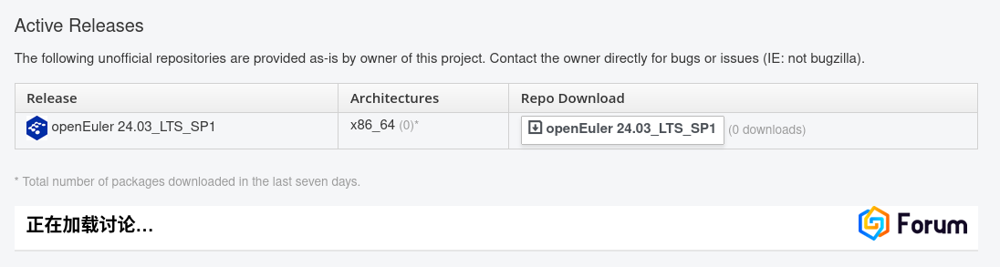
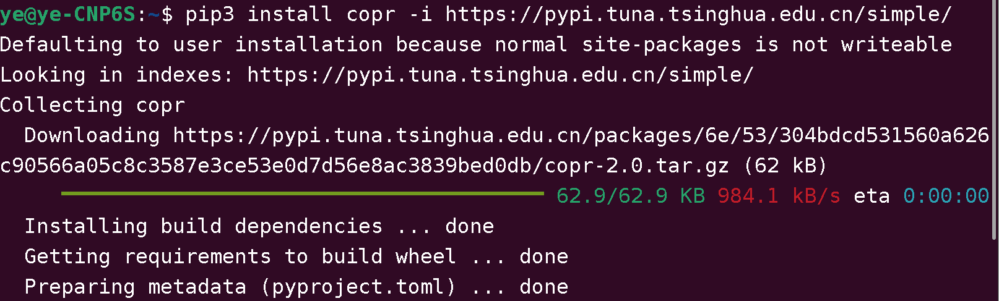
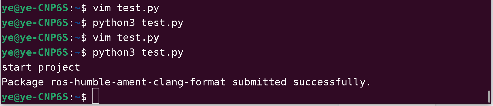
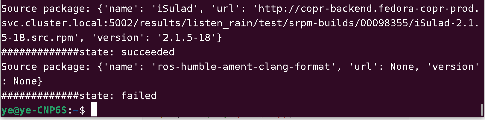
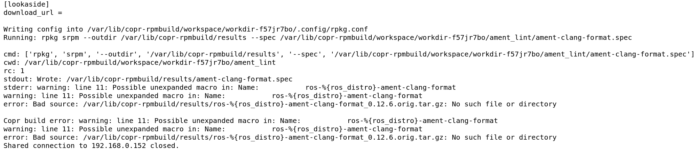

### step1 创建自己的仓库

		创建成功截图

### step2 使用copr进行批量创建package

在ubuntu上安装copr

建议使用源码安装，因为这个copr更新为v3版本了

从源代码安装
    克隆 python-copr 的 Git 仓库：
    `git clone https://github.com/fedora-copr/copr.git`
    进入 copr/python 目录：
    `cd copr/python`
    安装依赖项：
    `pip install -r requirements.txt`
    安装 python-copr：
    `sudo python setup.py install`
    
确认自己本机的token
在连接https://eur.openeuler.openatom.cn/api/处获取自己的令牌，然后在~/.config/处创建copr文件，把令牌内容写入。为后续python脚本登录使用的

包的build构建
书写python脚本，见同目录tets.py文件。脚本运行效果如下。

获取包build的状态
书写python脚本，见同目录status.py文件。脚本运行效果如下。

编译的log的查看

警告指出，在 Name 字段（ros-%{ros_distro}-ament-clang-format）中可能存在未展开的宏。%{ros_distro} 是一个宏，它通常代表 ROS 的版本（例如 humble、foxy 等）。Copr 构建系统在解析这个宏时没有正确扩展，导致构建失败。
解决方法在 .spec 文件中加入如下定义：
`%define ros_distro humble`

