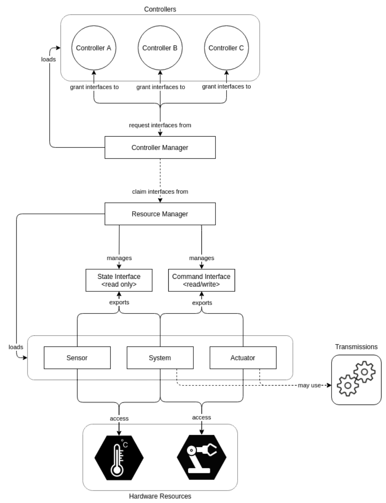
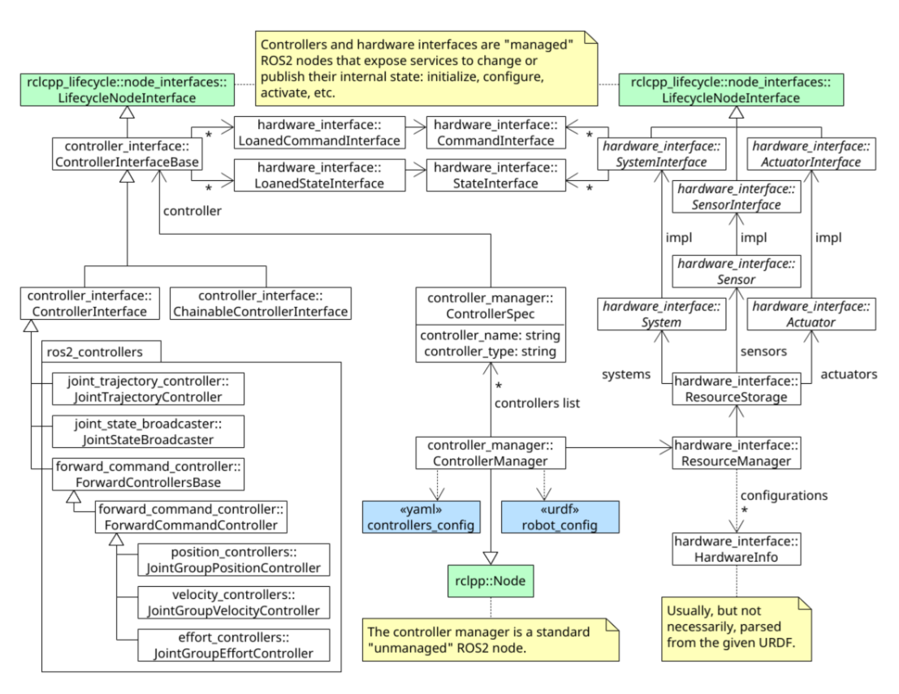
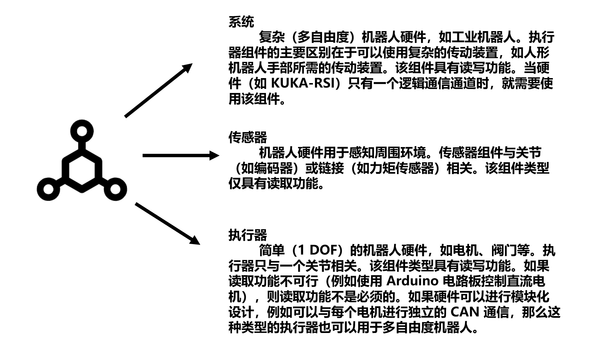

# ROS2_Control

## 资源库结构

ros2_control 框架由以下 Github 仓库组成：  
&nbsp;&nbsp;&nbsp;&nbsp;&nbsp;&nbsp;&nbsp;&nbsp;&nbsp;ros2_control - 框架的主要接口和组件；  
&nbsp;&nbsp;&nbsp;&nbsp;&nbsp;&nbsp;&nbsp;&nbsp;&nbsp;ros2_controllers - 广泛使用的控制器，如正向指令控制器、联合轨迹控制器、差分驱动控制器；  
&nbsp;&nbsp;&nbsp;&nbsp;&nbsp;&nbsp;&nbsp;&nbsp;&nbsp;control_toolbox - 控制器使用的一些广泛使用的控制理论实现（如 PID）；  
&nbsp;&nbsp;&nbsp;&nbsp;&nbsp;&nbsp;&nbsp;&nbsp;&nbsp;realtime_tools - 实时支持的通用工具包，如实时缓冲器和发布器 ：  
&nbsp;&nbsp;&nbsp;&nbsp;&nbsp;&nbsp;&nbsp;&nbsp;&nbsp;control_msgs - 常用消息；  
&nbsp;&nbsp;&nbsp;&nbsp;&nbsp;&nbsp;&nbsp;&nbsp;&nbsp;kinematics_interface - 用于使用 C++ 运动学框架；  
  
此外，还有以下（软件包与启动和项目管理有关：  
&nbsp;&nbsp;&nbsp;&nbsp;&nbsp;&nbsp;&nbsp;&nbsp;&nbsp;ros2_control_demos - 常见用例的示例实现，以便顺利启动；  
&nbsp;&nbsp;&nbsp;&nbsp;&nbsp;&nbsp;&nbsp;&nbsp;&nbsp;roadmap - 项目规划和设计文档。 

其官方github库链接为:  
`https://github.com/ros-controls/ros2_control`  
其官方文档链接为：  
`https://control.ros.org/master/doc/ros2_control/doc/index.html#`


## 安装方案
humble版本支持二进制安装，半二进制安装，源码安装三种种方式

### 二进制安装 / 半二进制安装

ros2_control 框架是为 ROS 2 滚动而发布的。要使用它，必须安装 ros-rolling-ros2-control 和ros-rolling-ros2-controllers 软件包。

### 源码安装  
滚动分支与 Humble 发行版兼容。你可以在本页面的 Humble 和 Iron 版本中找到更多关于兼容性的信息。如果你想从源代码安装框架，请使用以下命令：  
下载所有软件源：  
```
mkdir -p ~/ros2_ws/src  
cd ~/ros2_ws/  
wget https://raw.githubusercontent.com/ros-controls/ros2_control_ci/master/ros_controls.humble.repos  
vcs import src < ros_controls.humble.repos  
```

安装依赖项：  
```
rosdep update --rosdistro=humble
sudo apt-get update
rosdep install --from-paths src --ignore-src -r -y
```  
构建，例如:
```
. /opt/ros/humble/setup.sh
colcon build --symlink-install
```
最后：
```
source /opt/ros/humble/setup.bash
```

## ROS2_Control 架构
ros2_control框架的源代码可在 ros2_control和ros2_controllers GitHub 存储库中找到。下图显示了ros2_control 框架的架构。
  

 下面的 UML 类图描述了 ros2_control 框架的内部实现。

 

 ### 控制器管理器

 控制器管理器（CM）连接着 ros2_control 框架的控制器和硬件抽象。它也是用户通过 ROS 服务的入口点。CM 实现了一个没有执行器的节点，因此可以集成到自定义设置中。不过，通常使用controller_manager 软件包中 ros2_control_node 文件实现的默认节点设置。
 一方面，CM 管理（加载、激活、停用、卸载）控制器及其所需的接口。另一方面，它可以（通过资源管理器）访问硬件组件的接口。控制器管理器会匹配所需的接口和提供接口，在启用时允许控制器访问硬件，如果存在访问冲突，则会报错。
控制环的执行由 CM 的 update() 方法管理。它从硬件组件读取数据，更新所有激活控制器的输出，并将结果写入组件。

### 资源管理器

资源管理器（RM）为 ros2_control 框架抽象了物理硬件及其驱动程序（称为硬件组件）。RM 使用 pluginlib 库加载组件，管理其生命周期、组件状态和命令接口。RM 提供的抽象功能允许重用已实施的硬件组件，如机器人和抓手，而无需任何实施，并可灵活应用硬件来实现状态和命令接口，如用于电机控制和编码器读取的独立硬件/通信库。
在控制循环执行中，RM 的 read() 和 write() 方法处理与硬件组件的通信。

### 控制器

ros2_control 框架中的控制器基于控制理论。它们将参考值与测量输出进行比较，并根据这一误差计算系统的输入。控制器是从 ControllerInterface（ros2_control 中的 controller_interface 包）派生出来的对象，并使用 pluginlib-library 作为插件导出。有关控制器的示例，还需查看 ros2_controllers 软件库中的 ForwardCommandController 实现。控制器的生命周期基于 LifecycleNode 类，该类实现了节点生命周期设计文档中描述的状态机。

执行控制循环时，会调用 update() 方法。该方法可访问最新的硬件状态，并使控制器能够写入硬件命令接口。

### 用户接口

用户使用控制器管理器的服务与 ros2_control 框架交互。controller_manager_msgs 软件包中的 srv 文件夹，有有关服务及其定义的列表。  
虽然服务调用可以直接从命令行或通过节点使用，但还有一个与 ros2 cli 集成的用户友好型命令行界面（CLI）。它支持自动完成，并提供一系列常用命令。基本命令是 ros2 control。有关 CLI 功能的说明，命令行界面 (CLI) 文档中有详细说明（待补充）。

## 硬件组件

硬件组件实现了与物理硬件的通信，并在 ros2_control 框架中代表了物理硬件的抽象。这些组件必须使用 pluginlib-library 作为插件导出。资源管理器动态加载这些插件并管理其生命周期。



有关硬件组件的详细说明，还需参考 "通过控制器进行硬件访问 "设计文档进行补充。

### URDF 中的硬件描述

ros2_control框架使用机器人URDF文件中的<ros2_control>标记来描述其组件，即硬件设置。所选结构可将多个 xacro 宏合并为一个宏，而无需进行任何更改。下面的示例展示了一个具有 2-DOF 的位置控制机器人（RRBot）、一个外部 1-DOF 力矩传感器和一个外部控制的 1-DOF 平行抓手作为其末端执行器。更多示例和详细说明， ros2_control_demos 网站和 ROS 2 Control Components URDF Examples 设计文档会有更详细的说明。
```
<ros2_control name="RRBotSystemPositionOnly" type="system">
 <hardware>
   <plugin>ros2_control_demo_hardware/RRBotSystemPositionOnlyHardware</plugin>
   <param name="example_param_write_for_sec">2</param>
   <param name="example_param_read_for_sec">2</param>
 </hardware>
 <joint name="joint1">
   <command_interface name="position">
     <param name="min">-1</param>
     <param name="max">1</param>
   </command_interface>
   <state_interface name="position"/>
 </joint>
 <joint name="joint2">
   <command_interface name="position">
     <param name="min">-1</param>
     <param name="max">1</param>
   </command_interface>
   <state_interface name="position"/>
 </joint>
</ros2_control>
<ros2_control name="RRBotForceTorqueSensor1D" type="sensor">
 <hardware>
   <plugin>ros2_control_demo_hardware/ForceTorqueSensor1DHardware</plugin>
   <param name="example_param_read_for_sec">0.43</param>
 </hardware>
 <sensor name="tcp_fts_sensor">
   <state_interface name="force"/>
   <param name="frame_id">rrbot_tcp</param>
   <param name="min_force">-100</param>
   <param name="max_force">100</param>
 </sensor>
</ros2_control>
<ros2_control name="RRBotGripper" type="actuator">
 <hardware>
   <plugin>ros2_control_demo_hardware/PositionActuatorHardware</plugin>
   <param name="example_param_write_for_sec">1.23</param>
   <param name="example_param_read_for_sec">3</param>
 </hardware>
 <joint name="gripper_joint ">
   <command_interface name="position">
     <param name="min">0</param>
     <param name="max">50</param>
   </command_interface>
   <state_interface name="position"/>
   <state_interface name="velocity"/>
 </joint>
</ros2_control>
```

### 运行框架

要运行 ros2_control 框架，请执行以下操作。示例文件可在 ros2_control_demos 资源库中找到。
创建一个 YAML 文件，其中包含控制器管理器和两个控制器的配置。(RRBot 的配置示例）
用所需的 <ros2_control> 标记扩展机器人的 URDF 描述。建议使用宏文件 (xacro) 代替纯 URDF。(RRBot URDF 示例）
创建一个启动文件，以便使用控制器管理器启动节点。您可以使用默认的 ros2_control 节点（推荐），也可以在软件栈中集成控制器管理器。(RRBot 的启动文件示例）。