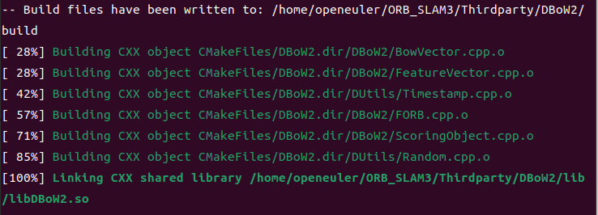
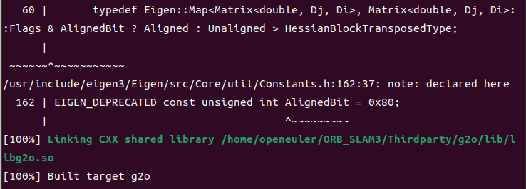
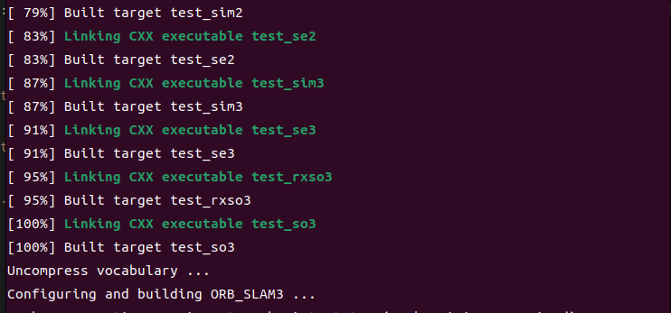
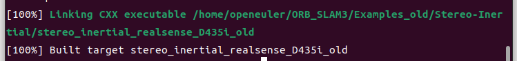
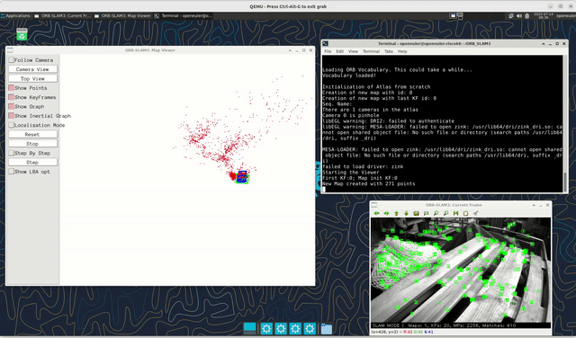
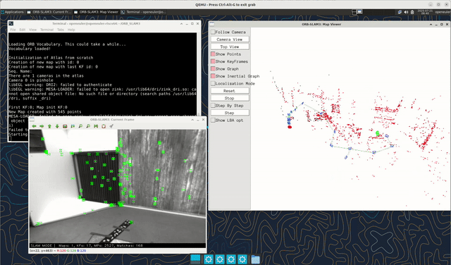

# ORB-SLAM3 移植到 openEuler 24.03 RISC-V 详细流程

## 一、项目概述

### 1.1 移植目标
将ORB-SLAM3视觉SLAM系统成功移植到openEuler 24.03 RISC-V架构上，确保基本功能正常运行。ORB-SLAM3是目前最先进的实时SLAM库之一，支持视觉、视觉-惯性和多地图SLAM，适用于单目、双目和RGB-D相机。

### 1.2 主要挑战
- RISC-V架构特性差异
- 依赖库的RISC-V支持
- 性能优化需求
- 可能的代码适配

### 1.3 移植意义

将ORB-SLAM3移植到openEuler RISC-V平台具有重要的实际价值。首先，这将验证RISC-V架构在运行复杂视觉算法方面的实际能力，为RISC-V在机器人、无人机等领域的应用提供关键技术支撑。其次，成功的移植将使openEuler RISC-V版本具备完整的视觉SLAM功能，提升其在边缘计算和嵌入式设备市场的竞争力。从技术角度看，移植过程中积累的经验，包括依赖库适配、性能优化、架构特定问题的解决方案等，将为后续其他大型项目的RISC-V移植提供宝贵参考。此外，由于RISC-V的开源特性和较低的授权成本，基于RISC-V的SLAM解决方案在成本敏感的应用场景中具有明显优势。最终，这项工作不仅能推动RISC-V生态系统的完善，还能为国产处理器在智能感知领域的应用探索可行路径。

## 二、环境准备阶段

### 2.1 系统环境检查
```bash
# 确认系统版本
cat /etc/os-release
uname -a

# 检查编译工具链
gcc --version
g++ --version
cmake --version

# 检查可用内存和存储
free -h
df -h
```

### 2.2 基础开发工具安装
```bash
# 更新系统包
sudo dnf update -y

# 安装基础开发工具
sudo dnf install -y git wget vim cmake cmake-gui
sudo dnf install -y gcc-c++ python3-devel
```

## 三、依赖库准备阶段

### 3.1 检查和安装系统级依赖

#### 3.1.1 基础库
```bash
# 安装基础依赖
sudo dnf install -y libjpeg-devel libpng-devel libtiff-devel
sudo dnf install -y libGL-devel libGLU-devel
sudo dnf install -y libX11-devel libXi-devel libXmu-devel
```

#### 3.1.2 Eigen3 (线性代数库)
```bash
# 检查是否有预编译包
sudo dnf search eigen3

# 直接安装
sudo dnf install -y eigen3-devel

```

#### 3.1.3 OpenCV (计算机视觉库)
```bash
# 检查是否有预编译包
sudo dnf search opencv

# 直接安装
sudo dnf install -y opencv
```

#### 3.1.4 Pangolin (可视化库)

见本目录下“移植Pangolin库-前置依赖.md”


## 四、ORB-SLAM3获取与初步分析

### 4.1 获取源代码
```bash
# 克隆ORB-SLAM3
git clone https://github.com/UZ-SLAMLab/ORB_SLAM3.git
cd ORB_SLAM3

```

### 4.2 修复部分导致编译的问题

```bash
# 更新 CakeList文件
见本目录下的CMakeList文件，主要更新修复有关“C++”标准设置和移除“-march=native“以适配ricv架构


# 显示图像
修改./Examples/Monocular/mono_euroc.cc中：
ORB_SLAM3::System SLAM(argv[1],argv[2],ORB_SLAM3::System::MONOCULAR, false);  --》 ORB_SLAM3::System SLAM(argv[1],argv[2],ORB_SLAM3::System::MONOCULAR, true);

## `-march=native` 编译参数在RISC-V架构上不被支持

修改DBoW2:
sed -i 's/-march=native//g' Thirdparty/DBoW2/CMakeLists.txt

修改g2o:
sed -i 's/-march=native//g' Thirdparty/g2o/CMakeLists.txt

修改Sophus:
sed -i 's/-march=native//g' Thirdparty/Sophus/CMakeLists.txt

# std::chrono::monotonic_clock 不是C++标准库的一部分
find Examples -type f -exec sed -i 's/std::chrono::monotonic_clock/std::chrono::steady_clock/g' {} +
find Examples_old -type f -exec sed -i 's/std::chrono::monotonic_clock/std::chrono::steady_clock/g' {} +


```

### 4.3 自动编译

```bash
./build.sh

```









## 五、ORB-SLAM3测试

### 4.1 获取EuRoC 测试数据集

EuRoC 数据集包含视觉惯性数据，适合测试视觉惯性 SLAM，包括 Machine Hall 和 Vicon Room 序列。数据格式为 ROS bag 或 ASL Dataset Format，包含立体图像、IMU 和地面真相。

- **步骤**：
  1. 访问官网：https://projects.asl.ethz.ch/datasets/doku.php?id=kmavvisualinertialdatasets
  2. 选择序列（推荐：Machine Hall 01-05 “easy” 到 “difficult”，Vicon Room 1 01-03）。
  3. 下载 ROS bag 或 ASL zip 文件。例如：
     - Machine Hall 01 (easy): http://robotics.ethz.ch/~asl-datasets/ijrr_euroc_mav_dataset/machine_hall/MH_01_easy/MH_01_easy.bag (ROS bag) 或 MH_01_easy.zip (ASL)。
     - 类似地下载其他序列，如 MH_02_easy、V1_01_easy 等。
  4. 解压并放置在 ORB-SLAM3/Data/EuRoC/ 下。

### 4.2 进行简单测试

单目摄像头测试：

```bash
./Examples/Monocular/mono_euroc ./Vocabulary/ORBvoc.txt ./Examples/Monocular/EuRoC.yaml /home/openeuler/shared/Datasets/EuRoC/MH01 ./Examples/Monocular/EuRoC_TimeStamps/MH01.txt dataset-MH01_mono
```



双目摄像头测试：

```bash
./Examples/Stereo/stereo_euroc ./Vocabulary/ORBvoc.txt ./Examples/Stereo/EuRoC.yaml /home/openeuler/shared/Datasets/EuRoC/V101 ./Examples/Stereo/EuRoC_TimeStamps/V101.txt dataset-V101_stereo
```



单目+惯性导航 (Monocular-Inertial) 测试:
```bash
./Examples/Monocular-Inertial/mono_inertial_euroc ./Vocabulary/ORBvoc.txt ./Examples/Monocular-Inertial/EuRoC.yaml /home/openeuler/shared/Datasets/EuRoC/V101 ./Examples/Monocular-Inertial/EuRoC_TimeStamps/V101.txt dataset-V101_monoi
```


