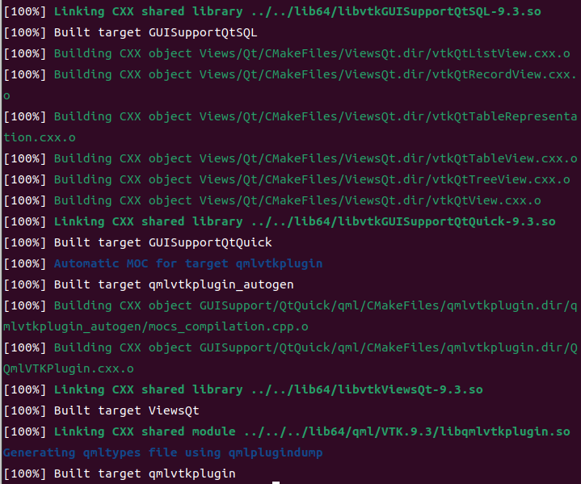
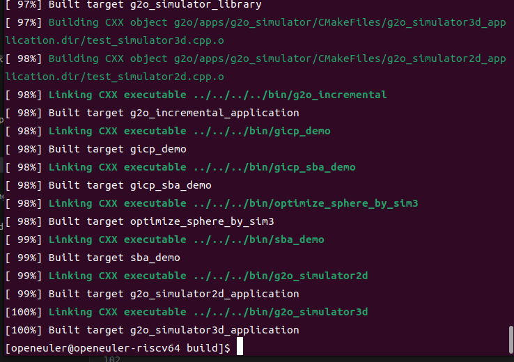
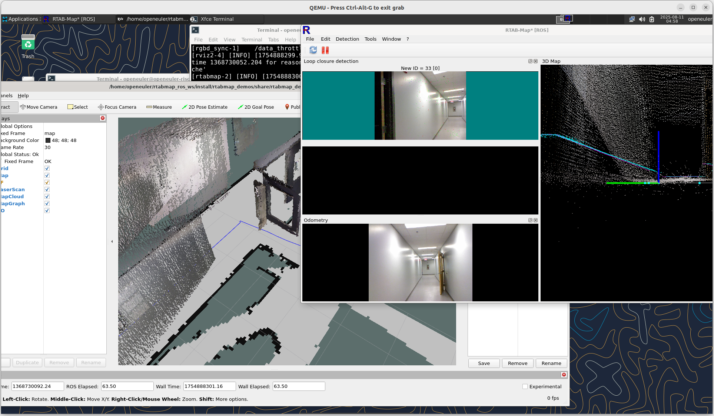

# RTABMAP 移植到 openEuler 24.03 RISC-V 详细流程

## 一、项目概述

### 1.1 移植目标
将RTABMAP（Real-Time Appearance-Based Mapping）实时外观建图系统及其ROS 2 Humble接口成功移植到openEuler 24.03 RISC-V架构上，确保核心SLAM功能、点云处理、闭环检测和可视化功能正常运行。RTABMAP是一个基于外观的实时定位与建图解决方案，支持激光雷达、立体相机、RGB-D相机等多种传感器，具有增量式建图、多会话建图、闭环检测和图优化等先进功能。

### 1.2 主要挑战
- RISC-V架构下复杂依赖链的管理（PCL、OpenCV、VTK等大型库）
- ROS 2 Humble在RISC-V平台的完整性
- 图优化器（g2o、GTSAM）的架构适配
- 内存使用优化和实时性能保证
- Qt GUI组件在RISC-V上的渲染性能

### 1.3 移植意义
将RTABMAP移植到openEuler RISC-V平台具有应用价值。作为一个成熟的RGB-D SLAM解决方案，RTABMAP在服务机器人、自动驾驶、无人机测绘等领域有广泛应用，其成功移植将直接推动RISC-V架构在这些高价值领域的落地应用。相比于其他SLAM系统，RTABMAP的独特优势在于其强大的闭环检测能力和对大规模环境的支持，能够实现持续的增量式建图，这对于长时间运行的机器人系统至关重要。

从技术生态角度看，RTABMAP依赖众多核心库（PCL、OpenCV、VTK、Qt等），其成功移植将验证RISC-V平台对复杂软件栈的支撑能力，为整个计算机视觉和机器人软件生态在RISC-V上的构建奠定基础。此外，RTABMAP与ROS 2的深度集成使其成为验证ROS 2在RISC-V平台完整性的理想测试案例，这对于推动整个机器人中间件生态向RISC-V迁移具有示范效应。

从产业应用角度看，基于RISC-V的RTABMAP方案可以显著降低机器人视觉系统的成本，特别是在需要部署大量边缘设备的场景中。开源的RISC-V架构配合开源的RTABMAP系统，将为国产自主可控的机器人感知方案提供完整的技术路径，有助于打破国外在高端传感器和处理器领域的技术垄断。

## 二、环境准备阶段

### 2.1 系统环境检查
```bash
# 确认系统版本和架构
cat /etc/os-release | grep -E "NAME|VERSION"
uname -m  # 应显示 riscv64
lscpu     # 查看CPU详细信息

# 检查编译工具链版本
gcc --version   # 需要 >= 4.0，支持C++11/14/17
g++ --version
cmake --version # 需要 >= 3.14
make --version

# 检查Python环境（用于ROS 2和可选的Python绑定）
python3 --version
pip3 --version

# 检查系统资源
free -h         # 建议至少8GB RAM用于编译
df -h /         # 建议至少20GB可用空间
nproc           # 查看可用CPU核心数
```

### 2.2 基础开发环境配置
```bash
# 更新系统包索引
sudo dnf update -y

# 安装基础开发工具
sudo dnf groupinstall -y "Development Tools"
sudo dnf install -y \
    git wget curl vim cmake cmake-gui \
    gcc-c++ gdb valgrind \
    pkg-config autoconf automake libtool

# 安装Python开发环境（ROS 2需要）
sudo dnf install -y \
    python3-devel python3-pip python3-setuptools \
    python3-wheel python3-numpy

```

### 2.3 ROS 2 Humble基础环境
```bash
# 添加ROS 2仓库（如果尚未添加）
# 注：具体仓库配置需根据openEuler RISC-V的ROS 2支持情况调整

# 安装ROS 2基础包
sudo dnf install -y \
    ros-humble-desktop \
    ros-humble-ros-base \
    python3-colcon-common-extensions \
    python3-rosdep

# 配置ROS 2环境变量
echo "source /opt/ros/humble/setup.bash" >> ~/.bashrc
source ~/.bashrc
```

## 三、依赖库准备阶段

### 3.1 系统仓库依赖安装

通过openEuler官方仓库安装RTABMAP所需的基础依赖库。这些包经过官方测试，与系统兼容性良好，优先使用可以减少编译时间和潜在的兼容性问题。

#### 3.1.1 核心必需依赖
```bash
# OpenCV及其依赖（计算机视觉核心）
sudo dnf install -y opencv

# 读取/写入 pcap（点云 I/O）或处理 PNG（图像 I/O）
sudo dnf install -y libpcap-devel libpng-devel

# PCL点云库及其依赖链
sudo dnf install -y \
    pcl pcl-devel pcl-tools \
    eigen3-devel flann-devel 

# 基础数学和数据处理库
sudo dnf install -y \
    boost-devel boost-thread boost-filesystem \
    boost-system boost-iostreams boost-program-options \
    boost-date-time boost-chrono boost-serialization \
    zlib-devel sqlite-devel yaml-cpp-devel
```

#### 3.1.2 GUI和可视化依赖
```bash
# Qt5开发环境（GUI支持）
sudo dnf install -y \
    qt5-qtbase-devel qt5-qtbase-gui \
    qt5-qtsvg-devel qt5-qttools-devel \
    qt5-qtdeclarative-devel qt5-qtmultimedia-devel

# OpenGL和渲染相关
sudo dnf install -y \
    mesa-libGL-devel mesa-libGLU-devel \
    freeglut-devel libXmu-devel libXi-devel
```

#### 3.1.3 ROS 2集成依赖
```bash
# ROS 2核心通信和工具包
sudo dnf install -y \
    ros-humble-rclcpp ros-humble-std-msgs \
    ros-humble-sensor-msgs ros-humble-geometry-msgs \
    ros-humble-nav-msgs ros-humble-visualization-msgs \
    ros-humble-tf2-ros ros-humble-tf2-eigen \
    ros-humble-tf2-geometry-msgs

# ROS 2图像和点云处理
sudo dnf install -y \
    ros-humble-cv-bridge ros-humble-image-transport \
    ros-humble-image-geometry ros-humble-pcl-ros \
    ros-humble-pcl-conversions ros-humble-laser-geometry

# ROS 2工具和插件系统
sudo dnf install -y \
    ros-humble-message-filters ros-humble-pluginlib \
    ros-humble-diagnostic-updater \
    ros-humble-rclcpp-components

# ROS 2可视化（RViz2）
sudo dnf install -y \
    ros-humble-rviz2 ros-humble-rviz-common \
    ros-humble-rviz-default-plugins \
    ros-humble-rviz-rendering
```

#### 3.1.4 可选功能依赖
```bash
# 传感器驱动支持
sudo dnf install -y \
    libuvc-devel libusb-devel \
    libdc1394-devel libraw1394-devel

# Python绑定支持（可选）
sudo dnf install -y \
    python3-numpy python3-matplotlib \
    pybind11-devel python3-pybind11

# 多线程和性能优化
sudo dnf install -y \
    tbb-devel openmp-devel \
    openblas-devel lapack-devel

# 附加工具库
sudo dnf install -y \
    protobuf-devel protobuf-compiler \
    hdf5-devel jsoncpp-devel \
    libxml2-devel libpng-devel libjpeg-devel libtiff-devel
```

#### 3.1.5 依赖验证
```bash
# 验证关键库的安装
pkg-config --modversion opencv4
pkg-config --modversion eigen3
pcl_version  # 如果pcl-tools安装成功

# 检查ROS 2包
ros2 pkg list | grep -E "cv_bridge|pcl|tf2"

# 生成已安装依赖报告
echo "=== RTABMAP依赖安装报告 ===" > rtabmap_deps.txt
echo "OpenCV: $(pkg-config --modversion opencv4)" >> rtabmap_deps.txt
echo "PCL: $(pcl_version 2>/dev/null || echo 'N/A')" >> rtabmap_deps.txt
echo "Boost: $(rpm -q boost-devel)" >> rtabmap_deps.txt
echo "Qt5: $(rpm -q qt5-qtbase-devel)" >> rtabmap_deps.txt
echo "ROS2 packages: $(ros2 pkg list | wc -l)" >> rtabmap_deps.txt
```

### 3.2 源码编译依赖

在openEuler RISC-V平台上，部分关键依赖需要通过源码编译安装。本节将详细说明VTK和GTSAM的编译过程。

#### 3.2.1 编译FLANN

FLANN (Fast Library for Approximate Nearest Neighbors) 是PCL的核心依赖，提供快速最近邻搜索功能。由于系统包不完整，需要源码编译。

```bash
# 进入依赖编译目录
cd ~/rtabmap_deps

# 下载FLANN源码
git clone https://github.com/flann-lib/flann.git
cd flann
git checkout 1.9.2  # 使用稳定版本1.9.2

# 创建构建目录
mkdir build && cd build

# 配置编译选项
cmake .. \
    -DCMAKE_BUILD_TYPE=Release \
    -DCMAKE_INSTALL_PREFIX=/usr/local \
    -DBUILD_CUDA_LIB=OFF

# 编译
make -j$(nproc)

# 安装
sudo make install
sudo ldconfig
```

#### 3.2.2 编译PCL

```bash
# 进入依赖编译目录
cd ~/rtabmap_deps

# 下载PCL源码
git clone https://github.com/PointCloudLibrary/pcl.git
cd pcl
git checkout pcl-1.12.1  # 使用稳定版本

# 创建构建目录
mkdir build && cd build

# 配置编译选项
cmake .. \
    -DCMAKE_BUILD_TYPE=Release \
    -DCMAKE_INSTALL_PREFIX=/usr/local \
    -DFLANN_ROOT=/usr/local \
    -DVTK_DIR=/usr/local/lib64/cmake/vtk-9.2 \
    -DWITH_VTK=ON \
    -DWITH_PNG=ON \
    -DWITH_PCAP=ON \
    -DBUILD_visualization=ON \
    -DCMAKE_CXX_FLAGS="-march=rv64gcv"

# 编译
make -j$(nproc)

# 安装
sudo make install
sudo ldconfig

# 验证安装
ls -la /usr/local/include/pcl*/pcl/surface/vtk_smoothing/
ldconfig -p | grep pcl | head -5
```

#### 3.2.3 编译VTK

VTK (Visualization Toolkit) 是rtabmap GUI功能的核心依赖，提供3D可视化支持。

```bash
# 创建工作目录
mkdir -p ~/rtabmap_deps && cd ~/rtabmap_deps

# 下载VTK源码（使用稳定版本9.2.6）
wget https://www.vtk.org/files/release/9.2/VTK-9.2.6.tar.gz
tar -xzf VTK-9.2.6.tar.gz
cd VTK-9.2.6

# 创建构建目录
mkdir build && cd build

# 配置编译选项
cmake .. \
    -DCMAKE_BUILD_TYPE=Release \
    -DCMAKE_INSTALL_PREFIX=/usr/local \
    -DVTK_GROUP_ENABLE_Qt=YES \
    -DVTK_MODULE_ENABLE_VTK_GUISupportQt=YES \
    -DVTK_QT_VERSION=5 \
    -DBUILD_SHARED_LIBS=ON \
    -DVTK_WRAP_PYTHON=OFF \
    -DVTK_USE_CUDA=OFF \
    -DVTK_ENABLE_REMOTE_MODULES=OFF

# 编译（根据CPU核心数调整-j参数）
make -j$(nproc)

# 安装
sudo make install
sudo ldconfig
```



#### 3.2.4 编译GTSAM

GTSAM (Georgia Tech Smoothing and Mapping) 提供先进的因子图优化算法。

```bash
# 返回工作目录
cd ~/rtabmap_deps

# 下载GTSAM源码（使用4.2版本）
wget https://github.com/borglab/gtsam/archive/refs/tags/4.2.tar.gz
tar -xzf 4.2.tar.gz
cd gtsam-4.2

# 创建构建目录
mkdir build && cd build

# 配置编译选项
cmake .. \
    -DCMAKE_BUILD_TYPE=Release \
    -DCMAKE_INSTALL_PREFIX=/usr/local \
    -DGTSAM_BUILD_TESTS=OFF \
    -DGTSAM_BUILD_EXAMPLES_ALWAYS=OFF \
    -DGTSAM_BUILD_UNSTABLE=OFF \
    -DGTSAM_USE_SYSTEM_EIGEN=ON \
    -DGTSAM_BUILD_WITH_MARCH_NATIVE=OFF \
    -DGTSAM_WITH_TBB=ON

# 编译
make -j$(nproc)

# 安装
sudo make install
sudo ldconfig
```

#### 3.2.5 源码编译g2o

```bash
# 编译g2o
cd ~/rtabmap_deps
git clone https://github.com/RainerKuemmerle/g2o.git
cd g2o
git checkout 20230223_git  # 使用稳定版本

mkdir build && cd build
cmake .. \
    -DCMAKE_BUILD_TYPE=Release \
    -DCMAKE_INSTALL_PREFIX=/usr/local \
    -DBUILD_WITH_MARCH_NATIVE=OFF \
    -DG2O_USE_CUDA=OFF

make -j$(nproc)
sudo make install
sudo ldconfig
```


#### 3.2.6 从源码编译SuiteSparse
```bash
cd ~/rtabmap_deps
git clone https://github.com/DrTimothyAldenDavis/SuiteSparse.git
cd SuiteSparse
git checkout v7.11.0

cmake .. \
    -DCMAKE_BUILD_TYPE=Release \
    -DCMAKE_INSTALL_PREFIX=/usr/local \
    -DBUILD_STATIC_LIBS=ON \
    -DBUILD_SHARED_LIBS=ON \
    -DSUITESPARSE_USE_CUDA=OFF \
    -DSUITESPARSE_USE_OPENMP=ON

make -j$(nproc) 
sudo make install
```

#### 3.2.7 验证安装

```bash
# 验证VTK
ls -la /usr/local/lib64/libvtk* | head -5
ls -la /usr/local/lib64/cmake/vtk*/VTKConfig.cmake 2>/dev/null

# 验证GTSAM
ls -la /usr/local/lib64/libgtsam* | head -5
find /usr/local -name "GTSAMConfig.cmake" 2>/dev/null

# 验证库链接
ldconfig -p | grep -E "vtk|gtsam" | head -10
```

## 四、RTABMAP编译安装

### 4.1 编译RTABMAP核心库

#### 4.1.1 获取源码

```bash
# 创建工作目录
cd ~
mkdir -p rtabmap_ws && cd rtabmap_ws

# 克隆rtabmap核心库源码
git clone https://github.com/introlab/rtabmap.git
cd rtabmap

# 检出稳定版本
git checkout 0.22.1-humble
```

#### 4.1.2 配置编译选项

```bash
# 设置环境变量
export LD_LIBRARY_PATH=/usr/local/lib:/usr/local/lib64:$LD_LIBRARY_PATH
export PKG_CONFIG_PATH=/usr/local/lib/pkgconfig:/usr/local/lib64/pkgconfig:$PKG_CONFIG_PATH
export CMAKE_PREFIX_PATH=/usr/local:$CMAKE_PREFIX_PATH

# 创建并进入构建目录
mkdir build && cd build

# 简化配置 - 只关闭确定不可用的功能
cmake .. \
    -DCMAKE_BUILD_TYPE=Release \
    -DCMAKE_INSTALL_PREFIX=/usr/local \
    -DCMAKE_PREFIX_PATH="/usr/local;/usr/local/lib64/cmake" \
    -DPCL_DIR=/usr/local/share/pcl-1.12 \
    -DVTK_DIR=/usr/local/lib64/cmake/vtk-9.2 \
    -DFLANN_ROOT=/usr/local \
    -DG2O_ROOT=/usr/local \
    -DGTSAM_DIR=/usr/local/lib/cmake/GTSAM \
    -DFLANN_KDTREE_MEM_OPT=ON
```

#### 4.1.3 编译安装

```bash
# 编译（根据系统性能调整并行数）
make -j$(nproc)

# 安装
sudo make install

# 更新动态库缓存
sudo ldconfig
```

#### 4.1.4 验证核心库安装

```bash
# 检查安装的库文件
ls -la /usr/local/lib*/librtabmap* | head -5

# 检查可执行文件
ls -la /usr/local/bin/rtabmap*

# 测试运行（如果编译了APP）
rtabmap --version

# 检查cmake配置文件
find /usr/local -name "RTABMapConfig.cmake" 2>/dev/null
```

### 4.2 编译RTABMAP ROS包

#### 4.2.1 创建ROS工作空间

```bash
# 创建colcon工作空间
cd ~
mkdir -p rtabmap_ros_ws/src && cd rtabmap_ros_ws/src

# 克隆rtabmap_ros源码
git clone https://github.com/introlab/rtabmap_ros.git

# 返回工作空间根目录
cd ~/rtabmap_ros_ws
git checkout 0.22.0-humble

```

#### 4.2.2 解决ROS依赖

```bash
# source ROS环境
source /opt/ros/humble/setup.bash

# 如果rosdep失败，手动安装可能缺失的包
sudo dnf install -y \
    ros-humble-stereo-msgs \
    ros-humble-nav2-msgs \
    ros-humble-image-pipeline
```

#### 4.2.3 编译ROS包

```bash
# 设置环境变量指向rtabmap核心库
export RTABMap_DIR=/usr/local/lib/cmake/rtabmap
export CMAKE_PREFIX_PATH=/usr/local:$CMAKE_PREFIX_PATH

# 使用colcon编译
colcon build \
    --cmake-args \
    -DCMAKE_BUILD_TYPE=Release \
```


#### 4.3.2 测试验证

```bash
Requirements:
  Download rosbag:
   * demo_mapping.db3: https://drive.google.com/file/d/1v9qJ2U7GlYhqBJr7OQHWbDSCfgiVaLWb/view?usp=drive_link

Example:

  SLAM:
    $ ros2 launch rtabmap_demos robot_mapping_demo.launch.py rviz:=true rtabmap_viz:=true

  Rosbag:
    $ ros2 bag play demo_mapping.db3 --clock
```




