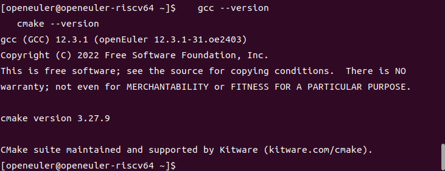

# Pangolin库移植到openEuler 24.03 RISC-V方案

## 项目概述

### 目标
将Pangolin库成功移植到openEuler 24.03 RISC-V架构上，为后续ORB-SLAM3移植奠定基础。

### Pangolin库简介
- **项目地址**: https://github.com/stevenlovegrove/Pangolin
- **功能**: 轻量级的OpenGL显示和交互库，提供3D可视化功能
- **用途**: 主要用于计算机视觉、机器人学、SLAM等领域的数据可视化
- **语言**: C++

## 环境分析

### 目标平台
- **操作系统**: openEuler 24.03
- **架构**: RISC-V 64位
- **编译环境**: QEMU虚拟机内直接编译
- **编译器**: 本地GCC

### 依赖库分析

#### 必需依赖
1. **构建系统**
   - CMake 3.16+ (必需)
   - C++17兼容编译器 (GCC/Clang)

#### 核心依赖（推荐安装）
1. **渲染系统**
   - OpenGL或OpenGL ES
   - Mesa (软件渲染支持)

2. **窗口系统（Linux平台）**
   - X11开发库 (libX11-devel)
   - 相关X11扩展库

#### 可选依赖（按功能分类）

1. **视频和图像支持**
   - libpng-devel (PNG图像支持)
   - libjpeg-devel (JPEG图像支持) 
   - TIFF库 (TIFF图像支持)
   - FFmpeg (视频编解码)
   - DC1394 (IEEE 1394相机支持)

2. **Python绑定**
   - Python3开发库
   - pybind11

3. **测试框架**
   - Catch2 (单元测试，仅在BUILD_TESTS=ON时需要)

4. **特殊平台支持**
   - Emscripten (Web编译)

#### 依赖特点
根据Pangolin官方文档，**大多数依赖都是可选的**，Pangolin采用"尽力而为"的构建策略：
- 未找到的依赖会被静默忽略
- 只构建能找到依赖的功能模块
- 使用工厂模式支持不同后端的动态选择

## 移植策略

### 阶段一：环境准备（当前任务）

1. **基础编译环境**
   ```bash
   # 更新系统包管理器
   sudo dnf update
   
   # 安装基础编译工具
   sudo dnf groupinstall "Development Tools"
   sudo dnf install cmake gcc-c++ make git
   
   # 验证编译环境
   gcc --version
   cmake --version
   ```
   

2. **完整依赖库安装**
   ```bash
   # 核心渲染依赖
   sudo dnf install mesa-libGL-devel mesa-libGLU-devel
   sudo dnf install libGL-devel libGLU-devel
   
   # X11窗口系统依赖
   sudo dnf install libX11-devel libXrandr-devel
   sudo dnf install libXinerama-devel libXcursor-devel
   sudo dnf install libXi-devel libXmu-devel
   
   # 图像处理库
   sudo yum install libepoxy-devel
   sudo dnf install libpng-devel libjpeg-devel
   sudo dnf install libtiff-devel
   
   # 视频处理（可选但推荐）
   sudo dnf install ffmpeg-devel
   
   # Python支持（可选）
   sudo dnf install python3-devel python3-pip
   pip3 install wheel
   
   # 其他工具库
   sudo dnf install pkg-config
   sudo dnf install eigen3-devel
   ```

### 阶段二：源码获取与分析
1. **获取源码**
   ```bash
   git clone https://github.com/stevenlovegrove/Pangolin.git
   cd Pangolin
   git submodule update --init --recursive
   ```

### 阶段三：CMake配置适配
1. **基础构建配置**
   ```bash
   mkdir build
   cd build
   cmake -DCMAKE_BUILD_TYPE=Release \
         -DBUILD_EXAMPLES=ON \
         -DBUILD_TESTS=OFF \
         -DBUILD_TOOLS=ON \
         -DBUILD_SHARED_LIBS=ON \
         ..

   # 构建核心库
   cmake --build .
   ```

2. **关键配置选项说明**
   - `BUILD_EXAMPLES`: 构建示例程序（开启用于测试）
   - `BUILD_TESTS`: 构建测试（需要Catch2，暂时关闭）
   - `BUILD_TOOLS`: 构建工具（如VideoViewer）
   - `BUILD_SHARED_LIBS`: 构建共享库vs静态库

### 阶段四：编译问题解决

#### 预期问题与解决方案

1. **组件构建失败**
   - **问题**: 某些组件因依赖缺失无法构建
   - **解决**: Pangolin采用组件化架构，缺失依赖的组件会被自动跳过
   - **策略**: 检查cmake输出的"Found and Enabled"行，确认核心功能已启用

2. **OpenGL支持问题**
   - **问题**: RISC-V平台OpenGL硬件加速有限
   - **解决**: 使用Mesa软件渲染（llvmpipe）
   - **验证**: 运行`glxinfo`检查OpenGL支持情况

3. **编译链接问题**
   - **问题**: 库文件路径或版本不匹配
   - **解决**: 使用pkg-config检查库配置
   - **调试**: 使用`ldd`检查生成库的依赖关系

4. **Python绑定问题**
   - **问题**: 交叉编译环境下Python路径混乱
   - **解决**: 初期禁用Python支持，专注核心功能

5. **内存和性能问题**
   - **问题**: RISC-V设备资源限制
   - **解决**: 
     - 使用`BUILD_SHARED_LIBS=OFF`减少内存占用
     - 禁用不必要的功能模块
     - 调整OpenGL缓冲区大小

### 阶段五：功能验证

1. **构建验证**
   ```bash
   # 检查cmake配置输出
   grep "Found and Enabled" build/CMakeCache.txt
   
   # 验证核心库编译
   ls build/src/
   ```

2. **基础功能测试**
   ```bash
   # 如果启用了示例程序
   cd build
   # 测试简单显示
   ./examples/SimpleDisplay/SimpleDisplay
   # 测试多显示窗口
   ./examples/SimpleMultiDisplay/SimpleMultiDisplay
   # 测试绘图功能
   ./examples/SimplePlot/SimplePlot
   ```

3. **核心API测试**
   - OpenGL上下文创建
   - 窗口管理和事件处理
   - 基本几何图形绘制
   - 视口操作

4. **集成测试准备**
   ```bash
   # 安装到系统目录或指定路径
   cmake --build build --target install
   # 验证pkg-config配置
   pkg-config --cflags --libs pangolin
   ```

5. **最小化测试程序**
   创建简单的测试程序验证Pangolin基本功能：
   ```cpp
   #include <pangolin/pangolin.h>
   int main() {
       pangolin::CreateWindowAndBind("Test", 640, 480);
       glEnable(GL_DEPTH_TEST);
       // 简单的绘制循环
       while(!pangolin::ShouldQuit()) {
           glClear(GL_COLOR_BUFFER_BIT | GL_DEPTH_BUFFER_BIT);
           pangolin::FinishFrame();
       }
       return 0;
   }
   ```

## 风险评估与应对

### 高风险项
1. **OpenGL驱动兼容性**
   - 风险: RISC-V平台OpenGL支持不完整
   - 应对: 准备软件渲染方案

2. **依赖库缺失**
   - 风险: 某些依赖库在RISC-V平台不可用
   - 应对: 源码编译或寻找替代库

### 中风险项
1. **性能问题**
   - 风险: 软件渲染性能不足
   - 应对: 优化渲染参数，降低质量要求

2. **内存使用**
   - 风险: RISC-V设备内存限制
   - 应对: 优化内存使用，减少缓存

## 时间规划

### 第1周：环境搭建
- 配置交叉编译环境
- 安装依赖库
- 获取源码

### 第2周：编译适配
- 修复编译错误
- 解决架构兼容性问题
- 完成基础编译

### 第3周：功能验证
- 运行基础测试
- 验证核心功能
- 性能调优

### 第4周：集成测试
- 与ORB-SLAM3集成测试
- 问题修复和优化
- 文档整理

## 成功标准

1. **编译成功**: 能够在openEuler 24.03 RISC-V虚拟机上成功编译Pangolin
2. **功能正常**: 核心显示和交互功能工作正常
3. **性能可接受**: 满足ORB-SLAM3的基本性能要求
4. **稳定性良好**: 长时间运行无崩溃

## 后续工作

1. **优化工作**
   - 针对RISC-V架构的特定优化
   - 内存使用优化
   - 渲染性能优化

2. **维护工作**
   - 定期更新Pangolin版本
   - 跟踪上游修复
   - 维护RISC-V补丁

3. **社区贡献**
   - 向上游提交RISC-V支持补丁
   - 分享移植经验
   - 建立RISC-V版本维护机制

## 备选方案

如果Pangolin移植遇到重大困难，可考虑以下替代方案：

1. **轻量级替代库**
   - OpenCV的highgui模块
   - SDL2 + OpenGL
   - 自定义简化显示库

2. **无图形界面版本**
   - 修改ORB-SLAM3使用无头模式
   - 数据输出到文件
   - 后处理可视化

这个移植方案提供了从环境搭建到最终验证的完整流程，同时考虑了可能遇到的技术挑战和解决方案。