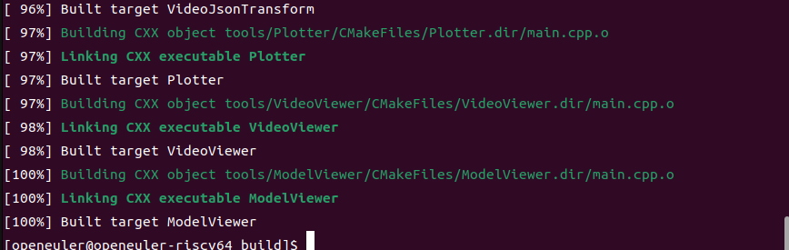
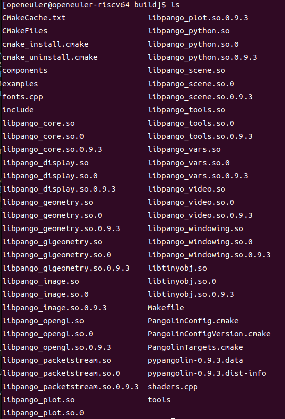
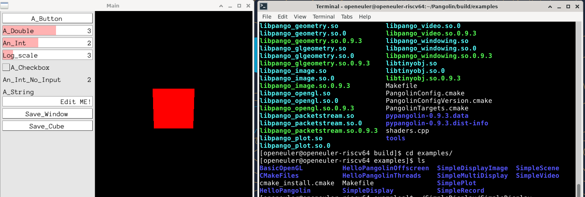
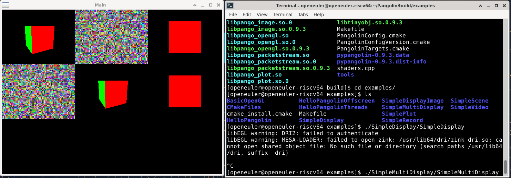
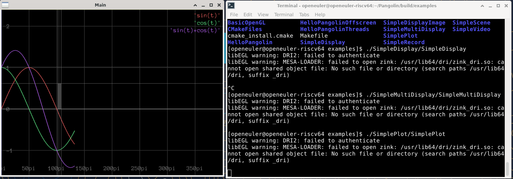

# Pangolin库移植到openEuler 24.03 RISC-V方案

## 项目概述

### 目标
将Pangolin库成功移植到openEuler 24.03 RISC-V架构上，为后续ORB-SLAM3移植奠定基础。

### Pangolin库简介
- **项目地址**: https://github.com/stevenlovegrove/Pangolin
- **功能**: 轻量级的OpenGL显示和交互库，提供3D可视化功能
- **用途**: 主要用于计算机视觉、机器人学、SLAM等领域的数据可视化
- **语言**: C++

## 环境分析

### 目标平台
- **操作系统**: openEuler 24.03
- **架构**: RISC-V 64位
- **编译环境**: QEMU虚拟机内直接编译
- **编译器**: 本地GCC

### 依赖库分析

#### 必需依赖
1. **构建系统**
   - CMake 3.16+ (必需)
   - C++17兼容编译器 (GCC/Clang)

#### 核心依赖（推荐安装）
1. **渲染系统**
   - OpenGL或OpenGL ES
   - Mesa (软件渲染支持)

2. **窗口系统（Linux平台）**
   - X11开发库 (libX11-devel)
   - 相关X11扩展库

#### 可选依赖（按功能分类）

1. **视频和图像支持**
   - libpng-devel (PNG图像支持)
   - libjpeg-devel (JPEG图像支持) 
   - TIFF库 (TIFF图像支持)
   - FFmpeg (视频编解码)
   - DC1394 (IEEE 1394相机支持)

2. **Python绑定**
   - Python3开发库
   - pybind11

3. **测试框架**
   - Catch2 (单元测试，仅在BUILD_TESTS=ON时需要)

4. **特殊平台支持**
   - Emscripten (Web编译)

#### 依赖特点
根据Pangolin官方文档，**大多数依赖都是可选的**，Pangolin采用"尽力而为"的构建策略：
- 未找到的依赖会被静默忽略
- 只构建能找到依赖的功能模块
- 使用工厂模式支持不同后端的动态选择

## 移植策略

### 阶段一：环境准备（当前任务）

1. **基础编译环境**
   ```bash
   # 更新系统包管理器
   sudo dnf update
   
   # 安装基础编译工具
   sudo dnf groupinstall "Development Tools"
   sudo dnf install cmake gcc-c++ make git
   
   # 验证编译环境
   gcc --version
   cmake --version
   ```
   

2. **完整依赖库安装**
   ```bash
   # 核心渲染依赖
   sudo dnf install mesa-libGL-devel mesa-libGLU-devel
   sudo dnf install libGL-devel libGLU-devel
   
   # X11窗口系统依赖
   sudo dnf install libX11-devel libXrandr-devel
   sudo dnf install libXinerama-devel libXcursor-devel
   sudo dnf install libXi-devel libXmu-devel
   
   # 图像处理库
   sudo yum install libepoxy-devel
   sudo dnf install libpng-devel libjpeg-devel
   sudo dnf install libtiff-devel
   
   # 视频处理（可选但推荐）
   sudo dnf install ffmpeg-devel
   
   # Python支持（可选）
   sudo dnf install python3-devel python3-pip
   pip3 install wheel
   
   # 其他工具库
   sudo dnf install pkg-config
   sudo dnf install eigen3-devel
   ```

### 阶段二：源码获取与分析
1. **获取源码**
   ```bash
   git clone https://github.com/stevenlovegrove/Pangolin.git
   cd Pangolin
   git submodule update --init --recursive
   ```

### 阶段三：CMake配置适配
1. **基础构建配置**
   ```bash
   mkdir build
   cd build
   cmake -DCMAKE_BUILD_TYPE=Release \
         -DBUILD_EXAMPLES=ON \
         -DBUILD_TESTS=OFF \
         -DBUILD_TOOLS=ON \
         -DBUILD_SHARED_LIBS=ON \
         ..

   # 构建核心库
   cmake --build .
   ```
   

2. **关键配置选项说明**
   - `BUILD_EXAMPLES`: 构建示例程序（开启用于测试）
   - `BUILD_TESTS`: 构建测试（需要Catch2，暂时关闭）
   - `BUILD_TOOLS`: 构建工具（如VideoViewer）
   - `BUILD_SHARED_LIBS`: 构建共享库vs静态库

### 阶段四：功能验证

1. **构建验证**
   ```bash
   # 验证核心库编译
   ls build/*
   ```
   

2. **基础功能测试**
   ```bash
   cd build/examples
   # 测试简单显示
   ./SimpleDisplay/SimpleDisplay
   # 测试多显示窗口
   ./SimpleMultiDisplay/SimpleMultiDisplay
   # 测试绘图功能
   ./SimplePlot/SimplePlot
   ```
   
   
   

3. **安装**
   ```bash
   sudo cmake --install .
   ```


### 总结与展望

本文档详细阐述了Pangolin库在openEuler 24.03 RISC-V架构上的移植方案，包括环境准备、依赖分析、CMake配置以及功能验证等关键步骤。通过成功移植并验证Pangolin库，我们为后续ORB-SLAM3等依赖Pangolin的计算机视觉和机器人学项目在RISC-V平台上的顺利部署奠定了坚实的基础。下一步工作将聚焦于ORB-SLAM3的移植与优化，以期充分发挥RISC-V架构在该领域的潜力。