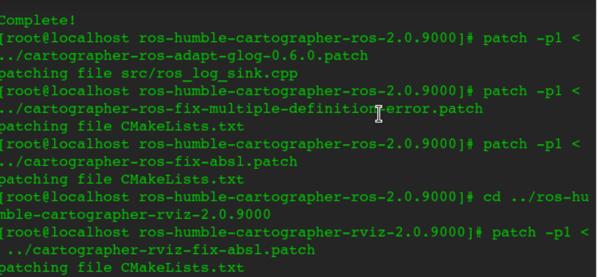
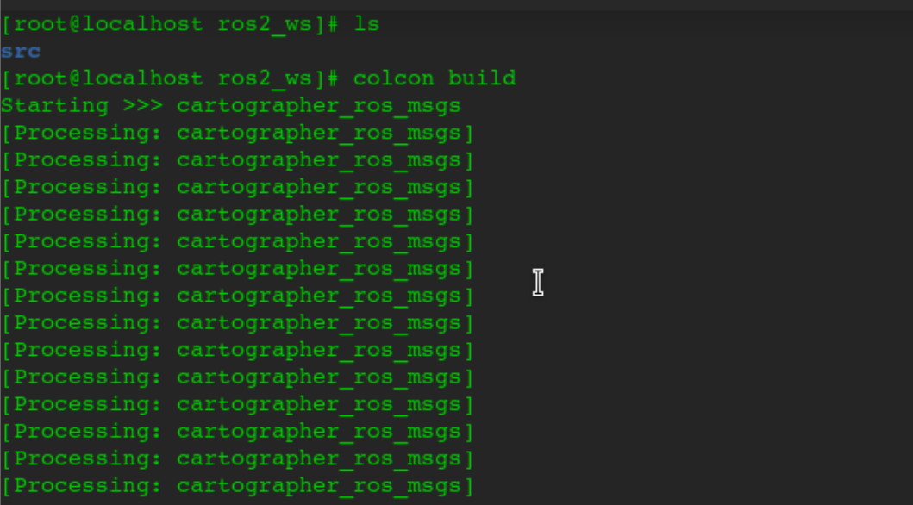
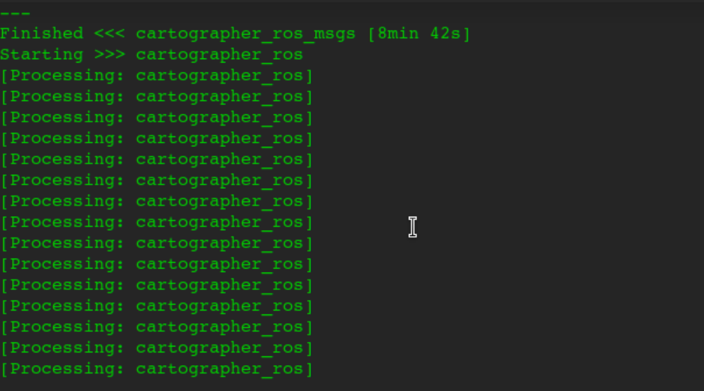
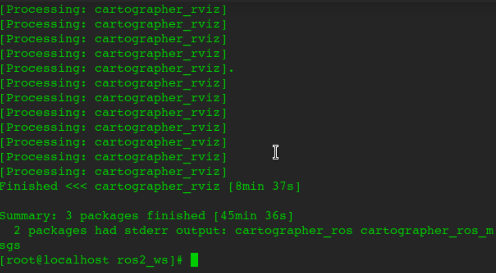

#  编译 Cartographer ROS（riscv架构）

## 系统及其要求
系统版本：openeluler 24.03(riscv)
成功安装ros2相关包。

## 构建与安装
为了在openEuler上构建 Cartographer ROS，我们推荐使用 colcon 。为了更快的构建，我们还推荐使用 Ninja。以下使用colon。
在使用 ROS Humble 的 openEuler 上，使用以下命令安装上述工具：
```
sudo dnf update
sudo dnf install python3-colcon-common-extensions python3-rosdep ninja-build
```
一般来说安装ros2会安装这些工具，注意riscv默认源没有这些工具，也可以使用pip3安装。

安装工具后，在 ‘ros2_ws’ 中创建一个新的 cartographer_ros 工作区。
```
mkdir -p ros2_ws/src
cd ros2_ws/src
git clone https://gitee.com/src-openeuler/cartographer_ros.git
cd cartographer_ros
git checkout humble
tar xf ros-humble-cartographer-ros_2.0.9000.orig.tar.gz
tar xf ros-humble-cartographer-ros-msgs_2.0.9000.orig.tar.gz
tar xf ros-humble-cartographer-rviz_2.0.9000.orig.tar.gz
```


现在需要给 cartographer_ros 打上补丁。
```
cd ros-humble-cartographer-ros-2.0.9000/
patch -p1 < ../cartographer-ros-adapt-glog-0.6.0.patch
patch -p1 < ../cartographer-ros-fix-multiple-definition-error.patch
patch -p1 < ../cartographer-ros-fix-absl.patch
```
还有rviz的补丁
```
cd ros-humble-cartographer-ros-2.0.9000/
patch -p1 < ../cartographer-ros-adapt-glog-0.6.0.patch
patch -p1 < ../cartographer-ros-fix-multiple-definition-error.patch
patch -p1 < ../cartographer-ros-fix-absl.patch
```




构建并且安装
```
cd ../../       # 现在你应该在 ros2_ws/下面
colcon build    # 这将花去非常多的时间，don't panic.
```






