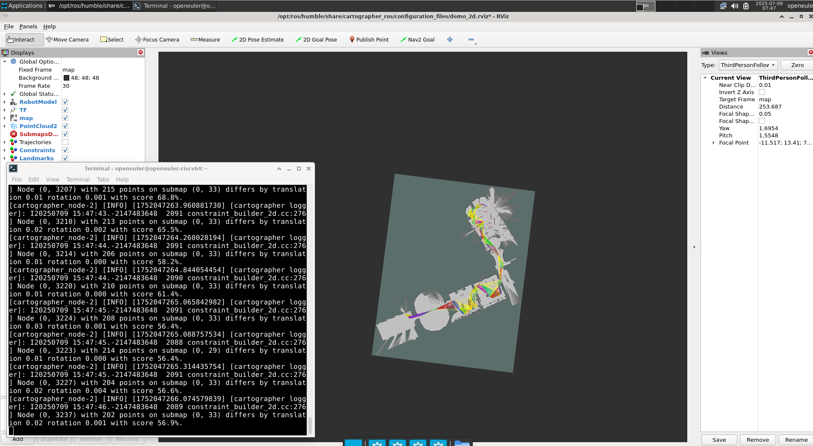

# openEuler运行Cartographer完整指南

## 概述

本文档记录了在openEuler系统上安装和运行Google Cartographer SLAM算法的完整过程。Cartographer是一个系统，可在多个平台和传感器配置中提供实时同时定位和建图（SLAM）。

## 系统环境

- **操作系统**: openEuler (RISC-V 64位架构)
- **ROS版本**: ROS 2 Humble
- **架构**: riscv64

## 安装过程

### 1. 准备安装包

由于构建还没有合并到主分支，选择直接下载预编译的RPM包进行安装：

```bash
[openeuler@openeuler-riscv64 shared]$ ls
cartographer_ros2_bag
pad.txt
ros-humble-cartographer-1.0.0-3.oe2403.riscv64.rpm
ros-humble-cartographer-ros-2.0.9003-1.oe2403.riscv64.rpm
```

### 2. 执行安装

使用dnf包管理器安装Cartographer相关包：

```bash
[openeuler@openeuler-riscv64 shared]$ sudo dnf install ./ros-humble-cartographer-*.rpm ./ros-humble-cartographer-ros-*.rpm
```

### 3. 安装结果

```bash
Last metadata expiration check: 3:04:29 ago on Wed 09 Jul 2025 12:11:49 PM CST.
Dependencies resolved.
================================================================================
 Package                      Arch     Version              Repository     Size
================================================================================
Installing:
 ros-humble-cartographer      riscv64  1.0.0-3.oe2403       @commandline  6.9 M
 ros-humble-cartographer-ros  riscv64  2.0.9003-1.oe2403    @commandline  1.5 M

Transaction Summary
================================================================================
Install  2 Packages

Total size: 8.4 M
Installed size: 67 M
Is this ok [y/N]: y
Downloading Packages:
Running transaction check
Transaction check succeeded.
Running transaction test
Transaction test succeeded.
Running transaction
  Preparing        :                                                        1/1 
  Installing       : ros-humble-cartographer-1 [========================= ] 1/2[11948.644710][ T1653] capability: warning: `dnf' uses 32-bit capabilities (legacy support in use)
  Installing       : ros-humble-cartographer-1.0.0-3.oe2403.riscv64         1/2 
  Installing       : ros-humble-cartographer-ros-2.0.9003-1.oe2403.riscv6   2/2 
  Verifying        : ros-humble-cartographer-1.0.0-3.oe2403.riscv64         1/2 
  Verifying        : ros-humble-cartographer-ros-2.0.9003-1.oe2403.riscv6   2/2 

Installed:
  ros-humble-cartographer-1.0.0-3.oe2403.riscv64                                
  ros-humble-cartographer-ros-2.0.9003-1.oe2403.riscv64                         

Complete!
```

**结论**: 安装成功完成！

## 基本测试

### 1. 验证安装

检查已安装的Cartographer相关包：

```bash
[openeuler@openeuler-riscv64 ~]$ dnf list installed | grep cartographer
ros-humble-cartographer.riscv64                                                1.0.0-3.oe2403                  @@commandline       
ros-humble-cartographer-ros.riscv64                                            2.0.9003-1.oe2403               @@commandline       
ros-humble-cartographer-ros-debuginfo.riscv64                                  2.0.9000-2.oe2403               @openEulerROS-humble
ros-humble-cartographer-ros-debugsource.riscv64                                2.0.9000-2.oe2403               @openEulerROS-humble
ros-humble-cartographer-ros-msgs.riscv64                                       2.0.9000-1.oe2403               @openEulerROS-humble
ros-humble-cartographer-rviz-debuginfo.riscv64                                 2.0.9000-1.oe2403               @openEulerROS-humble
ros-humble-cartographer-rviz-debugsource.riscv64                               2.0.9000-1.oe2403               @openEulerROS-humble
```

### 2. 检查可执行文件

查看cartographer_ros包提供的可执行文件：

```bash
[openeuler@openeuler-riscv64 ~]$ ros2 pkg executables cartographer_ros
cartographer_ros cartographer_assets_writer
cartographer_ros cartographer_node
cartographer_ros cartographer_occupancy_grid_node
cartographer_ros cartographer_offline_node
cartographer_ros cartographer_pbstream_map_publisher
cartographer_ros cartographer_pbstream_to_ros_map
cartographer_ros cartographer_rosbag_validate
```

#### 可执行文件说明

- **cartographer_node**: 主要的SLAM节点
- **cartographer_assets_writer**: 地图资源写入工具
- **cartographer_occupancy_grid_node**: 占据栅格地图节点
- **cartographer_offline_node**: 离线建图节点
- **cartographer_pbstream_map_publisher**: 发布pbstream格式地图
- **cartographer_pbstream_to_ros_map**: pbstream到ROS地图格式转换
- **cartographer_rosbag_validate**: rosbag数据验证工具

### 3. 运行2D建图测试

使用demo数据包运行2D SLAM测试：

```bash
ros2 launch cartographer_ros demo_backpack_2d.launch.py bag_filename:=${HOME}/shared/cartographer_ros2_bag
```

## 运行结果

### RViz可视化界面




