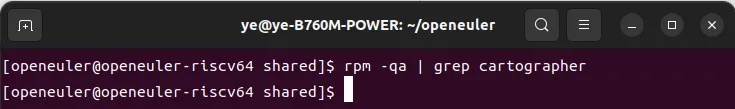
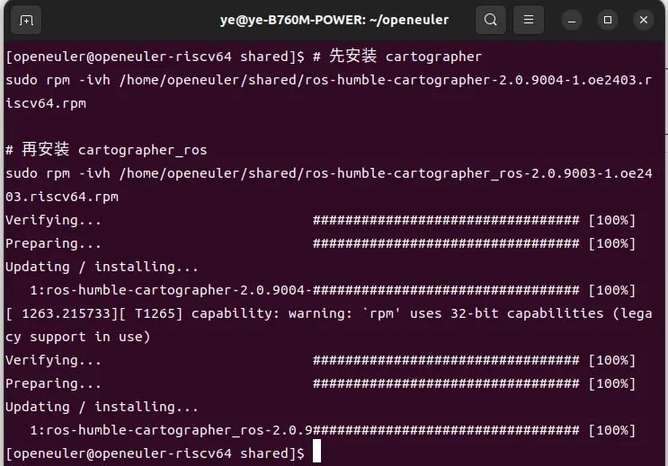
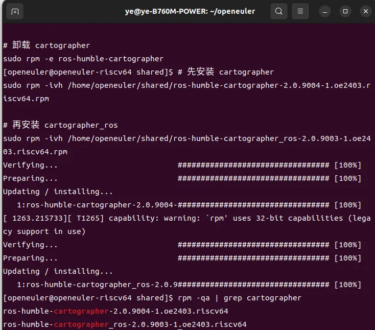
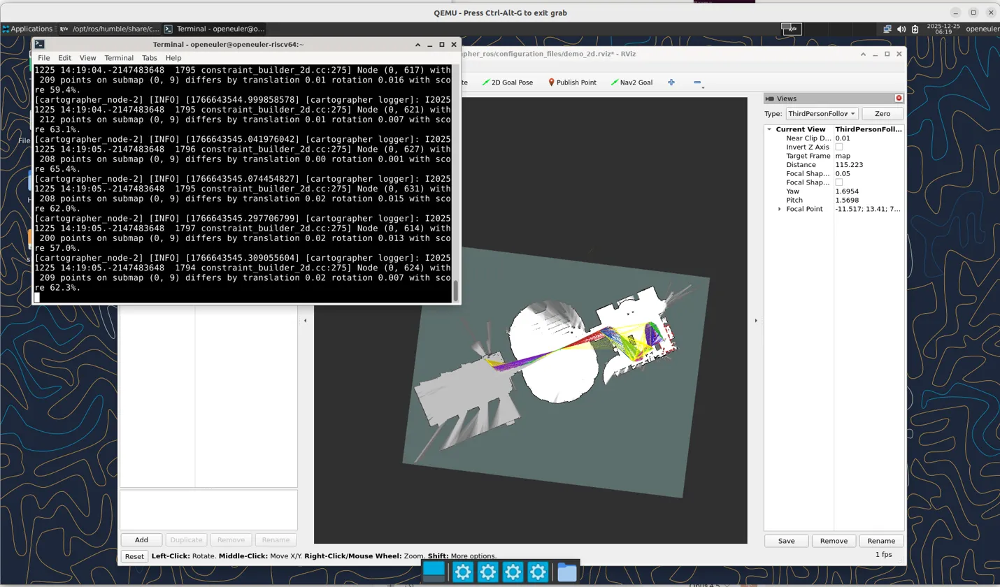
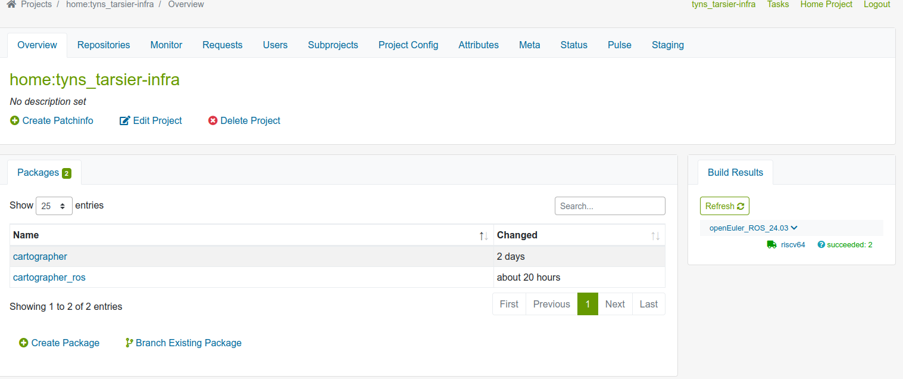

# Cartographer ROS2 在 openEuler RISC-V 上的安装指南

## 1. 概述

本文档描述了在 openEuler 24.03 LTS RISC-V 平台上安装和验证 Cartographer ROS2 SLAM 软件包的完整流程。

Cartographer 是 Google 开源的一个实时同步定位与建图（SLAM）库，支持 2D 和 3D 环境下的多平台、多传感器配置。本文档涵盖的软件包包括：

- **ros-humble-cartographer**：Cartographer SLAM 核心库
- **ros-humble-cartographer_ros**：Cartographer 的 ROS2 集成包（包含 cartographer_ros、cartographer_ros_msgs、cartographer_rviz）

## 2. 环境要求

### 2.1 硬件环境

- RISC-V 64 位处理器（或 QEMU 模拟器）

### 2.2 软件环境

| 组件 | 版本 |
|------|------|
| 操作系统 | openEuler 24.03 LTS |
| 内核版本 | 6.6.0-31.0.0.39.oe2403.riscv64 |
| ROS2 发行版 | Humble Hawksbill |
| QEMU（如使用模拟器） | 10.0.2 |

### 2.3 依赖要求

安装前请确保系统已安装 ROS2 Humble 基础环境及以下依赖包：

- ros-humble-ros-workspace
- ros-humble-ament-cmake
- ros-humble-rclcpp
- ros-humble-tf2、ros-humble-tf2-ros、ros-humble-tf2-eigen、ros-humble-tf2-msgs
- ros-humble-sensor-msgs、ros-humble-nav-msgs、ros-humble-geometry-msgs
- ros-humble-visualization-msgs
- ros-humble-pcl-conversions
- ros-humble-rosbag2-cpp、ros-humble-rosbag2-storage
- ros-humble-rviz-common、ros-humble-rviz-rendering、ros-humble-rviz-ogre-vendor
- ros-humble-launch、ros-humble-launch-ros
- ros-humble-robot-state-publisher
- ros-humble-urdf
- ros-humble-pluginlib

## 3. 安装步骤

### 3.1 获取 RPM 安装包

本项目提供预编译的 RPM 安装包，包含以下文件：

| 文件名 | 说明 |
|--------|------|
| ros-humble-cartographer-2.0.9004-1.oe2403.riscv64.rpm | Cartographer 核心库 |
| ros-humble-cartographer_ros-2.0.9003-1.oe2403.riscv64.rpm | Cartographer ROS2 集成包 |

如需从源码构建，请参考第 5 节"源码构建说明"。

### 3.2 卸载旧版本（如有）

如果系统中已安装旧版本的 Cartographer 相关包，请先卸载：

```bash
# 查看已安装的 Cartographer 相关包
rpm -qa | grep cartographer

# 卸载旧版本（根据实际安装的包名调整）
sudo rpm -e ros-humble-cartographer-ros-msgs
sudo rpm -e ros-humble-cartographer-ros-debuginfo
sudo rpm -e ros-humble-cartographer-ros-debugsource
sudo rpm -e ros-humble-cartographer-rviz-debuginfo
sudo rpm -e ros-humble-cartographer-rviz-debugsource
sudo rpm -e ros-humble-cartographer

# 确认卸载完成
rpm -qa | grep cartographer
```

### 3.3 安装 RPM 包

按照依赖顺序安装 RPM 包：

```bash
# 安装 Cartographer 核心库（先安装）
sudo rpm -ivh ros-humble-cartographer-2.0.9004-1.oe2403.riscv64.rpm

# 安装 Cartographer ROS2 集成包（后安装）
sudo rpm -ivh ros-humble-cartographer_ros-2.0.9003-1.oe2403.riscv64.rpm
```

安装前确认系统中无旧版本 Cartographer 包：



*图 3.1：安装前验证，确认系统中无 Cartographer 相关包*

安装过程：



*图 3.2：RPM 安装过程，两个包均安装成功（100%）*

### 3.4 验证安装

```bash
# 确认包已安装
rpm -qa | grep cartographer

# 验证 ROS2 能识别这些包
source /opt/ros/humble/setup.bash
ros2 pkg list | grep cartographer
```

预期输出：

```
ros-humble-cartographer-2.0.9004-1.oe2403.riscv64
ros-humble-cartographer_ros-2.0.9003-1.oe2403.riscv64
```



*图 3.3：安装后验证，确认两个包已成功安装*

## 4. 功能验证

### 4.1 准备测试数据

Cartographer 官方提供了 Deutsches Museum（德意志博物馆）数据集用于测试。

#### 4.1.1 下载 ROS1 格式 bag 文件

```bash
wget https://storage.googleapis.com/cartographer-public-data/bags/backpack_2d/cartographer_paper_deutsches_museum.bag
```

#### 4.1.2 转换为 ROS2 格式

使用 `rosbags-convert` 工具将 ROS1 bag 文件转换为 ROS2 格式：

```bash
# 安装 rosbags 工具（如未安装）
pip install rosbags

# 转换 bag 文件
rosbags-convert --src cartographer_paper_deutsches_museum.bag --dst cartographer_ros2_bag
```

### 4.2 运行 2D SLAM 演示

```bash
# 加载 ROS2 环境
source /opt/ros/humble/setup.bash

# 运行 2D 背包演示
ros2 launch cartographer_ros demo_backpack_2d.launch.py bag_filename:=${HOME}/cartographer_ros2_bag
```

### 4.3 预期结果

运行成功后将看到：

1. **终端输出**：显示 Cartographer 节点正在处理传感器数据，包含类似以下信息：
   ```
   [cartographer_node-2] [INFO] [cartographer logger]: I0225 14:19:04...
   [cartographer_node-2] 209 points on submap (0, 9) differs by translation 0.01 rotation 0.016 with score 59.4%.
   ```

2. **RViz 可视化**：显示实时建图结果，包括：
   - 激光雷达点云
   - 机器人运动轨迹
   - 2D 栅格地图



*图 4.1：2D SLAM 功能验证成功，左侧终端显示算法运行日志，右侧 RViz 显示建图结果*

## 5. 源码构建说明

### 5.1 OBS 构建结果

本项目已在 Open Build Service (OBS) 上完成构建，构建状态如下：



*图 5.1：OBS 构建成功，cartographer 和 cartographer_ros 两个包均构建通过*

### 5.2 源码文件

| 文件名 | 说明 |
|--------|------|
| cartographer-2.0.9004.tar.gz | Cartographer 核心库源码 |
| cartographer_ros-2.0.9003.tar.gz | Cartographer ROS2 集成源码 |
| cartographer.spec | Cartographer RPM 构建规格文件 |
| cartographer_ros.spec | Cartographer ROS2 RPM 构建规格文件 |

### 5.3 补丁文件

#### Cartographer 补丁

| 补丁文件 | 说明 |
|----------|------|
| 0001-cartographer-abseil-macros.patch | Abseil 宏兼容性修复 |

#### Cartographer ROS2 补丁

| 补丁文件 | 说明 |
|----------|------|
| 0002-cartographer_ros-abseil-macros.patch | Abseil 宏兼容性修复 |
| 0004-fix-build-resolve-compilation-issues-in-offline_node.patch | 修复 offline_node 编译问题 |
| 0005-fix-oe-ros2-apply-temporary-workaround-for-missing-t.patch | openEuler ROS2 适配修复 |

### 5.4 使用 OBS 构建

如需在 Open Build Service 上构建，请将源码、spec 文件和补丁文件上传至 OBS 项目，配置 openEuler 24.03 RISC-V 构建仓库后触发构建。

构建命令示例：

```bash
# 检出项目
osc checkout home:<username>/cartographer
osc checkout home:<username>/cartographer_ros

# 上传文件后提交
osc commit -m "Initial commit"

# 触发构建
osc rebuild home:<username> cartographer
osc rebuild home:<username> cartographer_ros

# 查看构建状态
osc results home:<username> cartographer
osc results home:<username> cartographer_ros
```

## 6. 文件清单

```
cartographer_ros2_openeuler_riscv/
├── rpm/
│   ├── ros-humble-cartographer-2.0.9004-1.oe2403.riscv64.rpm
│   └── ros-humble-cartographer_ros-2.0.9003-1.oe2403.riscv64.rpm
├── src/
│   ├── cartographer-2.0.9004.tar.gz
│   └── cartographer_ros-2.0.9003.tar.gz
├── spec/
│   ├── cartographer.spec
│   └── cartographer_ros.spec
├── patches/
│   ├── cartographer/
│   │   └── 0001-cartographer-abseil-macros.patch
│   └── cartographer_ros/
│       ├── 0002-cartographer_ros-abseil-macros.patch
│       ├── 0004-fix-build-resolve-compilation-issues-in-offline_node.patch
│       └── 0005-fix-oe-ros2-apply-temporary-workaround-for-missing-t.patch
├── images/
│   ├── 01_pre_install_check.png
│   ├── 02_rpm_install.png
│   ├── 03_post_install_verify.png
│   ├── 04_slam_demo.png
│   └── 05_obs_build_success.png
└── README.md
```

## 7. 参考资料

- [Cartographer 官方文档](https://google-cartographer.readthedocs.io/)
- [Cartographer ROS2 GitHub 仓库](https://github.com/ros2/cartographer_ros)
- [openEuler ROS SIG](https://gitee.com/openeuler/ros)
- [ROS2 Humble 文档](https://docs.ros.org/en/humble/)
