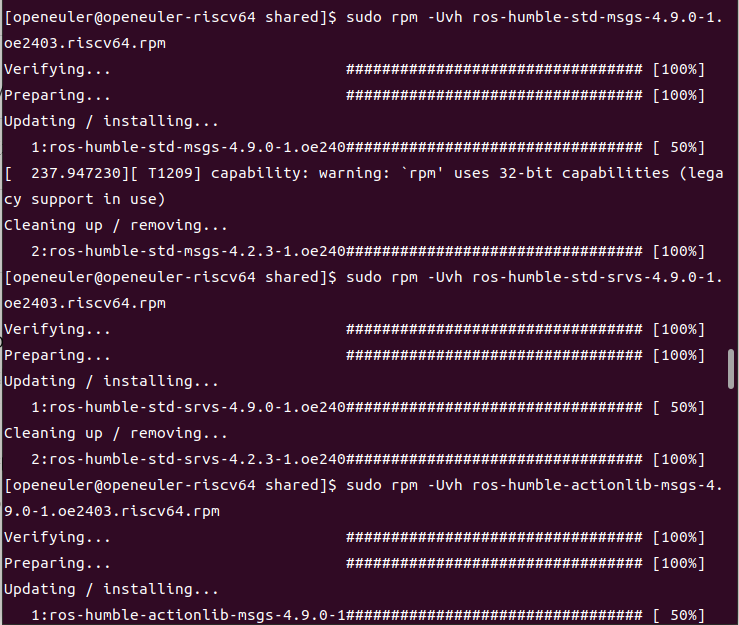
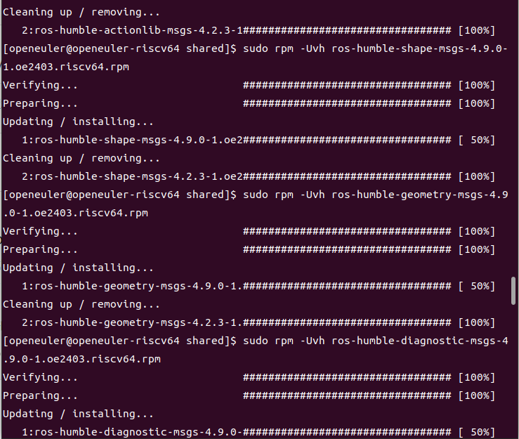
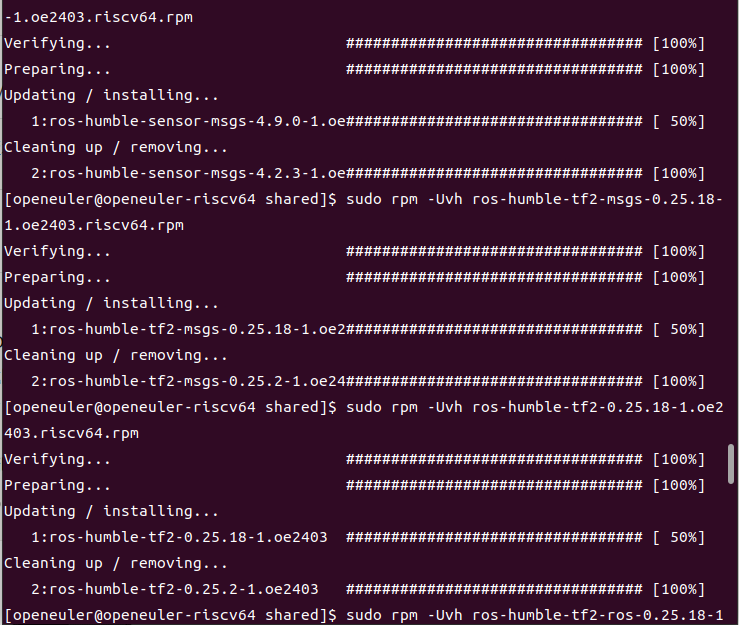
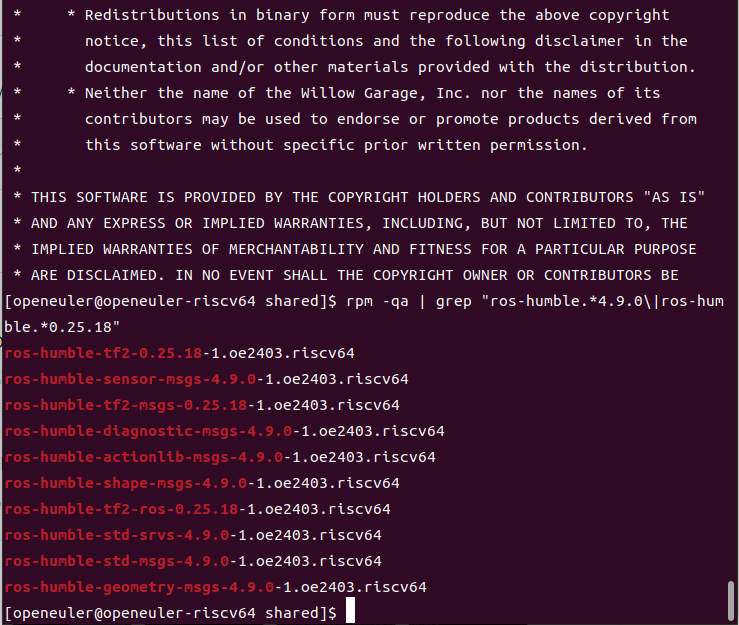
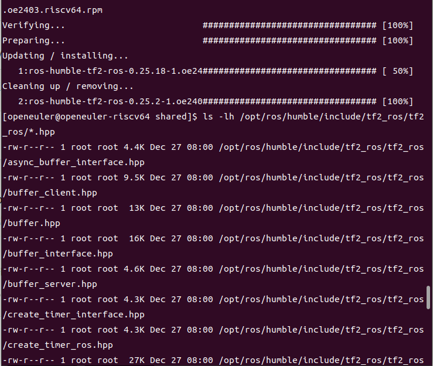
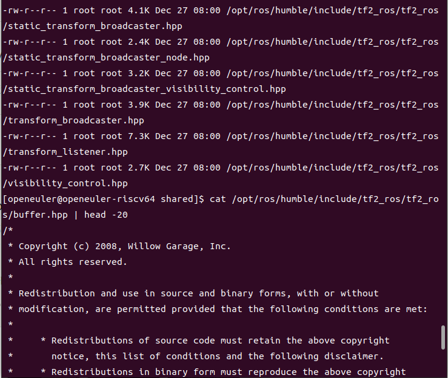

# ROS2 Common Interfaces & Geometry2 升级指南

## 1. 概述

本文档描述了在 openEuler 24.03 LTS RISC-V 平台上升级 ROS2 Humble 的 common_interfaces 和 geometry2 软件包的完整流程。

本次升级解决了 **issue #328**：geometry2 缺失 `.hpp` 头文件导致 C++ 项目编译失败的问题。

升级的软件包包括：

### common_interfaces 包组（13个包）
- **ros-humble-std-msgs**：标准消息定义（4.2.3 → 4.9.0）
- **ros-humble-std-srvs**：标准服务定义（4.2.3 → 4.9.0）
- **ros-humble-actionlib-msgs**：Action 消息定义（4.2.3 → 4.9.0）
- **ros-humble-shape-msgs**：形状消息定义（4.2.3 → 4.9.0）
- **ros-humble-geometry-msgs**：几何消息定义（4.2.3 → 4.9.0，新增 VelocityStamped 等消息）
- **ros-humble-diagnostic-msgs**：诊断消息定义（4.2.3 → 4.9.0）
- **ros-humble-sensor-msgs**：传感器消息定义（4.2.3 → 4.9.0）
- **ros-humble-sensor-msgs-py**：传感器消息 Python 绑定（4.2.3 → 4.9.0）
- **ros-humble-nav-msgs**：导航消息定义（4.2.3 → 4.9.0）
- **ros-humble-stereo-msgs**：立体视觉消息定义（4.2.3 → 4.9.0）
- **ros-humble-trajectory-msgs**：轨迹消息定义（4.2.3 → 4.9.0）
- **ros-humble-visualization-msgs**：可视化消息定义（4.2.3 → 4.9.0）
- **ros-humble-common-interfaces**：元包（4.2.3 → 4.9.0）

### geometry2 包组（14个包）
- **ros-humble-tf2**：坐标变换核心库（0.25.2 → 0.25.18）
- **ros-humble-tf2-ros**：TF2 ROS 集成（0.25.2 → 0.25.18，**包含 .hpp 头文件**）⭐
- **ros-humble-tf2-msgs**：TF2 消息定义（0.25.2 → 0.25.18）
- **ros-humble-tf2-py**：TF2 Python 绑定（0.25.2 → 0.25.18）
- **ros-humble-tf2-bullet**：TF2 Bullet 集成（0.25.2 → 0.25.18）
- **ros-humble-tf2-eigen**：TF2 Eigen 集成（0.25.2 → 0.25.18）
- **ros-humble-tf2-eigen-kdl**：TF2 Eigen-KDL 集成（0.25.2 → 0.25.18）
- **ros-humble-tf2-geometry-msgs**：TF2 几何消息转换（0.25.2 → 0.25.18）
- **ros-humble-tf2-kdl**：TF2 KDL 集成（0.25.2 → 0.25.18）
- **ros-humble-tf2-sensor-msgs**：TF2 传感器消息转换（0.25.2 → 0.25.18）
- **ros-humble-tf2-tools**：TF2 工具集（0.25.2 → 0.25.18）
- **ros-humble-tf2-ros-py**：TF2 ROS Python 绑定（0.25.2 → 0.25.18）
- **ros-humble-examples-tf2-py**：TF2 Python 示例（0.25.2 → 0.25.18）
- **ros-humble-geometry2**：元包（0.25.2 → 0.25.18）

## 2. 升级背景

### 2.1 问题描述（issue #328）

在编译依赖 geometry2 的 C++ 项目时，出现以下错误：

```
fatal error: tf2_ros/buffer.hpp: No such file or directory
```

**根本原因**：
- openEuler 上的 geometry2 版本为 **0.25.2**（旧版本）
- 该版本只提供 `.h` 头文件，缺少 `.hpp` 头文件
- 新版本的 C++ 项目依赖 `.hpp` 头文件（C++ 风格）

### 2.2 解决方案

升级到 geometry2 **0.25.18**，该版本提供了完整的 `.hpp` 头文件，与 `.h` 头文件共存，满足向后兼容性。

同时升级 common_interfaces 到 **4.9.0**，因为 geometry2 依赖新版本的消息定义（如 geometry_msgs 中的 VelocityStamped）。

## 3. 环境要求

### 3.1 硬件环境

- RISC-V 64 位处理器（或 QEMU 模拟器）

### 3.2 软件环境

| 组件 | 版本 |
|------|------|
| 操作系统 | openEuler 24.03 LTS |
| 内核版本 | 6.6.0-31.0.0.39.oe2403.riscv64 |
| ROS2 发行版 | Humble Hawksbill |

### 3.3 依赖要求

升级前请确保系统已安装 ROS2 Humble 基础环境。升级过程会自动处理依赖关系。

## 4. 升级步骤

### 4.1 获取 RPM 安装包

本项目提供预编译的 RPM 安装包，共 **27 个 RPM 文件**：

- **common_interfaces**：13 个 RPM
- **geometry2**：14 个 RPM

RPM 文件位于 `rpm/` 目录下。

### 4.2 升级安装（按依赖顺序）

使用 `rpm -Uvh` 命令升级旧版本。**必须按照以下顺序安装**，否则会因依赖关系失败。

#### 第一批：基础消息包（无依赖）

```bash
cd rpm/common_interfaces

# 1. std-msgs（最基础）
sudo rpm -Uvh ros-humble-std-msgs-4.9.0-1.oe2403.riscv64.rpm

# 2. std-srvs
sudo rpm -Uvh ros-humble-std-srvs-4.9.0-1.oe2403.riscv64.rpm

# 3. actionlib-msgs
sudo rpm -Uvh ros-humble-actionlib-msgs-4.9.0-1.oe2403.riscv64.rpm

# 4. shape-msgs
sudo rpm -Uvh ros-humble-shape-msgs-4.9.0-1.oe2403.riscv64.rpm
```



*图 4.1：第一批包升级成功，自动替换旧版本（4.2.3 → 4.9.0）*

#### 第二批：依赖第一批的包

```bash
# 5. geometry-msgs（依赖 std-msgs）
sudo rpm -Uvh ros-humble-geometry-msgs-4.9.0-1.oe2403.riscv64.rpm

# 6. diagnostic-msgs
sudo rpm -Uvh ros-humble-diagnostic-msgs-4.9.0-1.oe2403.riscv64.rpm
```



*图 4.2：第二批包升级成功，包括关键的 geometry-msgs*

#### 第三批：sensor-msgs

```bash
# 7. sensor-msgs（依赖 geometry-msgs）
sudo rpm -Uvh ros-humble-sensor-msgs-4.9.0-1.oe2403.riscv64.rpm
```



*图 4.3：sensor-msgs 升级成功*

#### 第四批：geometry2 基础包

```bash
cd ../geometry2

# 8. tf2-msgs
sudo rpm -Uvh ros-humble-tf2-msgs-0.25.18-1.oe2403.riscv64.rpm

# 9. tf2（核心库）
sudo rpm -Uvh ros-humble-tf2-0.25.18-1.oe2403.riscv64.rpm
```

#### 第五批：⭐ tf2-ros（关键包）

```bash
# 10. tf2-ros（包含 .hpp 头文件）
sudo rpm -Uvh ros-humble-tf2-ros-0.25.18-1.oe2403.riscv64.rpm
```

安装完成后，系统会自动清理旧版本（0.25.2）。

### 4.3 验证升级

#### 4.3.1 验证已安装的包版本

```bash
# 查看所有升级的包
rpm -qa | grep "ros-humble.*4.9.0\|ros-humble.*0.25.18"
```

预期输出（部分）：

```
ros-humble-std-msgs-4.9.0-1.oe2403.riscv64
ros-humble-geometry-msgs-4.9.0-1.oe2403.riscv64
ros-humble-sensor-msgs-4.9.0-1.oe2403.riscv64
ros-humble-tf2-0.25.18-1.oe2403.riscv64
ros-humble-tf2-ros-0.25.18-1.oe2403.riscv64
...
```



*图 4.4：验证所有包已成功升级到新版本*

#### 4.3.2 验证 .hpp 头文件（关键验证）

```bash
# 查看所有 tf2_ros 的 .hpp 头文件
ls -lh /opt/ros/humble/include/tf2_ros/tf2_ros/*.hpp
```

预期输出：

```
-rw-r--r-- 1 root root 4.4K Dec 27 08:00 /opt/ros/humble/include/tf2_ros/tf2_ros/async_buffer_interface.hpp
-rw-r--r-- 1 root root 9.5K Dec 27 08:00 /opt/ros/humble/include/tf2_ros/tf2_ros/buffer_client.hpp
-rw-r--r-- 1 root root  13K Dec 27 08:00 /opt/ros/humble/include/tf2_ros/tf2_ros/buffer.hpp ⭐
-rw-r--r-- 1 root root  16K Dec 27 08:00 /opt/ros/humble/include/tf2_ros/tf2_ros/buffer_interface.hpp
-rw-r--r-- 1 root root 7.3K Dec 27 08:00 /opt/ros/humble/include/tf2_ros/tf2_ros/transform_listener.hpp
...（共15个 .hpp 头文件）
```



*图 4.5：验证 .hpp 头文件存在，共15个文件*



*图 4.6：完整的 .hpp 头文件列表*

#### 4.3.3 验证 buffer.hpp 内容

```bash
# 查看 buffer.hpp 文件内容（前20行）
cat /opt/ros/humble/include/tf2_ros/tf2_ros/buffer.hpp | head -20
```

预期输出：

```cpp
/*
 * Copyright (c) 2008, Willow Garage, Inc.
 * All rights reserved.
 ...
```

标准的 C++ 头文件，包含完整的版权信息和代码。

## 5. 升级效果

### 5.1 解决的问题

✅ **issue #328 已解决**：tf2_ros 现在提供完整的 `.hpp` 头文件

- **buffer.hpp** 文件存在（13K）
- **transform_listener.hpp** 文件存在（7.3K）
- 共计 **15 个 .hpp 头文件**，覆盖所有 TF2 ROS 接口

### 5.2 向后兼容性

- ✅ `.h` 头文件保留，旧项目可继续使用
- ✅ `.hpp` 头文件新增，新项目可使用 C++ 风格
- ✅ 所有消息定义向后兼容（只新增，无删除）

### 5.3 新增功能

#### common_interfaces 新增消息

- **geometry_msgs/VelocityStamped**：带时间戳的速度消息
- **geometry_msgs/PolygonInstance**：多边形实例
- **geometry_msgs/PolygonInstanceStamped**：带时间戳的多边形实例

#### geometry2 新增功能

- C++ 风格的头文件（`.hpp`）
- 改进的类型安全性
- 更好的 IDE 支持（代码补全、语法高亮）

## 6. 源码构建说明

### 6.1 源码文件

本项目提供完整的源码包，位于 `src/` 目录：

#### common_interfaces 源码（13个）

- ros-humble-std-msgs_4.9.0.orig.tar.gz
- ros-humble-geometry-msgs_4.9.0.orig.tar.gz
- ros-humble-sensor-msgs_4.9.0.orig.tar.gz
- ...（共13个 .tar.gz 文件）

#### geometry2 源码（14个）

- ros-humble-tf2_0.25.18.orig.tar.gz
- ros-humble-tf2-ros_0.25.18.orig.tar.gz
- ...（共14个 .tar.gz 文件）

### 6.2 Spec 文件

本项目提供完整的 RPM 构建规格文件，位于 `spec/` 目录：

#### common_interfaces spec 文件（14个）

- 13 个子包 spec 文件
- 1 个 `_multibuild` 配置文件（用于 OBS 多包构建）

#### geometry2 spec 文件（15个）

- 14 个子包 spec 文件
- 1 个 `_multibuild` 配置文件

### 6.3 补丁文件

本项目**无需补丁**。所有源码均来自 ROS2 官方仓库，未做任何修改。

### 6.4 使用 OBS 构建

如需在 Open Build Service 上构建，请按以下步骤操作：

```bash
# 1. 创建 OBS 项目
osc mkpac common_interfaces
osc mkpac geometry2

# 2. 上传源码、spec 文件和 _multibuild
cd common_interfaces
cp path/to/src/common_interfaces/* .
cp path/to/spec/common_interfaces/* .
osc add *
osc commit -m "Add common_interfaces 4.9.0"

cd ../geometry2
cp path/to/src/geometry2/* .
cp path/to/spec/geometry2/* .
osc add *
osc commit -m "Add geometry2 0.25.18"

# 3. 触发构建
osc rebuild home:<username> common_interfaces
osc rebuild home:<username> geometry2

# 4. 查看构建状态
osc results
```

OBS 会自动处理依赖关系，按正确的顺序构建所有包。

## 7. 文件清单

```
ros2_common_interfaces_geometry2_upgrade/
├── rpm/
│   ├── common_interfaces/          # 13 个 RPM
│   │   ├── ros-humble-std-msgs-4.9.0-1.oe2403.riscv64.rpm
│   │   ├── ros-humble-geometry-msgs-4.9.0-1.oe2403.riscv64.rpm
│   │   └── ...（共13个）
│   └── geometry2/                   # 14 个 RPM
│       ├── ros-humble-tf2-0.25.18-1.oe2403.riscv64.rpm
│       ├── ros-humble-tf2-ros-0.25.18-1.oe2403.riscv64.rpm
│       └── ...（共14个）
├── src/
│   ├── common_interfaces/          # 13 个源码包
│   │   ├── ros-humble-std-msgs_4.9.0.orig.tar.gz
│   │   ├── ros-humble-geometry-msgs_4.9.0.orig.tar.gz
│   │   └── ...（共13个）
│   └── geometry2/                   # 14 个源码包
│       ├── ros-humble-tf2_0.25.18.orig.tar.gz
│       ├── ros-humble-tf2-ros_0.25.18.orig.tar.gz
│       └── ...（共14个）
├── spec/
│   ├── common_interfaces/          # 13 个 spec + 1 个 _multibuild
│   │   ├── std-msgs.spec
│   │   ├── geometry-msgs.spec
│   │   ├── _multibuild
│   │   └── ...（共14个文件）
│   └── geometry2/                   # 14 个 spec + 1 个 _multibuild
│       ├── tf2.spec
│       ├── tf2-ros.spec
│       ├── _multibuild
│       └── ...（共15个文件）
├── patches/
│   ├── common_interfaces/          # 空（无补丁）
│   └── geometry2/                   # 空（无补丁）
├── images/
│   ├── 01_install_batch1.png       # 第一批包安装
│   ├── 02_install_batch2.png       # 第二批包安装
│   ├── 03_install_batch3.png       # 第三批包安装
│   ├── 04_verify_hpp_files.png     # 验证 .hpp 文件
│   ├── 05_more_hpp_files.png       # 更多 .hpp 文件
│   └── 06_verify_installed.png     # 验证已安装包
└── README.md                        # 本文档
```

