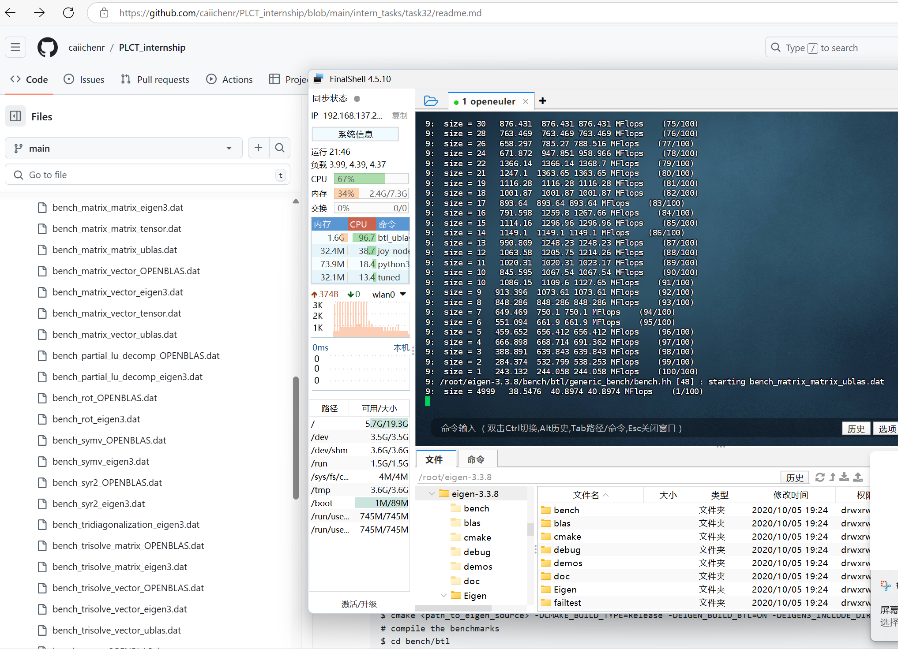

# 测试eigen3

## 测试环境

### 硬件环境
milk-v meles开发板

### 系统环境
NAME="openEuler"
VERSION="23.09"
ID="openEuler"
VERSION_ID="23.09"
PRETTY_NAME="openEuler 23.09"
ANSI_COLOR="0;31"

## 测试流程
Eigen 版本：3.3.8
Benchmars 情况：https://eigen.tuxfamily.org/index.php?title=How_to_run_the_benchmark_suite

```
# create a working directory
$ mkdir build
$ cd build
# create the makefiles
$ cmake <path_to_eigen_source> -DCMAKE_BUILD_TYPE=Release -DEIGEN_BUILD_BTL=ON -DEIGEN3_INCLUDE_DIR=<path_to_eigen_source>
# compile the benchmarks
$ cd bench/btl
$ make -j4
# run the benchmark (on a single core)
# VERY IMPORTANT : logout, log into a console (ctrl+shift+F1) and shutdown your X server (e.g.: sudo init 3), and stop as most as services as you can
$ OMP_NUM_THREADS=1 ctest -V
# - go sleep -
# copy the results into the same directory
$ mkdir data/set1
$ cp libs/*/*.dat data/set1
# build the nice plots
$ cd data
$ ./go_mean set1/
# the plots (png and pdf files) are in set1/
```

## 预见问题及解决方式
在编译安装的时候riscv版本openeuler缺少SuperLU
编译安装SuperLU
```
git clone https://github.com/xiaoyeli/superlu.git
cd superlu
mkdir build
cd build
cmake ..
make
make install
make install
```

测试通过即为安装成功

## 测试eigen3过慢停止测试，准备优化
