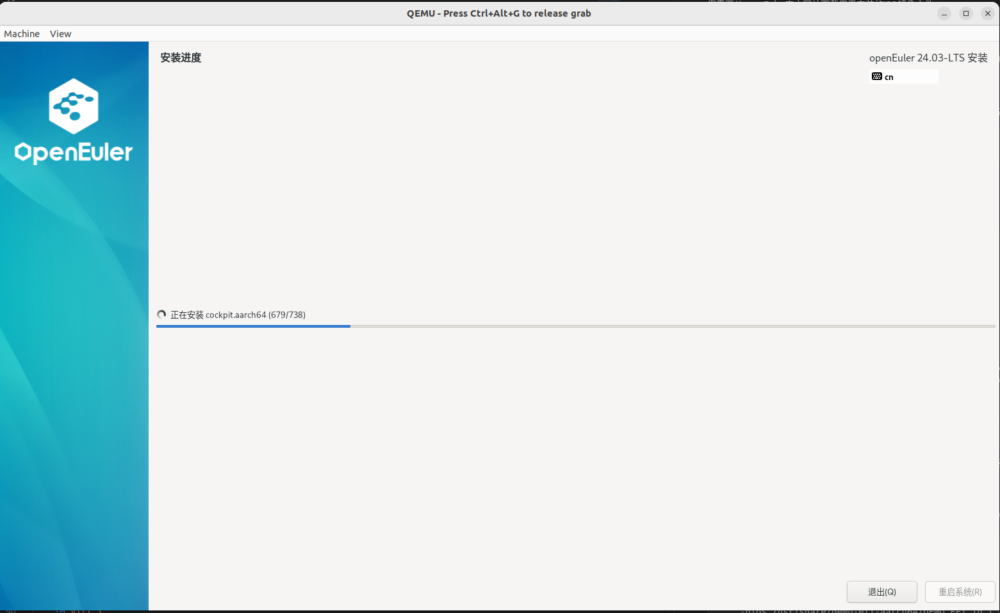
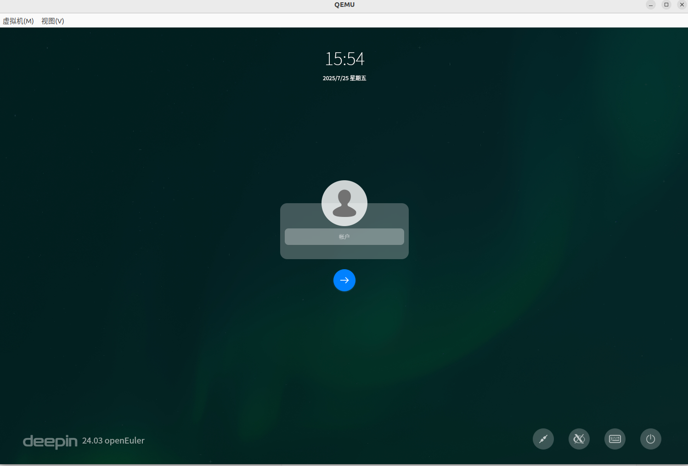
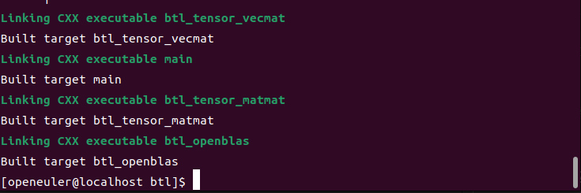

 **在 Ubuntu 上通过 QEMU 高效部署与测试 openEuler 24.03 arm架构虚拟机**

### **文档导览**

本教程将引导您完成在 `Ubuntu` 宿主机上，使用 `QEMU` 从零开始创建一台 openEuler 24.03 LTS arm 虚拟机的全过程。内容涵盖了从环境准备、系统安装、图形桌面配置，到最终在虚拟机内部编译和运行 `Eigen3` 科学计算库的性能测试。

-----

## **1.宿主机环境配置与 QEMU 安装**

本模块旨在完成宿主机（您的 Ubuntu 系统）的准备工作，核心是安装 QEMU 并验证硬件虚拟化支持。

### **1. 系统要求与环境更新**

在开始之前，请确保您的宿主机满足以下条件：

  * **硬件**:
      * x86\_64 架构处理器
      * 至少 8GB 物理内存（RAM）。
      * 至少 20GB 可用磁盘空间。
  * **软件**:
      * Ubuntu 20.04 LTS 或更高版本。
      * 一个拥有 `sudo` 权限的本地账户。

首先，更新您的系统软件包列表和已安装的软件：

```bash
sudo apt update && sudo apt upgrade -y
```

### **2. 安装 QEMU**
对于ARM架构的模拟，您需要安装`qemu-system-arm`。此外，安装过程需要UEFI固件，在Ubuntu中可以通过`qemu-efi-aarch64`包获得。

请执行以下命令来安装所需软件包：

```bash
sudo apt update
sudo apt install qemu-system-arm qemu-efi-aarch64 qemu-utils
```

  * `qemu-system-arm` 是用于模拟ARM架构系统的主程序。
  * `qemu-efi-aarch64` 提供了aarch64架构的UEFI固件。
  * `qemu-utils` 包含了用于创建和管理磁盘镜像的工具，例如 `qemu-img`。

### **3.下载openEuler 24.03 aarch64镜像**

您需要从openEuler官方网站下载用于安装的ISO镜像文件。

1.  访问下载页面：[https://www.openeuler.org/zh/download/](https://www.openeuler.org/zh/download/)
2.  在页面上找到 **24.03 LTS** 版本。
3.  选择 **aarch64** 架构，并下载 **DVD** 镜像。文件名通常类似于 `openEuler-24.03-LTS-aarch64-dvd.iso`。

### **4.创建虚拟机硬盘镜像**

使用`qemu-img`命令来创建一个虚拟硬盘文件。这个文件将作为虚拟机的硬盘使用。建议创建一个60GB大小的`qcow2`格式镜像。

```bash
qemu-img create -f qcow2 openEuler-24.03-aarch64.img 60G
```

### **5.启动虚拟机并安装openEuler**

接下来，我们将使用一个启动命令来开始安装过程。


```bash
qemu-system-aarch64 \
    -m 8G \
    -cpu cortex-a72 \
    -smp 4 \
    -M virt \
    -bios /usr/share/qemu-efi-aarch64/QEMU_EFI.fd \
    -device virtio-gpu-pci \
    -device nec-usb-xhci \
    -device usb-kbd \
    -device usb-mouse \
    -netdev user,id=net0 -device virtio-net-pci,netdev=net0 \
    -drive if=none,file=openEuler-24.03-LTS-aarch64-dvd.iso,id=cdrom,media=cdrom \
    -device virtio-scsi-pci \
    -device scsi-cd,drive=cdrom \
    -drive if=none,file=openEuler-24.03-aarch64.img,id=hd0 \
    -device virtio-blk-device,drive=hd0
```

执行此命令后，QEMU窗口将启动并从ISO文件引导，进入openEuler的安装界面。请按照图形界面的提示完成安装。

### **6.启动已安装的openEuler系统**

安装完成后，关闭虚拟机。现在，使用以下命令来启动您已经安装好的系统。这个命令与上一步类似，但不再加载ISO安装文件。

```bash
qemu-system-aarch64 \
    -m 8G \
    -cpu cortex-a72 \
    -smp 4 \
    -M virt \
    -bios /usr/share/qemu-efi-aarch64/QEMU_EFI.fd \
    -device virtio-gpu-pci \
    -device nec-usb-xhci \
    -device usb-kbd \
    -device usb-mouse \
    -netdev user,id=net0 -device virtio-net-pci,netdev=net0 \
    -drive if=none,file=openEuler-24.03-aarch64.img,id=hd0 \
    -device virtio-blk-device,drive=hd0
```


首次启动进入openEuler系统后，默认可能没有图形桌面。您可以根据文档的指导，在虚拟机内部打开终端，安装DDE或UKUI桌面环境。

**首次进入系统的命令**
```bash
qemu-system-aarch64 \
    -m 8G \
    -cpu cortex-a72 \
    -smp 4 \
    -M virt \
    -bios /usr/share/qemu-efi-aarch64/QEMU_EFI.fd \
    -device virtio-gpu-pci \
    -device nec-usb-xhci \
    -device usb-kbd \
    -device usb-mouse \
    -netdev user,id=net0 -device virtio-net-pci,netdev=net0 \
    -drive if=none,file=openEuler-24.03-aarch64.img,id=hd0 \
    -device virtio-blk-device,drive=hd0
```

**安装DDE桌面：**

1.  安装DDE软件包：
    ```bash
    yum install dde
    ```
2.  设置默认以图形化界面启动：
    ```bash
    systemctl set-default graphical.target
    ```
3.  重启虚拟机：
    ```bash
    reboot
    ```

### **7.创建 `vm-manager.sh` 脚本**

在您的工作目录 (`~/openeuler-vm`) 中，创建 `vm-manager.sh` 文件并写入以下内容：

```bash
# 创建并填充虚拟机管理脚本
cat > vm-manager.sh << 'EOF'
#!/usr/bin/env bash

# =================================================================
# QEMU aarch64 (ARM64) 虚拟机启动脚本
# 作者: Gemini (基于用户提供的 x86 脚本适配)
# =================================================================

# --- 颜色定义，用于美化输出 ---
# 使用 \001 和 \002 来告诉 Readline 这些是非打印字符
RESTORE=$(echo -en '\001\033[0m\002')
YELLOW=$(echo -en '\001\033[00;33m\002')
RED=$(echo -en '\001\033[00;31m\002')

# --- 虚拟机配置 ---
# 你可以在这里修改默认配置
vcpu=8
memory=8 # 单位: GB
disk="openeuler-24.03-aarch64.img" # 目标虚拟硬盘文件
uefi_fw="/usr/share/qemu-efi-aarch64/QEMU_EFI.fd" # aarch64 UEFI 固件路径
ssh_port=12056 # 映射到虚拟机的 22 端口
shared_dir="$HOME/openeuler-arm-vm/shared" # 宿主机与虚拟机共享的目录

# --- 检查依赖 ---
# 检查虚拟硬盘文件是否存在
if [ ! -f "$disk" ]; then
    echo -e "${RED}错误: 虚拟硬盘文件 '${disk}' 不存在！${RESTORE}"
    echo -e "${RED}请先使用 'qemu-img create' 命令创建它，或修改脚本中的 'disk' 变量。${RESTORE}"
    exit 1
fi

# 检查 UEFI 固件是否存在
if [ ! -f "$uefi_fw" ]; then
    echo -e "${RED}错误: aarch64 UEFI 固件 '${uefi_fw}' 不存在！${RESTORE}"
    echo -e "${RED}请确认已安装 'qemu-efi-aarch64' 包 (sudo apt install qemu-efi-aarch64)。${RESTORE}"
    exit 1
fi

# 检查共享目录是否存在，不存在则创建
if [ ! -d "$shared_dir" ]; then
    echo -e "${YELLOW}:: 共享目录 '${shared_dir}' 不存在，正在创建...${RESTORE}"
    mkdir -p "$shared_dir"
fi


# --- 用户交互菜单 ---
echo -e "${YELLOW}请选择启动模式：${RESTORE}"
echo -e "${YELLOW}1. 无头模式 (纯串口/SSH，无图形界面，性能最高)${RESTORE}"
echo -e "${YELLOW}2. 图形模式 (带图形窗口、鼠标、键盘和音频支持)${RESTORE}"
read -p "输入 1 或 2 后按回车: " mode
echo ""


# --- 根据选择构建 QEMU 命令 ---
# 定义通用参数
# 注意: ARM 模拟无法使用 KVM 和 -cpu host，性能会低于 x86
qemu_base_cmd="qemu-system-aarch64 \
  -M virt \
  -cpu cortex-a72 \
  -smp ${vcpu} -m ${memory}G \
  -bios ${uefi_fw} \
  -drive file=${disk},if=none,id=hd0,format=qcow2,cache=none \
  -device virtio-blk-pci,drive=hd0 \
  -object rng-random,filename=/dev/urandom,id=rng0 \
  -device virtio-rng-pci,rng=rng0 \
  -netdev user,id=usernet,hostfwd=tcp::${ssh_port}-:22\
  -device virtio-net-pci,netdev=usernet \
  -virtfs local,path=${shared_dir},mount_tag=host_share,security_model=passthrough"

if [ "$mode" = "1" ]; then
    # 模式1: 无头服务器模式
    echo -e "${YELLOW}:: 已选择无头模式。${RESTORE}"
    cmd="${qemu_base_cmd} \
      -nographic \
      -serial mon:stdio"
else
    # 模式2: 图形桌面模式 (默认选项)
    echo -e "${YELLOW}:: 已选择图形模式。${RESTORE}"
    cmd="${qemu_base_cmd} \
      -device virtio-gpu-pci \
      -display default,show-cursor=on \
      -device qemu-xhci \
      -device usb-tablet \
      -audiodev pa,id=snd0 \
      -device virtio-sound-pci,audiodev=snd0"
fi


# --- 显示最终配置并启动 ---
echo ""
echo -e "${YELLOW}:: 即将启动虚拟机...${RESTORE}"
echo -e "${YELLOW}:: 使用以下配置:${RESTORE}"
echo "-------------------------------------"
echo -e "${YELLOW}  CPU 型号: cortex-a72 (模拟)${RESTORE}"
echo -e "${YELLOW}  CPU 核心: ${vcpu}${RESTORE}"
echo -e "${YELLOW}  内存: ${memory}G${RESTORE}"
echo -e "${YELLOW}  虚拟硬盘: ${disk}${RESTORE}"
echo -e "${YELLOW}  UEFI 固件: ${uefi_fw}${RESTORE}"
echo -e "${YELLOW}  SSH 端口 (Host -> VM): ${ssh_port} -> 22${RESTORE}"
echo -e "${YELLOW}  共享目录 (Host -> VM): ${shared_dir} -> (挂载标签: host_share)${RESTORE}"
echo "-------------------------------------"
echo -e "${YELLOW}:: 提示: ARM 架构为纯软件模拟，性能远低于 KVM 加速的 x86 虚拟机。${RESTORE}"
echo -e "${YELLOW}:: 提示: 要在虚拟机内挂载共享目录, 请执行: sudo mount -t 9p -o trans=virtio host_share /mnt/share ${RESTORE}"
echo ""

# 延迟2秒，让用户看清配置
sleep 2

# 执行命令
eval "$cmd"
EOF
```

### **2. 赋予脚本执行权限**

```bash
chmod +x vm-manager.sh
```

现在，您只需在 `~/openeuler-vm-arm` 目录下运行 `./vm-manager.sh`，即可通过交互式菜单方便地启动您的 openEuler 虚拟机。




### **2. 下载 Eigen3 源代码**

我们选择一个广泛使用的稳定版本 `3.3.8` 进行测试。

```bash
# 下载 Eigen 3.3.8 源码包
wget https://gitlab.com/libeigen/eigen/-/archive/3.3.8/eigen-3.3.8.tar.gz

# 解压源码包
tar -zxvf eigen-3.3.8.tar.gz
```

### **3. 编译和构建 Eigen3**

进入源码目录，并使用 `CMake` 进行配置和构建。

```bash
cd eigen-3.3.8/

# 创建一个独立的构建目录，这是CMake推荐的做法
mkdir build
cd build

# 运行CMake配置，指定安装路径并启用测试
cmake .. -DCMAKE_INSTALL_PREFIX=/usr/local -DCMAKE_BUILD_TYPE=Release -DEIGEN_BUILD_PKGCONFIG=ON  -DBUILD_TESTING=ON  -DEIGEN_BUILD_BTL=ON  -Wno-dev

# 进入基准测试目录并开始编译 (使用4个核心)
cd bench/btl
make -j4
```




### **4. 运行 Eigen3 基准测试套件**

测试套件依赖 `gnuplot` 来生成性能图表，但 openEuler 官方源未提供，需要手动编译安装。同时，部分测试脚本需要微调以兼容新环境。

  * **第一步：准备测试数据**

    ```bash
    # 将编译生成的库性能数据复制到结果目录
    mkdir data/set1
    OMP_NUM_THREADS=1 ctest -V
    cp libs/*/*.dat data/set1/
    ```

  * **第二步：编译安装 gnuplot**

    ```bash
    # 进入测试数据目录
    cd data

    # 下载 gnuplot 源码
    wget https://sourceforge.net/projects/gnuplot/files/gnuplot/6.0.3/gnuplot-6.0.3.tar.gz/download -O gnuplot-6.0.3.tar.gz

    # 解压并进入源码目录
    tar -xzf gnuplot-6.0.3.tar.gz
    cd gnuplot-6.0.3

    # 配置、编译并安装
    ./configure --with-qt=qt5
    make -j4
    sudo make install

    # 返回上一级目录
    cd ..
    ```

  * **第三步：修正测试脚本**

    ```bash
    # 修正 go_mean 脚本中的数值比较语法
    # 原内容: if [ $# < 1 ]; then
    # 修改为: if [ $# -lt 1 ]; then
    sed -i "s/if \[ \$# < 1 \]; then/if \[ \$# -lt 1 \]; then/g" go_mean

    # 修正 gnuplot 配置文件中已弃用的命令
    # 原内容: set clabel '%8.3g'
    # 修改为: set cntrlabel format '%8.3g'
    sed -i "s/set clabel '%8.3g'/set cntrlabel format '%8.3g'/g" gnuplot_common_settings.hh
    ```

  * **第四步：生成测试报告**

    ```bash
    # 运行处理脚本，生成图表
    ./go_mean set1/
    ```

测试完成后，生成的性能图表（.png 和 .pdf 文件）将位于 `set1/` 目录中。
