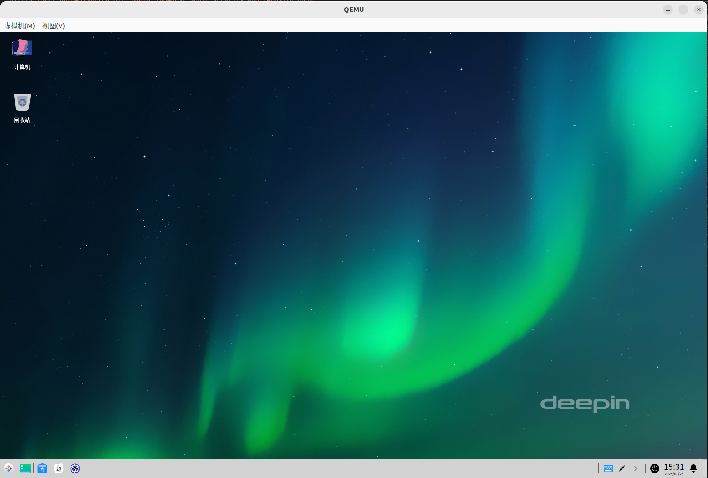
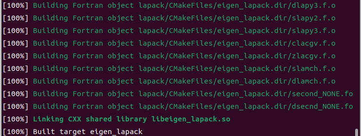
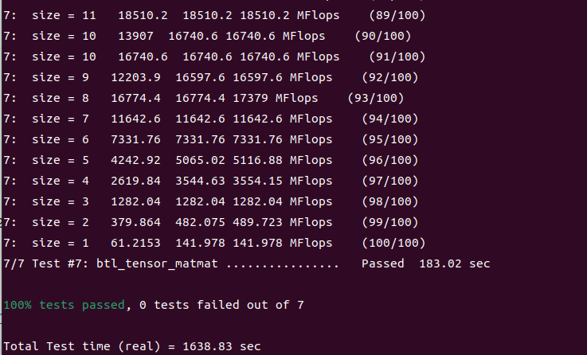

##好的，我已经根据您的要求，在不改变核心技术流程和信息的前提下，对这份 Markdown 文档进行了排版优化和内容润色，使其结构更清晰、更具可读性。

-----

# **在 Ubuntu 上通过 QEMU 高效部署与测试 openEuler 24.03 虚拟机**

### **文档导览**

本教程将引导您完成在 `Ubuntu` 宿主机上，使用 `QEMU` 和 `KVM` 从零开始创建一台 openEuler 24.03 LTS x86\_64 虚拟机的全过程。内容涵盖了从环境准备、系统安装、图形桌面配置，到最终在虚拟机内部编译和运行 `Eigen3` 科学计算库的性能测试。

-----

## **模块一：宿主机环境配置与 QEMU 安装**

本模块旨在完成宿主机（您的 Ubuntu 系统）的准备工作，核心是安装 QEMU 并验证硬件虚拟化支持。

### **1. 系统要求与环境更新**

在开始之前，请确保您的宿主机满足以下条件：

  * **硬件**:
      * x86\_64 架构处理器，并启用 `VT-x` (Intel) 或 `AMD-V` (AMD) 虚拟化技术。
      * 至少 8GB 物理内存（RAM）。
      * 至少 20GB 可用磁盘空间。
  * **软件**:
      * Ubuntu 20.04 LTS 或更高版本。
      * 一个拥有 `sudo` 权限的本地账户。

首先，更新您的系统软件包列表和已安装的软件：

```bash
sudo apt update && sudo apt upgrade -y
```

### **2. 确认硬件虚拟化支持**

执行以下命令，验证您的 CPU 是否支持硬件虚拟化。如果输出的数字**大于0**，则表示支持。

```bash
# 检查CPU是否支持KVM加速
egrep -c '(vmx|svm)' /proc/cpuinfo
```

### **3. 从源码编译安装 QEMU**

为了体验最新的功能并获得最佳性能，我们选择从源码编译安装 QEMU。

  * **第一步：安装编译依赖**

    ```bash
    sudo apt install -y build-essential zlib1g-dev libglib2.0-dev \
        libfdt-dev libpixman-1-dev libaio-dev libbluetooth-dev \
        libbrlapi-dev libbz2-dev libcap-ng-dev libcurl4-gnutls-dev \
        libgtk-3-dev libibverbs-dev libjpeg8-dev libncurses5-dev \
        libnuma-dev librbd-dev librdmacm-dev libsasl2-dev \
        libsdl2-dev libseccomp-dev libsnappy-dev libssh2-1-dev \
        libvde-dev libvdeplug-dev libxen-dev liblzo2-dev \
        valgrind xfslibs-dev ninja-build meson
    ```

  * **第二步：下载、配置与编译**

    ```bash
    # 进入/tmp目录进行临时操作
    cd /tmp

    # 下载QEMU源码 (版本号可根据官网最新版本替换)
    wget https://download.qemu.org/qemu-10.0.2.tar.xz
    tar xf qemu-10.0.2.tar.xz
    cd qemu-10.0.2

    # 配置编译选项，指定目标平台和所需功能
    # --target-list=x86_64-softmmu: 只编译x86_64模拟器
    # --enable-kvm: 启用KVM加速
    # --prefix=/usr/local: 指定安装路径
    ./configure --target-list=x86_64-softmmu --enable-kvm --enable-curses \
                --enable-virtfs --enable-vhost-user --enable-slirp \
                --enable-user --prefix=/usr/local

    # 使用所有CPU核心并行编译，然后安装
    make -j$(nproc)
    sudo make install
    ```

  * **第三步：验证安装**
    检查 QEMU 版本，确保安装成功并能正确执行。

    ```bash
    qemu-system-x86_64 --version
    ```

-----

## **模块二：虚拟机资源准备**

本模块将准备创建虚拟机所需的核心文件：一个用于存放所有资源的工作目录、openEuler 系统安装镜像以及一块虚拟硬盘。

### **1. 创建专属工作目录**

为了方便管理虚拟机相关文件，我们建议创建一个独立的目录。

```bash
# 在用户主目录下创建并进入该目录
mkdir -p ~/openeuler-vm
cd ~/openeuler-vm
```

### **2. 下载 openEuler 24.03 ISO 镜像**

从官方认可的镜像源下载系统安装 ISO 文件，使用国内镜像源可大幅提升下载速度。

```bash
# 下载 openEuler 24.03 LTS SP1 的 x86_64 DVD 镜像
wget https://mirrors.pku.edu.cn/openeuler/openEuler-24.03-LTS-SP1/ISO/x86_64/openEuler-24.03-LTS-SP1-x86_64-dvd.iso
```

### **3. 创建 qcow2 格式虚拟硬盘**

我们使用 `qemu-img` 工具创建虚拟硬盘。`qcow2` 格式是推荐的选择，因为它支持动态扩容（thin provisioning）、压缩和快照等高级功能，非常适合开发与测试场景。

```bash
# 创建一个逻辑上限为60GB的qcow2格式虚拟硬盘
# 文件初始占用空间很小，会根据实际使用量增长
qemu-img create -f qcow2 openeuler-24.03-disk.qcow2 60G

# (可选) 查看新建虚拟硬盘的详细信息
qemu-img info openeuler-24.03-disk.qcow2
```

-----

## **模块三：首次引导与 openEuler 系统安装**

现在，我们将启动虚拟机并完成 openEuler 操作系统的安装。

### **1. 执行安装引导命令**

此命令会启动一个配置好的虚拟机，挂载我们准备的虚拟硬盘和 ISO 镜像，并设置从 ISO 镜像优先启动。

```bash
# openEuler 24.03 安装引导命令
qemu-system-x86_64 \
    -enable-kvm \
    -machine q35 \
    -cpu host \
    -m 4G \
    -smp 4 \
    -drive file=openeuler-24.03-disk.qcow2,format=qcow2,if=virtio \
    -drive file=openEuler-24.03-LTS-SP1-x86_64-dvd.iso,media=cdrom,readonly \
    -boot order=d \
    -vga virtio \
    -display gtk,gl=on \
    -netdev user,id=net0 \
    -device virtio-net-pci,netdev=net0
```

> **核心参数解读**: `-boot order=d` 是本步骤的关键。它强制虚拟机从 CD-ROM (`d`rive) 启动，从而加载 ISO 文件中的安装程序。

### **2. 在图形化向导中完成系统安装**

在弹出的 QEMU 窗口中，您将看到 openEuler 的安装向导。请按以下步骤操作：

1.  **语言选择**: 选择 “中文 (简体)” 或 “English”，然后点击 “继续”。
2.  **安装信息摘要**:
      * **时间和日期**: 点击进入，在地图上选择 “亚洲/上海” 时区。
      * **安装目的地**: 点击进入，确保已选中我们创建的虚拟硬盘 (`qcow2` 文件)，然后直接使用 “自动配置分区” 即可。
3.  **用户设置**:
      * **Root 密码**: 为 `root` 超级用户设置一个强密码。
      * **创建用户**: 创建一个日常使用的管理员账户，并务必勾选 “将此用户设为管理员”。
4.  **开始安装**: 确认所有配置项无误后，点击 “开始安装”。安装过程约需要 15-30 分钟。

### **3. 完成安装**

安装完成后，点击 “重新引导” 按钮。此时，**请不要等待虚拟机重启，直接关闭 QEMU 窗口**以结束本次安装会话。

-----

## **模块四：安装后配置与图形桌面启动**

系统已成功安装到虚拟硬盘。本模块将指导您如何从虚拟硬盘启动，并为其配置 DDE (Deepin Desktop Environment) 图形化桌面。

### **1. 从虚拟硬盘启动系统**

执行以下命令。请注意，这次我们**移除了 `-drive` 参数中的 ISO 文件**，并增加了对 USB 输入设备的支持，以确保鼠标在图形界面中能够正常工作。

```bash
# 首次从虚拟硬盘启动
qemu-system-x86_64 \
    -enable-kvm \
    -m 4G \
    -smp 4 \
    -cpu host \
    -drive file=openeuler-24.03-disk.qcow2,if=virtio,format=qcow2,cache=none \
    -vga virtio \
    -display default,show-cursor=on \
    -usb \
    -device usb-tablet \
    -net nic,model=virtio \
    -net user
```

### **2. 安装并启用 DDE 桌面环境**

虚拟机启动后，使用您在安装时创建的账户登录。进入系统后，打开终端，执行以下命令：

```bash
# 1. 更新系统软件包
sudo dnf update -y

# 2. 安装 DDE (Deepin Desktop Environment) 桌面环境及其相关组件
sudo dnf install -y dde

# 3. 设置默认启动目标为图形化界面
sudo systemctl set-default graphical.target

# 4. 重启系统以应用所有更改
sudo reboot
```

系统重启后，您将看到 DDE 的图形化登录界面，代表桌面环境已配置成功。

-----

## **模块五：创建高效的虚拟机管理脚本**

为了避免每次都输入冗长复杂的 QEMU 命令，我们将其固化到一个交互式的管理脚本中，从而简化日常的启动和管理工作。

### **1. 创建 `vm-manager.sh` 脚本**

在您的工作目录 (`~/openeuler-vm`) 中，创建 `vm-manager.sh` 文件并写入以下内容：

```bash
# 创建并填充虚拟机管理脚本
cat > vm-manager.sh << 'EOF'
#!/usr/bin/env bash

# =================================================================
# QEMU x86_64 KVM 虚拟机启动与管理脚本 for openEuler
# =================================================================

# --- 美化输出：颜色定义 ---
# 使用 \001 和 \002 来告诉 Readline 这些是非打印字符
RESTORE=$(echo -en '\001\033[0m\002')
YELLOW=$(echo -en '\001\033[00;33m\002')
RED=$(echo -en '\001\033[00;31m\002')
GREEN=$(echo -en '\001\033[00;32m\002')

# --- 虚拟机默认配置 (可在此处修改) ---
VCPU=4
MEMORY=4 # 单位: GB
DISK="openeuler-24.03-disk.qcow2" # 目标虚拟硬盘文件
SSH_PORT=12055 # 宿主机端口，将映射到虚拟机的 22 端口
SHARED_DIR="$HOME/shared" # 宿主机与虚拟机共享的目录路径

# --- 启动前依赖检查 ---
# 检查虚拟硬盘文件是否存在
if [ ! -f "$DISK" ]; then
    echo -e "${RED}错误: 虚拟硬盘文件 '${DISK}' 不存在！${RESTORE}"
    echo -e "${RED}请先使用 'qemu-img create' 创建，或修改脚本中的 'DISK' 变量。${RESTORE}"
    exit 1
fi

# 检查共享目录是否存在，不存在则自动创建
if [ ! -d "$SHARED_DIR" ]; then
    echo -e "${YELLOW}:: 共享目录 '${SHARED_DIR}' 不存在，正在自动创建...${RESTORE}"
    mkdir -p "$SHARED_DIR"
fi

# --- 用户交互式菜单 ---
echo -e "${GREEN}=====================================${RESTORE}"
echo -e "${GREEN}  openEuler VM 启动管理器${RESTORE}"
echo -e "${GREEN}=====================================${RESTORE}"
echo -e "${YELLOW}请选择启动模式：${RESTORE}"
echo "  ${GREEN}1. 无头模式${RESTORE} (纯后台运行，通过 SSH 连接，性能最高)"
echo "  ${GREEN}2. 图形模式${RESTORE} (带图形窗口、鼠标、键盘和音频支持)"
read -p "输入选项 [1-2] (默认为 2): " mode
echo ""

# --- 根据用户选择构建 QEMU 命令 ---
# 定义通用基础参数
QEMU_BASE_CMD="qemu-system-x86_64 \
  -enable-kvm \
  -cpu host \
  -smp ${VCPU} -m ${MEMORY}G \
  -drive file=${DISK},if=virtio,format=qcow2,cache=none,aio=native \
  -object rng-random,filename=/dev/urandom,id=rng0 \
  -device virtio-rng-pci,rng=rng0 \
  -netdev user,id=usernet,hostfwd=tcp::${SSH_PORT}-:22 \
  -device virtio-net-pci,netdev=usernet \
  -virtfs local,path=${SHARED_DIR},mount_tag=host_share,security_model=passthrough"

# 根据模式附加特定参数
if [ "$mode" = "1" ]; then
    # 模式1: 无头服务器模式
    echo -e "${YELLOW}:: 已选择无头模式启动...${RESTORE}"
    FINAL_CMD="${QEMU_BASE_CMD} -nographic"
else
    # 模式2: 图形桌面模式 (默认)
    echo -e "${YELLOW}:: 已选择图形模式启动...${RESTORE}"
    FINAL_CMD="${QEMU_BASE_CMD} \
      -vga virtio \
      -display default,show-cursor=on \
      -device qemu-xhci \
      -device usb-tablet \
      -audiodev pa,id=snd0 \
      -device ich9-intel-hda \
      -device hda-duplex,audiodev=snd0"
fi

# --- 显示最终配置并执行 ---
echo ""
echo -e "${GREEN}--- 虚拟机配置概览 ---${RESTORE}"
echo "--------------------------------------------------------"
echo -e "${YELLOW}  CPU 核心      :${RESTORE} ${VCPU}"
echo -e "${YELLOW}  内存大小      :${RESTORE} ${MEMORY}G"
echo -e "${YELLOW}  虚拟硬盘      :${RESTORE} ${DISK}"
echo -e "${YELLOW}  SSH 端口转发  :${RESTORE} localhost:${SSH_PORT} -> VM:22"
echo -e "${YELLOW}  宿主机共享目录:${RESTORE} ${SHARED_DIR}"
echo "--------------------------------------------------------"
echo -e "${YELLOW}提示: 关闭虚拟机请在系统内正常关机，或直接关闭QEMU窗口。${RESTORE}"
echo ""

# 延迟2秒，方便用户核对信息
sleep 2

# 执行最终构建的命令
eval "$FINAL_CMD"
EOF
```

### **2. 赋予脚本执行权限**

```bash
chmod +x vm-manager.sh
```

现在，您只需在 `~/openeuler-vm` 目录下运行 `./vm-manager.sh`，即可通过交互式菜单方便地启动您的 openEuler 虚拟机。



-----

## **模块六：在 openEuler 虚拟机内编译与测试 Eigen3**

本模块将指导您在已经运行的 openEuler 虚拟机内部，完成 `Eigen3` 库的编译、安装和基准测试。

### **1. 安装编译依赖和工具**

首先，在虚拟机的终端中，安装构建 `Eigen3` 及其测试套件所需的软件包。

```bash
# 更新系统软件包
sudo dnf update -y

# 安装C++编译器、CMake、Git以及其他科学计算库依赖
sudo dnf install -y \
    gcc \
    gcc-c++ \
    cmake \
    make \
    git \
    wget \
    blas-devel \
    lapack-devel \
    python3 \
    python3-pip
```

### **2. 下载 Eigen3 源代码**

我们选择一个广泛使用的稳定版本 `3.3.8` 进行测试。

```bash
# 下载 Eigen 3.3.8 源码包
wget https://gitlab.com/libeigen/eigen/-/archive/3.3.8/eigen-3.3.8.tar.gz

# 解压源码包
tar -zxvf eigen-3.3.8.tar.gz
```

### **3. 编译和构建 Eigen3**

进入源码目录，并使用 `CMake` 进行配置和构建。

```bash
cd eigen-3.3.8/

# 创建一个独立的构建目录，这是CMake推荐的做法
mkdir build
cd build

# 运行CMake配置，指定安装路径并启用测试
cmake .. \
    -DCMAKE_INSTALL_PREFIX=/usr/local \
    -DCMAKE_BUILD_TYPE=Release \
    -DEIGEN_BUILD_TESTS=ON \
    -DEIGEN_BUILD_PKGCONFIG=ON

# 进入基准测试目录并开始编译 (使用4个核心)
cd bench/btl
make -j4
```




### **4. 运行 Eigen3 基准测试套件**

测试套件依赖 `gnuplot` 来生成性能图表，但 openEuler 官方源未提供，需要手动编译安装。同时，部分测试脚本需要微调以兼容新环境。

  * **第一步：准备测试数据**

    ```bash
    # 将编译生成的库性能数据复制到结果目录
    mkdir data/set1
    cp libs/*/*.dat data/set1/
    ```

  * **第二步：编译安装 gnuplot**

    ```bash
    # 进入测试数据目录
    cd data

    # 下载 gnuplot 源码
    wget https://sourceforge.net/projects/gnuplot/files/gnuplot/6.0.3/gnuplot-6.0.3.tar.gz/download -O gnuplot-6.0.3.tar.gz

    # 解压并进入源码目录
    tar -xzf gnuplot-6.0.3.tar.gz
    cd gnuplot-6.0.3

    # 配置、编译并安装
    ./configure --with-qt=qt5
    make -j4
    sudo make install

    # 返回上一级目录
    cd ..
    ```

  * **第三步：修正测试脚本**

    ```bash
    # 修正 go_mean 脚本中的数值比较语法
    # 原内容: if [ $# < 1 ]; then
    # 修改为: if [ $# -lt 1 ]; then
    sed -i "s/if \[ \$# < 1 \]; then/if \[ \$# -lt 1 \]; then/g" go_mean

    # 修正 gnuplot 配置文件中已弃用的命令
    # 原内容: set clabel '%8.3g'
    # 修改为: set cntrlabel format '%8.3g'
    sed -i "s/set clabel '%8.3g'/set cntrlabel format '%8.3g'/g" gnuplot_common_settings.hh
    ```

  * **第四步：生成测试报告**

    ```bash
    # 运行处理脚本，生成图表
    ./go_mean set1/
    ```



测试完成后，生成的性能图表（.png 和 .pdf 文件）将位于 `set1/` 目录中。

