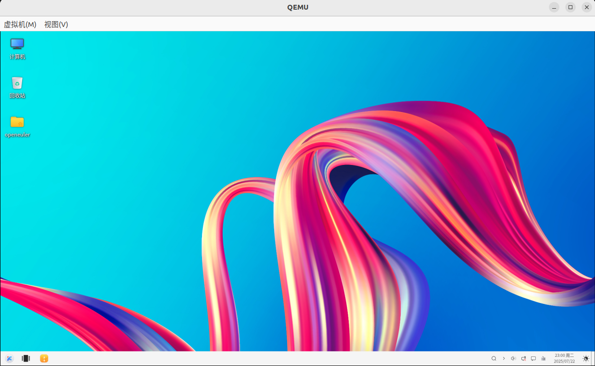

好的，理解您的要求。这次的修改将严格遵循“**基于原文，不改变已有内容，将零散部分组合成功能明确的具体模块，并用精炼的语句补充说明**”的原则。

目标是让教程的结构感更强，每一步都像一个独立的、目标明确的任务模块，同时保持您原有内容的完整性。

-----

### **优化版教程：在Ubuntu上通过QEMU启动openEuler 24.03 x86虚拟机**

#### **概述**

本教程将详细介绍如何在Ubuntu操作系统上使用QEMU虚拟化技术，从准备环境到最终创建并运行一台配置完善的openEuler 24.03 x86\_64架构虚拟机。

#### **模块一：宿主机环境配置与QEMU安装**

这个模块将完成所有在宿主机（您的Ubuntu系统）上的准备工作，核心是安装QEMU。

**1. 系统要求与环境更新**

  * **硬件**: x86\_64架构处理器（支持VT-x/AMD-V），至少8GB RAM，至少20GB可用磁盘空间。
  * **软件**: Ubuntu 20.04 LTS或更高版本，拥有`sudo`权限的账户。

首先，确保系统环境为最新状态：

```bash
sudo apt update && sudo apt upgrade -y
```

**2. 检查并确认硬件虚拟化支持**

执行以下命令验证CPU是否支持硬件虚拟化。输出结果应为一个大于0的数字。

```bash
# 检查CPU是否支持虚拟化
egrep -c '(vmx|svm)' /proc/cpuinfo
```

**3. 从源码编译安装QEMU**

为使用最新功能，我们从源码进行编译。

  * **安装编译依赖**:

    ```bash
    sudo apt install -y build-essential zlib1g-dev libglib2.0-dev \
        libfdt-dev libpixman-1-dev libaio-dev libbluetooth-dev \
        libbrlapi-dev libbz2-dev libcap-ng-dev libcurl4-gnutls-dev \
        libgtk-3-dev libibverbs-dev libjpeg8-dev libncurses5-dev \
        libnuma-dev librbd-dev librdmacm-dev libsasl2-dev \
        libsdl2-dev libseccomp-dev libsnappy-dev libssh2-1-dev \
        libvde-dev libvdeplug-dev libxen-dev liblzo2-dev \
        valgrind xfslibs-dev ninja-build meson
    ```

  * **下载、配置与编译**:

    ```bash
    # 进入临时目录进行操作
    cd /tmp
    # 下载QEMU源码 (版本号可按需替换为官网最新)
    wget https://download.qemu.org/qemu-10.0.2.tar.xz
    tar xf qemu-10.0.2.tar.xz
    cd qemu-10.0.2

    # 配置编译选项，指定目标平台和启用的功能
    ./configure --target-list=x86_64-softmmu --enable-kvm --enable-curses --enable-virtfs --enable-vhost-user --enable-slirp --enable-user --prefix=/usr/local

    # 使用所有CPU核心进行编译，然后安装
    make -j$(nproc)
    sudo make install
    ```

  * **验证安装**:
    检查QEMU版本，确认安装成功。

    ```bash
    qemu-system-x86_64 --version
    ```

-----

#### **模块二：虚拟机资源准备**

本模块负责准备创建虚拟机所需的全部文件：工作目录、系统安装镜像和虚拟硬盘。

**1. 创建工作目录**

为了方便管理，我们将所有虚拟机相关文件存放在一个专属目录中。

```bash
# 创建并进入虚拟机文件存储目录
mkdir -p ~/openeuler-vm
cd ~/openeuler-vm
```

**2. 下载openEuler 24.03 ISO镜像**

从官方镜像源下载系统安装文件。

```bash
# 使用国内镜像源以获得较快速度
wget https://mirrors.pku.edu.cn/openeuler/openEuler-24.03-LTS-SP1/ISO/x86_64/openEuler-24.03-LTS-SP1-x86_64-dvd.iso
```

**3. 创建qcow2格式的虚拟硬盘**

使用`qemu-img`工具创建一个虚拟硬盘。我们选择`qcow2`格式，因为它支持动态扩展、压缩和快照等高级功能，非常适合开发和测试。

```bash
# 创建一个初始大小很小，但上限为60GB的qcow2格式虚拟硬盘
qemu-img create -f qcow2 openeuler-24.03-disk.qcow2 60G

# （可选）查看虚拟硬盘的详细信息
qemu-img info openeuler-24.03-disk.qcow2
```

-----

#### **模块三：首次引导与openEuler系统安装**

本模块将完成从启动安装程序到系统成功安装到虚拟硬盘的全过程。

**1. 执行安装引导命令**

此命令会启动一个虚拟机，将我们准备好的虚拟硬盘和ISO镜像挂载进去，并设置从ISO镜像启动。

```bash
# openEuler 24.03 安装脚本
qemu-system-x86_64 \
    -enable-kvm \
    -machine q35 \
    -cpu host \
    -m 4G \
    -smp 4 \
    -drive file=openeuler-24.03-disk.qcow2,format=qcow2,if=virtio \
    -drive file=openEuler-24.03-LTS-SP1-x86_64-dvd.iso,media=cdrom,readonly \
    -boot order=d \
    -vga virtio \
    -display gtk,gl=on \
    -netdev user,id=net0 \
    -device virtio-net-pci,netdev=net0
```

> **参数说明**: `-boot order=d`是此步骤的关键，它强制虚拟机从CD-ROM (`d`rive) 启动，从而进入安装程序。

**2. 在安装向导中完成系统配置**

在弹出的QEMU窗口中，您将进入openEuler的图形化安装向导：

1.  **语言选择**: 选择“中文（简体）”或“English”，点击“继续”。
2.  **安装信息摘要配置**:
      * **时间和日期**: 点击进入，选择“亚洲/上海”时区。
      * **安装目的地**: 点击进入，选择我们创建的虚拟硬盘，使用“自动配置分区”即可。
3.  **用户设置**:
      * **Root密码**: 设置一个强密码。
      * **创建用户**: 创建一个日常使用的管理员账户，勾选“将此用户设为管理员”。
4.  **开始安装**: 确认所有配置无误后，点击“开始安装”，等待其完成（约15-30分钟）。

**3. 完成安装**

安装完成后，点击“重新引导”。此时，请**直接关闭QEMU窗口**以结束本次安装会话。

-----

#### **模块四：安装后配置与图形化桌面启动**

系统已安装完毕。本模块将指导您如何从虚拟硬盘启动系统，并为其安装和配置UKUI桌面环境。

**1. 从硬盘启动系统**

执行以下命令。注意，这次我们**不再加载ISO文件**，并增加了USB设备支持，以便鼠标能在图形界面中正常使用。

```bash
# 首次从硬盘启动
qemu-system-x86_64 \
    -enable-kvm \
    -m 4G \
    -smp 4 \
    -cpu host \
    -drive file=openeuler-24.03-disk.qcow2,if=virtio,format=qcow2,cache=none \
    -vga virtio \
    -display default,show-cursor=on \
    -usb \
    -device usb-tablet \
    -net nic,model=virtio \
    -net user
```

**2. 安装并启用UKUI桌面环境**

进入openEuler系统后，使用您创建的账户登录。打开终端，执行以下命令：

```bash
# 安装UKUI桌面环境
sudo dnf -y install ukui
# 设置系统默认以图形化界面启动
sudo systemctl set-default graphical.target
# 重启系统以应用更改
sudo reboot
```

重启后，系统将自动进入UKUI图形登录界面。

-----

#### **模块五：创建高效的虚拟机管理脚本**

为了避免每次都输入复杂的QEMU命令，我们将所有配置固化到一个可交互的启动脚本中，极大简化日常使用。

**1. 创建`vm-manager.sh`脚本文件**

在您的工作目录 (`~/openeuler-vm`) 中，创建并写入以下脚本内容：

```bash
# 创建虚拟机管理脚本
cat > vm-manager.sh << 'EOF'
#!/usr/bin/env bash

# =================================================================
# QEMU x86_64 KVM 虚拟机启动脚本
# =================================================================

# --- 颜色定义，用于美化输出 ---
# 使用 \001 和 \002 来告诉 Readline 这些是非打印字符
RESTORE=$(echo -en '\001\033[0m\002')
YELLOW=$(echo -en '\001\033[00;33m\002')
RED=$(echo -en '\001\033[00;31m\002')

# --- 虚拟机配置 ---
# 你可以在这里修改默认配置
vcpu=4
memory=4 # 单位: GB
disk="openeuler-24.03-disk.qcow2" # 目标虚拟硬盘文件
ssh_port=12055 # 映射到虚拟机的 22 端口
shared_dir="$HOME/shared" # 宿主机与虚拟机共享的目录

# --- 检查依赖 ---
# 检查虚拟硬盘文件是否存在
if [ ! -f "$disk" ]; then
    echo -e "${RED}错误: 虚拟硬盘文件 '${disk}' 不存在！${RESTORE}"
    echo -e "${RED}请先使用 'qemu-img create' 命令创建它，或修改脚本中的 'disk' 变量。${RESTORE}"
    exit 1
fi

# 检查共享目录是否存在，不存在则创建
if [ ! -d "$shared_dir" ]; then
    echo -e "${YELLOW}:: 共享目录 '${shared_dir}' 不存在，正在创建...${RESTORE}"
    mkdir -p "$shared_dir"
fi


# --- 用户交互菜单 ---
echo -e "${YELLOW}请选择启动模式：${RESTORE}"
echo -e "${YELLOW}1. 无头模式 (纯串口/SSH，无图形界面，性能最高)${RESTORE}"
echo -e "${YELLOW}2. 图形模式 (带图形窗口、鼠标、键盘和音频支持)${RESTORE}"
read -p "输入 1 或 2 后按回车: " mode
echo ""


# --- 根据选择构建 QEMU 命令 ---
# 定义通用参数
qemu_base_cmd="qemu-system-x86_64 \
  -enable-kvm \
  -cpu host \
  -smp ${vcpu} -m ${memory}G \
  -drive file=${disk},if=virtio,format=qcow2,cache=none,aio=native \
  -object rng-random,filename=/dev/urandom,id=rng0 \
  -device virtio-rng-pci,rng=rng0 \
  -netdev user,id=usernet,hostfwd=tcp::${ssh_port}-:22 \
  -device virtio-net-pci,netdev=usernet \
  -virtfs local,path=${shared_dir},mount_tag=host_share,security_model=passthrough"

if [ "$mode" = "1" ]; then
    # 模式1: 无头服务器模式
    echo -e "${YELLOW}:: 已选择无头模式。${RESTORE}"
    cmd="${qemu_base_cmd} -nographic"
else
    # 模式2: 图形桌面模式 (默认选项)
    echo -e "${YELLOW}:: 已选择图形模式。${RESTORE}"
    cmd="${qemu_base_cmd} \
      -vga virtio \
      -display default,show-cursor=on \
      -device qemu-xhci \
      -device usb-tablet \
      -audiodev pa,id=snd0 \
      -device ich9-intel-hda \
      -device hda-duplex,audiodev=snd0"
fi


# --- 显示最终配置并启动 ---
echo ""
echo -e "${YELLOW}:: 即将启动虚拟机...${RESTORE}"
echo -e "${YELLOW}:: 使用以下配置:${RESTORE}"
echo "-------------------------------------"
echo -e "${YELLOW}  CPU 核心: ${vcpu}${RESTORE}"
echo -e "${YELLOW}  内存: ${memory}G${RESTORE}"
echo -e "${YELLOW}  虚拟硬盘: ${disk}${RESTORE}"
echo -e "${YELLOW}  SSH 端口 (Host -> VM): ${ssh_port} -> 22${RESTORE}"
echo -e "${YELLOW}  共享目录 (Host -> VM): ${shared_dir} -> (挂载标签: host_share)${RESTORE}"
echo "-------------------------------------"
echo -e "${YELLOW}:: 提示: 要关闭虚拟机，请在虚拟机内部正常关机，或直接关闭 QEMU 窗口。${RESTORE}"
echo -e "${YELLOW}:: 提示: 如果 'ping' 报告权限错误, 尝试在虚拟机内执行 'sudo dnf reinstall iputils'。${RESTORE}"
echo ""

# 延迟2秒，让用户看清配置
sleep 2

# 执行命令
eval "$cmd"
EOF
```

**2. 赋予脚本执行权限**

```bash
chmod +x vm-manager.sh
```

现在，您只需执行 `./vm-manager.sh` 即可方便地启动和管理您的 openEuler 虚拟机。

 


