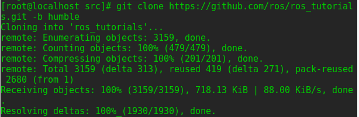
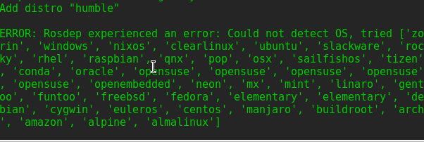
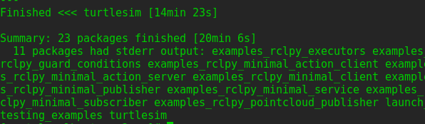
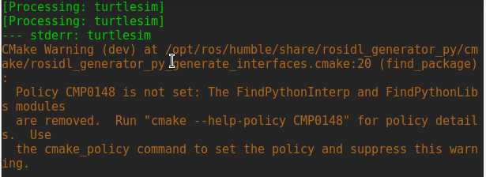
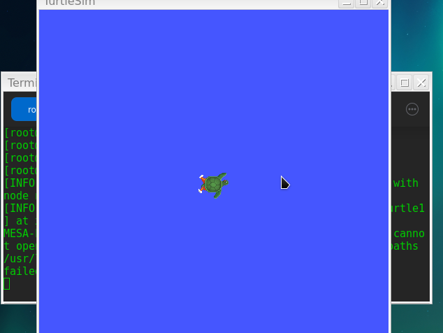
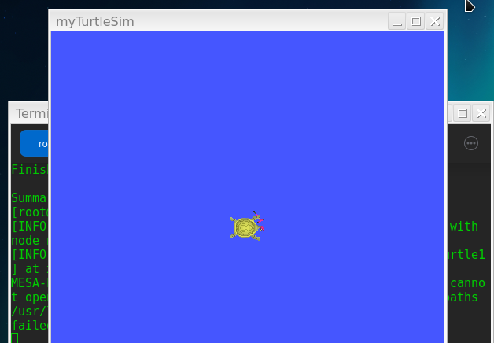
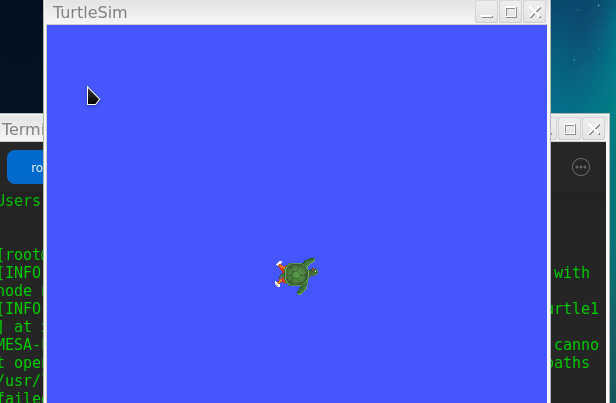

# 配置ROS2环境  
`source /opt/ros/humble/setup.bash`  

# 创建工作目录  
`mkdir -p ~/ros2_ws/src`  
进入创建的src目录中  
`cd ~/ros2_ws/src`  
  

# 克隆示例仓库  
`git clone https://github.com/ros/ros_tutorials.git -b humble`  
  

# 安装rosdepc并通过rosdepc安装依赖
安装rosdepc，可能会失败多安装几次就行  
`sudo pip install rosdepc`  
`rosdepc update`  
`sudo rosdepc init`  
请在row2_ws目录下运行这个命令  
**注意以上命令务必在非root权限下运行**  
**此处有严重问题**  
  
问题代码  
```
 File "/usr/lib/python3.11/site-packages/rospkg/os_detect.py", line 606, in detect_os
    raise OsNotDetected("Could not detect OS, tried %s" % attempted)
rospkg.os_detect.OsNotDetected: Could not detect OS, tried ['zorin', 'windows', 'nixos', 'clearlinux', 'ubuntu', 'slackware', 'rocky', 'rhel', 'raspbian', 'qnx', 'pop', 'osx', 'sailfishos', 'tizen', 'conda', 'oracle', 'opensuse', 'opensuse', 'opensuse', 'opensuse', 'opensuse', 'openembedded', 'neon', 'mx', 'mint', 'linaro', 'gentoo', 'funtoo', 'freebsd', 'fedora', 'elementary', 'elementary', 'debian', 'cygwin', 'euleros', 'centos', 'manjaro', 'buildroot', 'arch', 'amazon', 'alpine', 'almalinux']
```
`rosdepc install -i --from-path src --rosdistro humble -y`  

# 使用 colcon 构建工作区  
构建完成，部分无法构建，turtlesim完成构建但是抛出warning  
  
  
构建warning文本  
```
[Processing: turtlesim]                                          
--- stderr: turtlesim                                          
CMake Warning (dev) at /opt/ros/humble/share/rosidl_generator_py/cmake/rosidl_generator_py_generate_interfaces.cmake:20 (find_package):                                                                  
  Policy CMP0148 is not set: The FindPythonInterp and FindPythonLibs modules                                                          
  are removed.  Run "cmake --help-policy CMP0148" for policy details.  Use                                                            
  the cmake_policy command to set the policy and suppress this warning.                                                              
                                                                   
Call Stack (most recent call first):                              
  /opt/ros/humble/share/ament_cmake_core/cmake/core/ament_execute_extensions.cmake:48 (include)                                      
  /opt/ros/humble/share/rosidl_cmake/cmake/rosidl_generate_interfaces.cmake:286 (ament_execute_extensions)                            
  CMakeLists.txt:24 (rosidl_generate_interfaces)                  
This warning is for project developers.  Use -Wno-dev to suppress it.                                                                
                                                                   
CMake Warning (dev) at /opt/ros/humble/share/python_cmake_module/cmake/Modules/FindPythonExtra.cmake:52 (find_package):              
  Policy CMP0148 is not set: The FindPythonInterp and FindPythonLibs modules                                                          
  are removed.  Run "cmake --help-policy CMP0148" for policy details.  Use                                                            
  the cmake_policy command to set the policy and suppress this warning.                                                              
                                                                   
Call Stack (most recent call first):                              
  /opt/ros/humble/share/rosidl_generator_py/cmake/rosidl_generator_py_generate_interfaces.cmake:23 (find_package)                    
  /opt/ros/humble/share/ament_cmake_core/cmake/core/ament_execute_extensions.cmake:48 (include)                                      
  /opt/ros/humble/share/rosidl_cmake/cmake/rosidl_generate_interfaces.cmake:286 (ament_execute_extensions)                            
  CMakeLists.txt:24 (rosidl_generate_interfaces)                  
This warning is for project developers.  Use -Wno-dev to suppress it.                                                                
                                                                   
CMake Warning (dev) at /opt/ros/humble/share/python_cmake_module/cmake/Modules/FindPythonExtra.cmake:140 (find_package):              
  Policy CMP0148 is not set: The FindPythonInterp and FindPythonLibs modules                                                          
  are removed.  Run "cmake --help-policy CMP0148" for policy details.  Use                                                            
  the cmake_policy command to set the policy and suppress this warning.                                                              
                                                                   
Call Stack (most recent call first):                              
  /opt/ros/humble/share/rosidl_generator_py/cmake/rosidl_generator_py_generate_interfaces.cmake:23 (find_package)                    
  /opt/ros/humble/share/ament_cmake_core/cmake/core/ament_execute_extensions.cmake:48 (include)                                      
  /opt/ros/humble/share/rosidl_cmake/cmake/rosidl_generate_interfaces.cmake:286 (ament_execute_extensions)                            
  CMakeLists.txt:24 (rosidl_generate_interfaces)                  
This warning is for project developers.  Use -Wno-dev to suppress it.        
```
install 文件夹成功创建  
  

# 进行叠加层
`source /opt/ros/humble/setup.bash`  
`cd ~/ros2_ws`  
`source install/local_setup.bash`  
运行叠加层的turtlesim  

`ros2 run turtlesim turtlesim_node`  



# 修改叠加层进行验证  
`cd ~/ros2_ws/src/ros_tutorials/turtlesim/src`  
`vi urtle_frame.cpp`  
把setWindowTitle("TurtleSim")改为setWindowTitle("myTurtleSim")  
`cd ~/ros2_ws`  
`colcon build`  
待叠加重新构建完成  
`ros2 run turtlesim turtlesim_node`  
  
主界面运行  
`ros2 run turtlesim turtlesim_node`  
  
**可以确认叠加层不会影响底层内容** 


