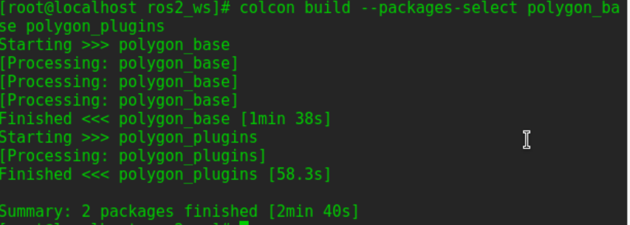

# 创建基类包
使用以下命令在文件夹中创建新的空包：ros2_ws/src 
`ros2 pkg create --build-type ament_cmake --license Apache-2.0 --dependencies pluginlib --node-name area_node polygon_base`     


打开您最喜欢的编辑器， 编辑 ，并将以下内容粘贴到其中：ros2_ws/src/polygon_base/include/polygon_base/regular_polygon.hpp
```
#ifndef POLYGON_BASE_REGULAR_POLYGON_HPP
#define POLYGON_BASE_REGULAR_POLYGON_HPP

namespace polygon_base
{
  class RegularPolygon
  {
    public:
      virtual void initialize(double side_length) = 0;
      virtual double area() = 0;
      virtual ~RegularPolygon(){}

    protected:
      RegularPolygon(){}
  };
}  // namespace polygon_base

#endif  // POLYGON_BASE_REGULAR_POLYGON_HPP
```


我们需要使此标头对其他类可用，因此请打开以进行编辑ros2_ws/src/polygon_base/CMakeLists.txt。 在命令ament_target_dependencies后添加以下行：
```
install(
  DIRECTORY include/
  DESTINATION include
)
```

并在ament_package命令之前添加此命令：
```
ament_export_include_directories(
  include
)
```


# 创建插件包
现在，我们将编写抽象类的两个非虚拟实现。 使用以下命令在您的文件夹ros2_ws/src中创建第二个空包：  
`ros2 pkg create --build-type ament_cmake --license Apache-2.0 --dependencies polygon_base pluginlib --library-name polygon_plugins polygon_plugins`


## 插件源代码
打开ros2_ws/src/polygon_plugins/src/polygon_plugins.cpp进行编辑，并在其中粘贴以下内容：
```
#include <polygon_base/regular_polygon.hpp>
#include <cmath>

namespace polygon_plugins
{
  class Square : public polygon_base::RegularPolygon
  {
    public:
      void initialize(double side_length) override
      {
        side_length_ = side_length;
      }

      double area() override
      {
        return side_length_ * side_length_;
      }

    protected:
      double side_length_;
  };

  class Triangle : public polygon_base::RegularPolygon
  {
    public:
      void initialize(double side_length) override
      {
        side_length_ = side_length;
      }

      double area() override
      {
        return 0.5 * side_length_ * getHeight();
      }

      double getHeight()
      {
        return sqrt((side_length_ * side_length_) - ((side_length_ / 2) * (side_length_ / 2)));
      }

    protected:
      double side_length_;
  };
}

#include <pluginlib/class_list_macros.hpp>

PLUGINLIB_EXPORT_CLASS(polygon_plugins::Square, polygon_base::RegularPolygon)
PLUGINLIB_EXPORT_CLASS(polygon_plugins::Triangle, polygon_base::RegularPolygon)
```


## 声明xml
使用以下代码创建：
`vi ros2_ws/src/polygon_plugins/plugins.xml`
写入以下内容：
```
<library path="polygon_plugins">
  <class type="polygon_plugins::Square" base_class_type="polygon_base::RegularPolygon">
    <description>This is a square plugin.</description>
  </class>
  <class type="polygon_plugins::Triangle" base_class_type="polygon_base::RegularPolygon">
    <description>This is a triangle plugin.</description>
  </class>
</library>
```


## CMake插件声明
这是ros1的步骤，ros2可以忽略。
最后一步是通过CMakeLists.txt导出您的插件。 这是对 ROS 1 的更改，在 ROS 1 中，导出是通过package.xml完成的。 将以下行添加到您的行 ros2_ws/src/polygon_plugins/CMakeLists.txt find_package(pluginlib REQUIRED)后面：
`pluginlib_export_plugin_description_file(polygon_base plugins.xml)`


# 使用插件
现在是时候使用这些插件了。 这可以在任何包中完成，但这里我们将在 base 包中完成。 编辑ros2_ws/src/polygon_base/src/area_node.cpp以包含以下内容：
```
#include <pluginlib/class_loader.hpp>
#include <polygon_base/regular_polygon.hpp>

int main(int argc, char** argv)
{
  // To avoid unused parameter warnings
  (void) argc;
  (void) argv;

  pluginlib::ClassLoader<polygon_base::RegularPolygon> poly_loader("polygon_base", "polygon_base::RegularPolygon");

  try
  {
    std::shared_ptr<polygon_base::RegularPolygon> triangle = poly_loader.createSharedInstance("polygon_plugins::Triangle");
    triangle->initialize(10.0);

    std::shared_ptr<polygon_base::RegularPolygon> square = poly_loader.createSharedInstance("polygon_plugins::Square");
    square->initialize(10.0);

    printf("Triangle area: %.2f\n", triangle->area());
    printf("Square area: %.2f\n", square->area());
  }
  catch(pluginlib::PluginlibException& ex)
  {
    printf("The plugin failed to load for some reason. Error: %s\n", ex.what());
  }

  return 0;
}
```
   

# 构建并且运行
导航回工作区的根目录，然后构建新包：ros2_ws   
`colcon build --packages-select polygon_base polygon_plugins` 
  

从ros2_ws中，确保获取安装文件： 
`source install/setup.bash` 
现在运行节点：  
`ros2 run polygon_base area_node` 
     

**complete!!**
