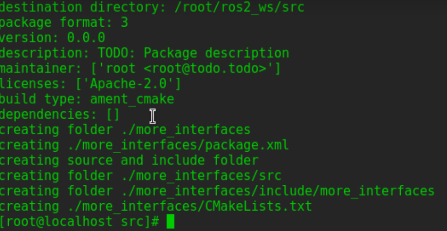
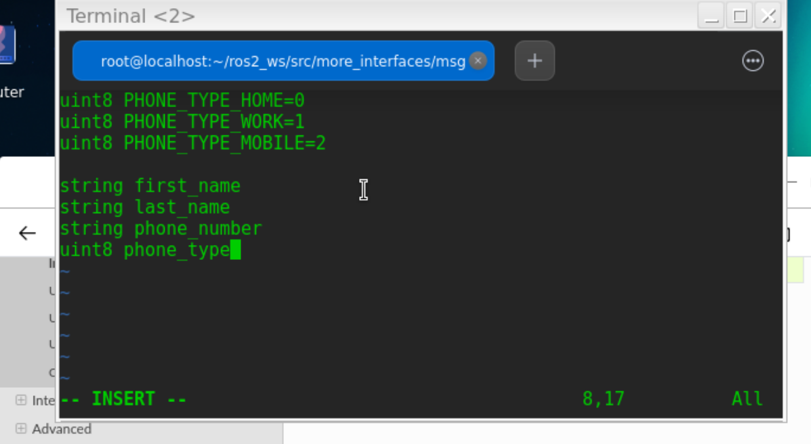
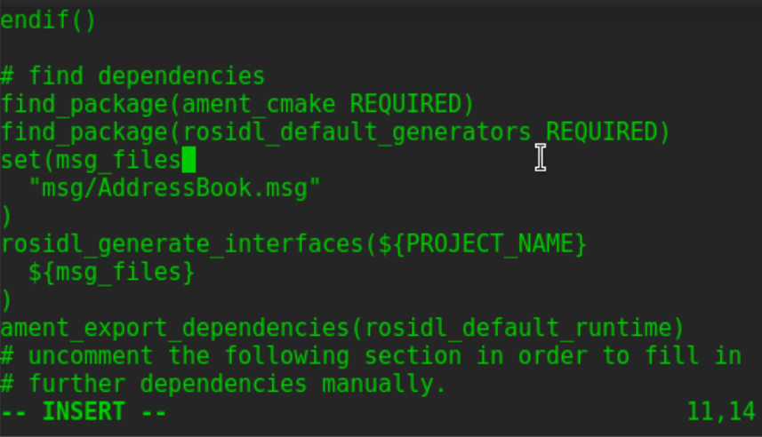
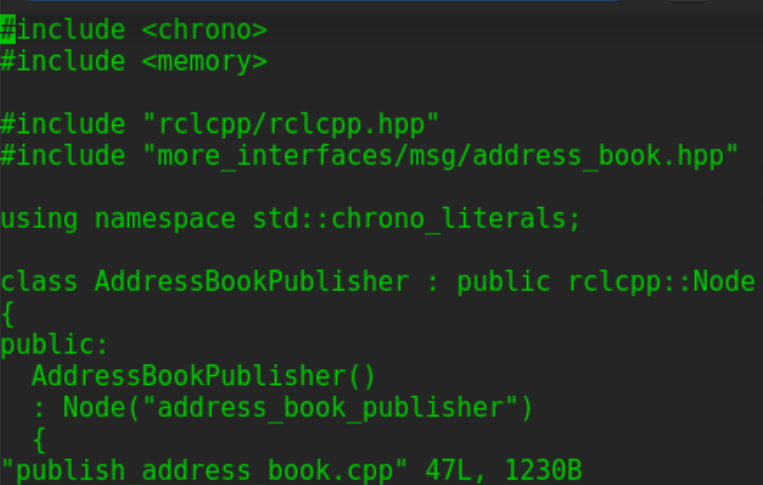
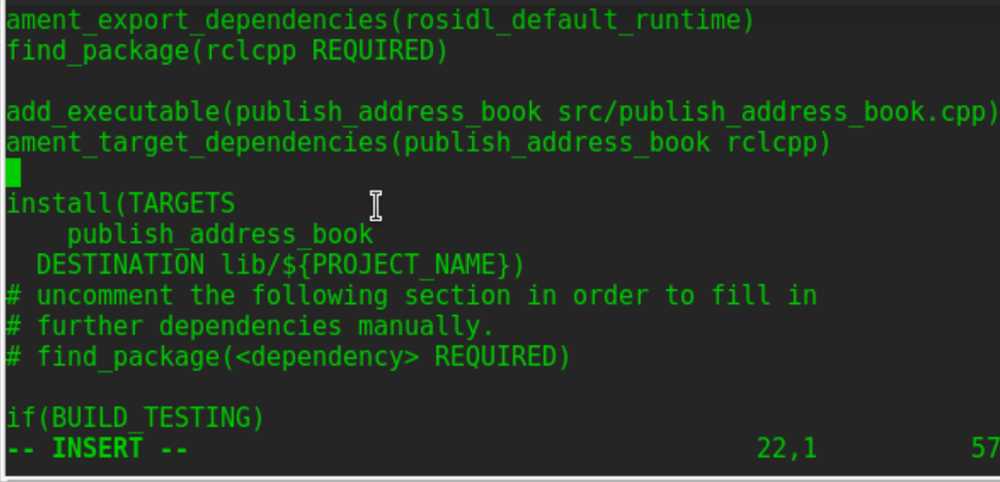
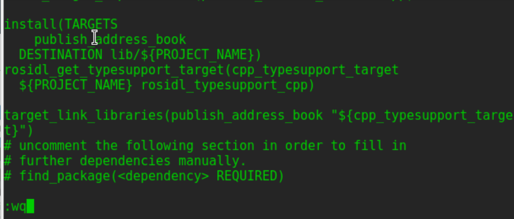
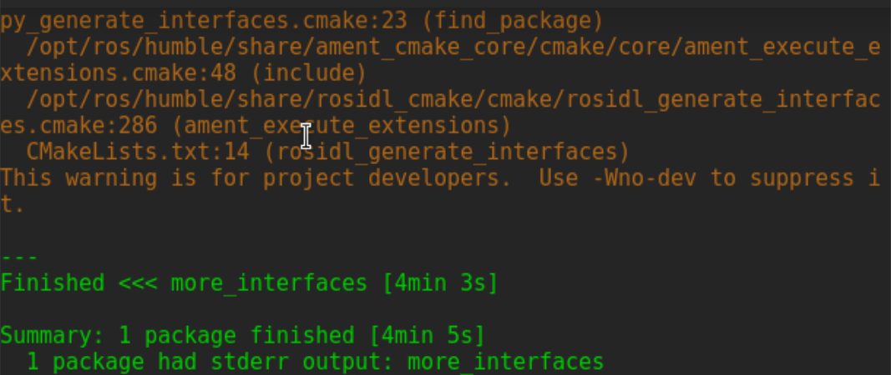
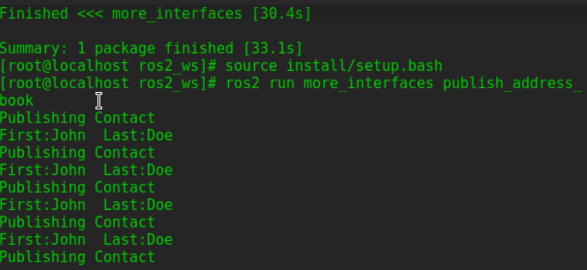

# 创建功能包
在工作空间src目录下，创建more_interfaces以及msg文件夹：
```
ros2 pkg create --build-type ament_cmake more_interfaces
mkdir more_interfaces/msg

```


# 创建一个msg文件
在more_interfaces/msg文件夹下，创建一个新文件： AddressBook.msg。
粘贴以下代码来创建个人信息：
```
bool FEMALE=true
bool MALE=false

string first_name
string last_name
bool gender
uint8 age
string address
```
该消息分为5个部分：
·first_name: string 类型
·last_name: string 类型
·gender: bool 类型
·age: uint8类型
·address: string 类型


# 编译msg文件
打开package.xml文件，添加：
```
<buildtool_depend>rosidl_default_generators</buildtool_depend>
<exec_depend>rosidl_default_runtime</exec_depend>
<member_of_group>rosidl_interface_packages</member_of_group>
```
注意：在编译时，需要rosidl_default_generators，而在运行时，只需要rosidl_default_runtime。
打开CMakeLists.txt文件，并添加以下代码：
找到从msg/srv文件中生成消息代码的包:  
`find_package(rosidl_default_generators REQUIRED)`  
声明要生成的消息列表:   
```
set(msg_files
  "msg/AddressBook.msg"
)

```
通过手动添加.msg文件，可以确保CMake知道在添加其他.msg文件后，它何时需要重新配置项目。
生成消息：
```
rosidl_generate_interfaces(${PROJECT_NAME}
  ${msg_files}
)
```
还要确保导出消息运行时的依赖项:
`ament_export_dependencies(rosidl_default_runtime)`



# 在同一个包里使用接口
在 more_interfaces/src 目录下，创建一个名为 publish_address_book.cpp的文件并粘贴以下代码：
```
#include <chrono>
#include <memory>

#include "rclcpp/rclcpp.hpp"
#include "more_interfaces/msg/address_book.hpp"

using namespace std::chrono_literals;

class AddressBookPublisher : public rclcpp::Node
{
public:
  AddressBookPublisher()
  : Node("address_book_publisher")
  {
    address_book_publisher_ =
      this->create_publisher<more_interfaces::msg::AddressBook>("address_book", 10);

    auto publish_msg = [this]() -> void {
        auto message = more_interfaces::msg::AddressBook();

        message.first_name = "John";
        message.last_name = "Doe";
        message.age = 30;
        message.gender = message.MALE;
        message.address = "unknown";

        std::cout << "Publishing Contact\nFirst:" << message.first_name <<
          "  Last:" << message.last_name << std::endl;

        this->address_book_publisher_->publish(message);
      };
    timer_ = this->create_wall_timer(1s, publish_msg);
  }

private:
  rclcpp::Publisher<more_interfaces::msg::AddressBook>::SharedPtr address_book_publisher_;
  rclcpp::TimerBase::SharedPtr timer_;
};


int main(int argc, char * argv[])
{
  rclcpp::init(argc, argv);
  rclcpp::spin(std::make_shared<AddressBookPublisher>());
  rclcpp::shutdown();

  return 0;
}
```


## 编译发布者
需要在CMakeLists.txt中添加：
```
find_package(rclcpp REQUIRED)

add_executable(publish_address_book
  src/publish_address_book.cpp
)

ament_target_dependencies(publish_address_book
  "rclcpp"
)

install(TARGETS publish_address_book
 DESTINATION lib/${PROJECT_NAME})

```


## 对接接口
为了使用在同一个包中生成的消息，需要使用以下CMake代码：
```
rosidl_target_interfaces(publish_address_book
  ${PROJECT_NAME} "rosidl_typesupport_cpp")

```
这将找到AddressBook.msg中生成的相关c++代码，并且允许链接到它。
当使用的接口来自单独构建的包时，此步骤是不必要的。这个CMake代码只有当你想要在同一个包中使用接口时才需要。


# 运行
返回工作空间根目录，编译功能包：
```
cd ~/ros2_ws
colcon build --packages-up-to more_interfaces
```


然后运行：
```
. install/local_setup.bash
ros2 run more_interfaces publish_address_book

```
此时会看到发布者转发自定义的msg，包括在publish_address_book.cpp中设置的值。


要确认消息发布在address_book话题上，打开另一个终端(不要忘记source)，并调用topic echo:
```
. install/setup.bash
ros2 topic echo /address_book

```


