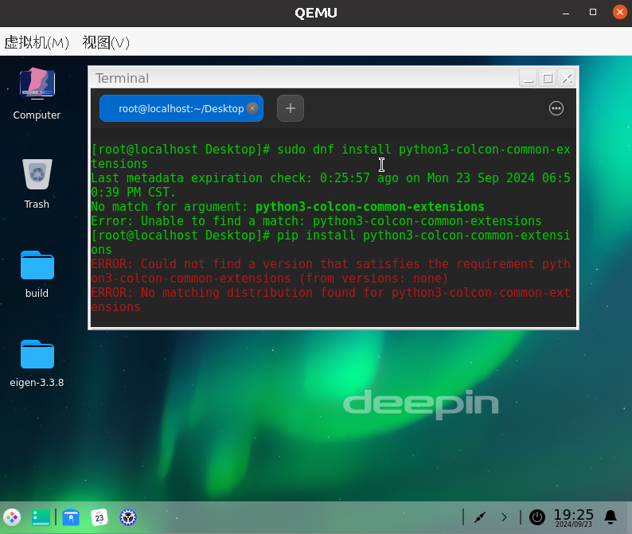
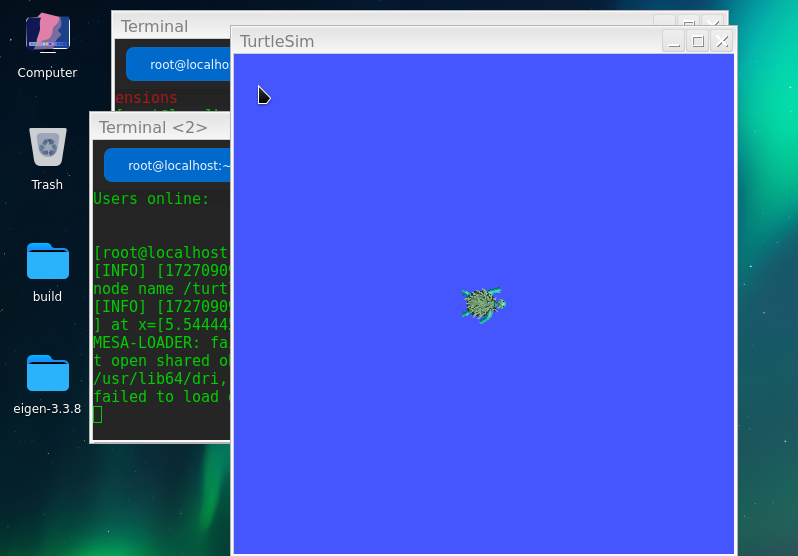
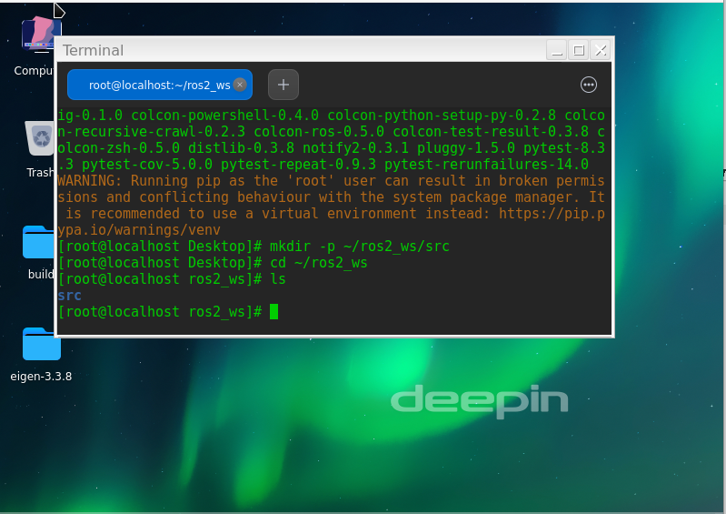
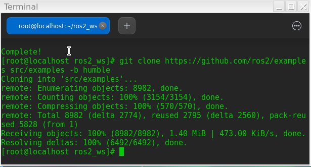
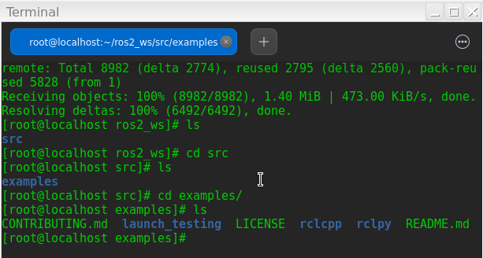
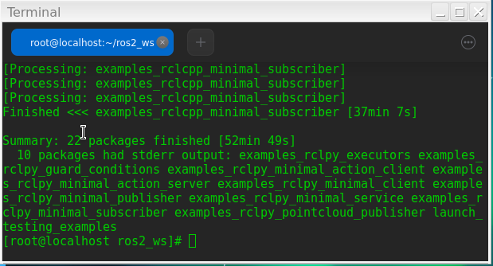
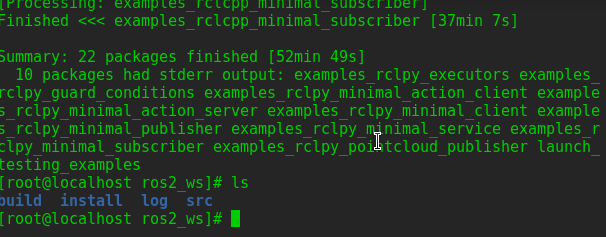
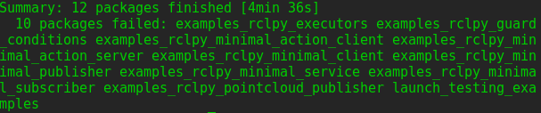
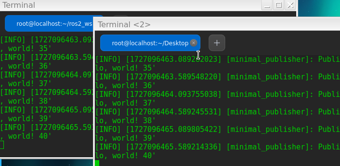

# 安装colcon 
教程命令找不到包，使用其他教程用pip3安装  
`pip3 install -U pytest colcon-common-extensions`



# 安装ROS2

已经安装完成



安装步骤见:[安装ROS Humble](https://openeuler-ros-docs.readthedocs.io/en/latest/installation/install-ros-humble.html)

# 创建工作区
`mkdir -p ~/ros2_ws/src`
`cd ~/ros2_ws`
工作区状态


# 添加源进入工作目录
`git clone https://github.com/ros2/examples src/examples -b humble`

结果：



文件状态：




# 构建工作区
`colcon build --symlink-install`

结果：



构建结果和文件状态，构建时间很长。


	
# 运行测试
测试结果(文本)：
```
Starting >>> examples_rclcpp_async_client
Starting >>> examples_rclcpp_cbg_executor                  
Starting >>> examples_rclcpp_minimal_action_client
Starting >>> examples_rclcpp_minimal_action_server
[Processing: examples_rclcpp_async_client, examples_rclcpp_cbg_executor, examples_rclcpp_minimal_action_client, examples_rclcpp_minimal_action_server]
Finished <<< examples_rclcpp_minimal_action_server [54.2s]
Starting >>> examples_rclcpp_minimal_client
Finished <<< examples_rclcpp_async_client [55.1s]
Starting >>> examples_rclcpp_minimal_composition
Finished <<< examples_rclcpp_minimal_action_client [56.8s]
Starting >>> examples_rclcpp_minimal_publisher
Finished <<< examples_rclcpp_cbg_executor [1min 8s]
Starting >>> examples_rclcpp_minimal_service
[Processing: examples_rclcpp_minimal_client, examples_rclcpp_minimal_composition, examples_rclcpp_minimal_publisher, examples_rclcpp_minimal_service]
Finished <<< examples_rclcpp_minimal_client [50.5s]
Starting >>> examples_rclcpp_minimal_subscriber
Finished <<< examples_rclcpp_minimal_service [46.1s]
Starting >>> examples_rclcpp_minimal_timer
Finished <<< examples_rclcpp_minimal_publisher [58.8s]
Starting >>> examples_rclcpp_multithreaded_executor
Finished <<< examples_rclcpp_minimal_composition [1min 1s]
Starting >>> examples_rclcpp_wait_set
[Processing: examples_rclcpp_minimal_subscriber, examples_rclcpp_minimal_timer, examples_rclcpp_multithreaded_executor, examples_rclcpp_wait_set]
Finished <<< examples_rclcpp_multithreaded_executor [44.9s]
Starting >>> examples_rclpy_executors
Finished <<< examples_rclcpp_minimal_timer [54.9s]
Starting >>> examples_rclpy_guard_conditions
Finished <<< examples_rclcpp_minimal_subscriber [1min 4s]
Starting >>> examples_rclpy_minimal_action_client
Finished <<< examples_rclcpp_wait_set [1min 16s]
Starting >>> examples_rclpy_minimal_action_server
Failed   <<< examples_rclpy_executors [40.6s, exited with code 2]
Failed   <<< examples_rclpy_guard_conditions [32.1s, exited with code 2]
Starting >>> examples_rclpy_minimal_client
Starting >>> examples_rclpy_minimal_publisher          
Failed   <<< examples_rclpy_minimal_action_client [46.5s, exited with code 2]
Starting >>> examples_rclpy_minimal_service
Failed   <<< examples_rclpy_minimal_action_server [33.5s, exited with code 2]
Starting >>> examples_rclpy_minimal_subscriber
Failed   <<< examples_rclpy_minimal_client [34.1s, exited with code 2]
Starting >>> examples_rclpy_pointcloud_publisher
Failed   <<< examples_rclpy_minimal_publisher [45.6s, exited with code 2]
Starting >>> launch_testing_examples
Failed   <<< examples_rclpy_minimal_service [40.2s, exited with code 2]
Failed   <<< examples_rclpy_minimal_subscriber [30.8s, exited with code 2]
Failed   <<< examples_rclpy_pointcloud_publisher [30.7s, exited with code 2]
Failed   <<< launch_testing_examples [25.1s, exited with code 2]

Summary: 12 packages finished [4min 36s]
  10 packages failed: examples_rclpy_executors examples_rclpy_guard_conditions examples_rclpy_minimal_action_client examples_rclpy_minimal_action_server examples_rclpy_minimal_client examples_rclpy_minimal_publisher examples_rclpy_minimal_service examples_rclpy_minimal_subscriber examples_rclpy_pointcloud_publisher launch_testing_examples
```

测试结果：


	

# 尝试运行示例程序
运行前需执行 source install/setup.bash 用于配置环境变量

终端1：`ros2 run examples_rclcpp_minimal_subscriber subscriber_member_function`
终端2：`ros2 run examples_rclcpp_minimal_publisher publisher_member_function`

运行后可以看见不断打印hello world 并且后编号不断增长




