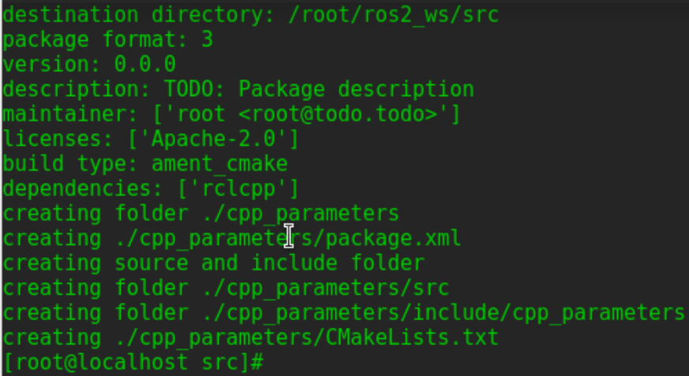
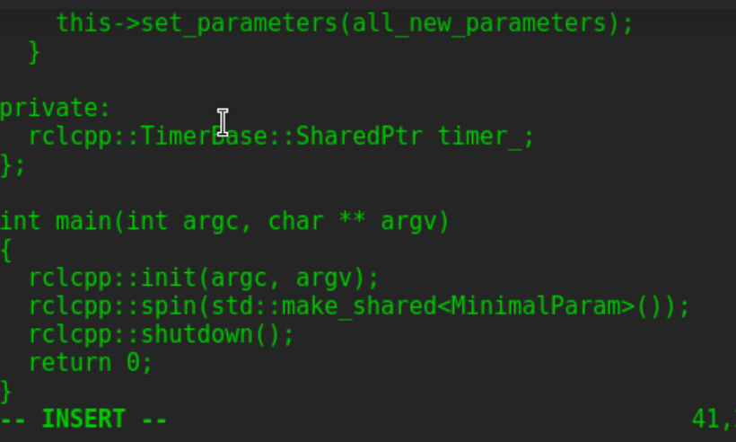
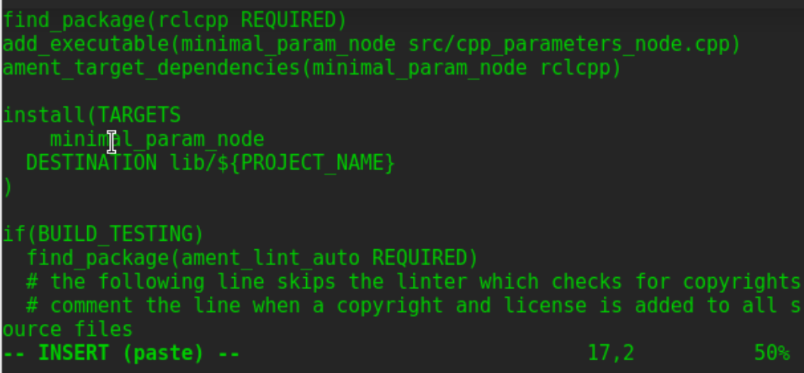
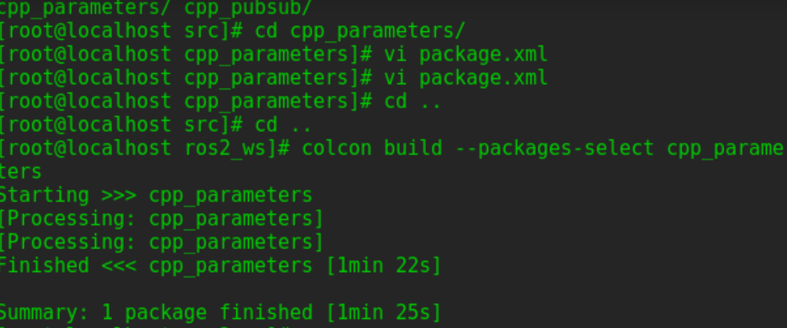
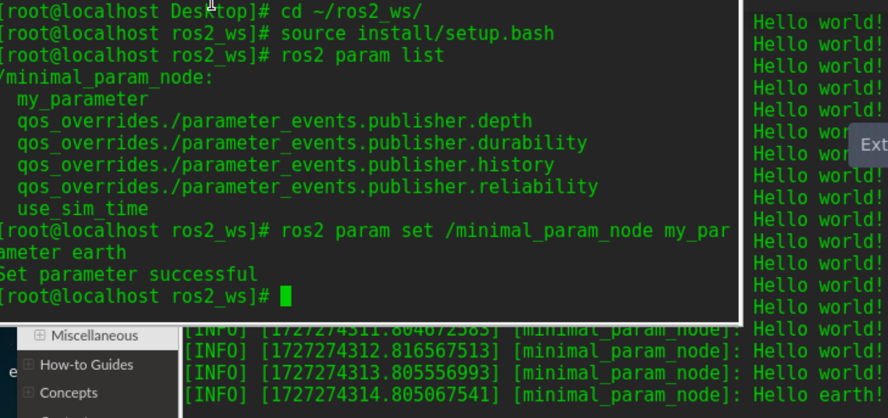
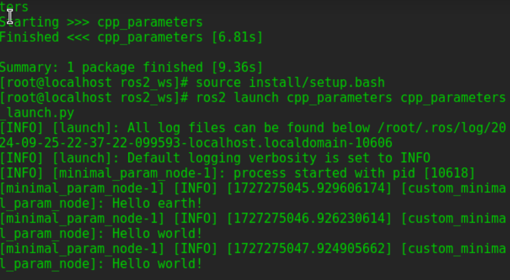

# 创建功能包
在工作空间src目录下，运行：   
`ros2 pkg create --build-type ament_cmake cpp_parameters --dependencies rclcpp`


更新*package.xml*信息：
```
<description>C++ parameter tutorial</description>
<maintainer email="you@email.com">Your Name</maintainer>
<license>Apache License 2.0</license>
```

# 编写C++节点
在*dev_ws/src/cpp_parameters/src*目录中，创建一个名为*cpp_parameters_node.cpp*的新文件，并将以下代码粘贴到其中：
```
#include <rclcpp/rclcpp.hpp>
#include <chrono>
#include <string>
#include <functional>

using namespace std::chrono_literals;

class ParametersClass: public rclcpp::Node
{
  public:
    ParametersClass()
      : Node("parameter_node")
    {
      this->declare_parameter<std::string>("my_parameter", "world");
      timer_ = this->create_wall_timer(
      1000ms, std::bind(&ParametersClass::respond, this));
    }
    void respond()
    {
      this->get_parameter("my_parameter", parameter_string_);
      RCLCPP_INFO(this->get_logger(), "Hello %s", parameter_string_.c_str());
    }
  private:
    std::string parameter_string_;
    rclcpp::TimerBase::SharedPtr timer_;
};

int main(int argc, char** argv)
{
  rclcpp::init(argc, argv);
  rclcpp::spin(std::make_shared<ParametersClass>());
  rclcpp::shutdown();
  return 0;
}
```


## 理解代码

## 添加可执行文件
打开 CMakeLists.txt ，在 find_package(rclcpp REQUIRED) 下面添加：

```
add_executable(parameter_node src/cpp_parameters_node.cpp)
ament_target_dependencies(parameter_node rclcpp)

install(TARGETS
  parameter_node
  DESTINATION lib/${PROJECT_NAME}
)
```


# 编译和运行
工作空间根目录下，运行  
`colcon build --packages-select cpp_parameters` 
source：  
`. install/setup.bash`  
运行：  
`ros2 run cpp_parameters parameter_node`  
终端每秒返回消息：  
 

可以看到参数的默认值，但是希望能够自己设置它，有两种方法可以实现这一点。

## 通过consle控制台改变
打开另一终端，再次source环境，运行以下命令：  
`ros2 param list` 
终端返回，自定义参数：my_parameter，可以在终端通过简单的命令行改变：  
`ros2 param set /parameter_node my_parameter earth` 
此时，终端输出Set parameter successful表示设置参数成功。此时，运行parameter_node节点的终端输出：  
 

## 通过launch文件改变
可以在启动文件中设置参数，但需要添加launch文件夹。在dev_ws/src/cpp_parameters/目录中，创建一个名为launch的新目录。在其中，创建一个名为cpp_parameters_launch.py的新文件；
```
from launch import LaunchDescription
from launch_ros.actions import Node

def generate_launch_description():
    return LaunchDescription([
        Node(
            package="cpp_parameters",
            executable="parameter_node",
            name="custom_parameter_node",
            output="screen",
            emulate_tty=True,
            parameters=[
                {"my_parameter": "earth"}
            ]
        )
    ])

```
当启动节点parameter_node时，将my_parameter设置为earth，并·通过添加下面的两行代码，确保在控制台中打印输出：
```
output="screen",
emulate_tty=True,
```
打开CMakeLists.txt文件，添加：
```
install(
  DIRECTORY launch
  DESTINATION share/${PROJECT_NAME}
)

```
在工作空间根目录下，编译包：   
`colcon build --packages-select cpp_parameters` 
source:     
`. install/setup.bash`   
启动launch文件：   
`ros2 launch cpp_parameters cpp_parameters_launch.py`   
此时终端每秒返回信息：  
 

**complete!!**

