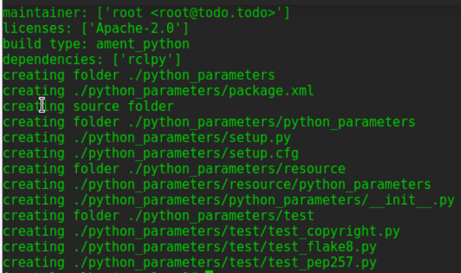
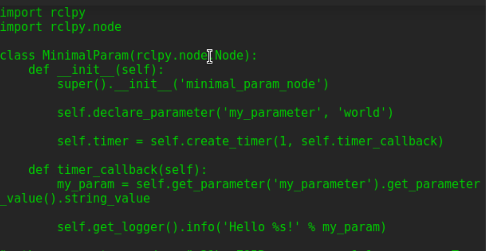
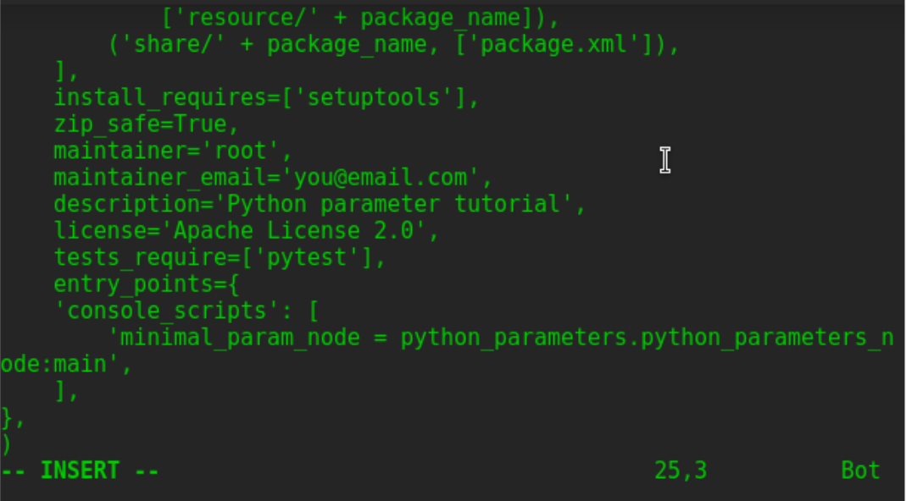
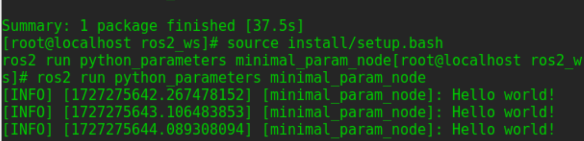
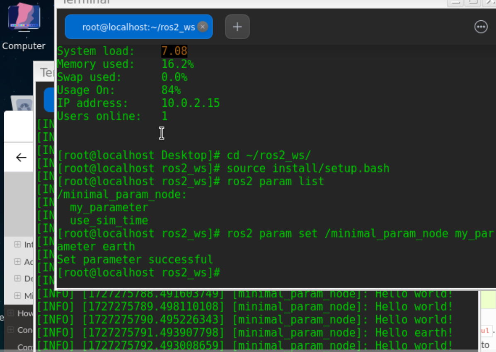

# 创建功能包
在工作空间src目录下，运行： 
`ros2 pkg create --build-type ament_python --license Apache-2.0 python_parameters --dependencies rclpy`


更新*package.xml*信息：
```
<description>Python parameter tutorial</description>
<maintainer email="you@email.com">Your Name</maintainer>
<license>Apache License 2.0</license>
```

# 编写Python节点
在*ros2_ws/src/python_parameters/python_parameters*目录中，创建一个名为*python_parameters_node.py*的新文件，并将以下代码粘贴到其中：
```
import rclpy
import rclpy.node

class MinimalParam(rclpy.node.Node):
    def __init__(self):
        super().__init__('minimal_param_node')

        self.declare_parameter('my_parameter', 'world')

        self.timer = self.create_timer(1, self.timer_callback)

    def timer_callback(self):
        my_param = self.get_parameter('my_parameter').get_parameter_value().string_value

        self.get_logger().info('Hello %s!' % my_param)

        my_new_param = rclpy.parameter.Parameter(
            'my_parameter',
            rclpy.Parameter.Type.STRING,
            'world'
        )
        all_new_parameters = [my_new_param]
        self.set_parameters(all_new_parameters)

def main():
    rclpy.init()
    node = MinimalParam()
    rclpy.spin(node)

if __name__ == '__main__':
    main()
```


## 理解代码

## 添加入口点
打开文件set.py 将maintainer，maintainer_email，description，license与package.xml保持同步。
```
maintainer='YourName',
maintainer_email='you@email.com',
description='Python parameter tutorial',
license='Apache License 2.0',
```
添加入口：
```
entry_points={
    'console_scripts': [
        'minimal_param_node = python_parameters.python_parameters_node:main',
    ],
},
```



# 编译和运行    
工作空间根目录下，运行  
`colcon build --packages-select python_parameters`  
source：    
`source install/setup.bash` 
运行：  
`ros2 run python_parameters minimal_param_node` 
终端每秒返回消息：  


可以看到参数的默认值，但是希望能够自己设置它，有两种方法可以实现这一点。

## 通过consle控制台改变
打开另一终端，再次source环境，运行以下命令：    
`ros2 param list`   
终端返回，自定义参数：my_parameter，可以在终端通过简单的命令行改变：    
`ros2 param set /parameter_node my_parameter earth` 
此时，终端输出Set parameter successful表示设置参数成功。此时，运行parameter_node节点的终端输出：    
 

**complete!!**

