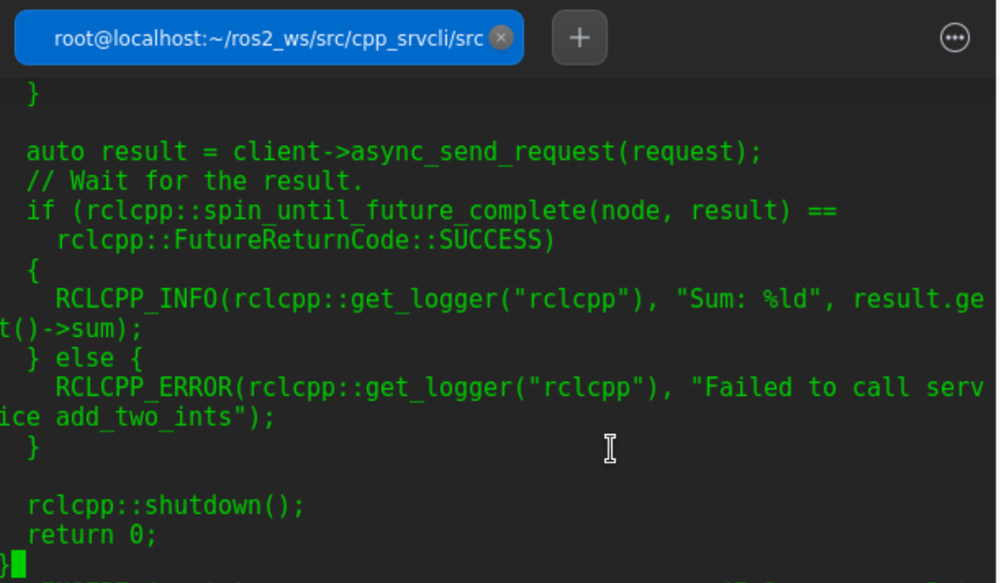

# 创建功能包
在开始之前，确保*ROS2*的环境变量正确配置。    
其次，包应该在*src*目录下，不是在工作空间的根目录下。所以，导航到*ros2_ws*下，并创建一个新的包：      
`ros2 pkg create --build-type ament_cmake cpp_srvcli --dependencies rclcpp example_interfaces`  
终端返回创建成功信息：    
   
*--dependencies*参数将自动将必要的依赖项添加到*package.xml*和*CMakeLists.txt*。*example_interfaces*是包含*.srv*文件的包，通过此来构造请求和响应:     
```
int64 a
int64 b
---
int64 sum

```     

## 更新package.xml
由于在包创建过程中使用了\--dependencies选项，所以不必手动向*package.xml*或*CMakeLists.txt*添加依赖项。   
但是，与往常一样，请确保将描述、维护人员电子邮件和名称以及许可信息添加到*package.xml*。   
修改package.xml后效果：  
   

# 编写服务节点  
在*ros2_ws/src/cpp_srvcli/src*文件夹下，创建一个名为*add_two_ints_server.cpp*的新文件（可以使用touch命令），并将以下代码粘贴到其中：  
`touch ros2_ws/src/cpp_srvcli/src/add_two_ints_server.cpp`  
`vi ros2_ws/src/cpp_srvcli/src/add_two_ints_server/add_two_ints_server.cpp` 
添加如下代码：    
```
#include "rclcpp/rclcpp.hpp"
#include "example_interfaces/srv/add_two_ints.hpp"

#include <memory>

void add(const std::shared_ptr<example_interfaces::srv::AddTwoInts::Request> request,
          std::shared_ptr<example_interfaces::srv::AddTwoInts::Response>      response)
{
  response->sum = request->a + request->b;
  RCLCPP_INFO(rclcpp::get_logger("rclcpp"), "Incoming request\na: %ld" " b: %ld",
                request->a, request->b);
  RCLCPP_INFO(rclcpp::get_logger("rclcpp"), "sending back response: [%ld]", (long int)response->sum);
}

int main(int argc, char **argv)
{
  rclcpp::init(argc, argv);

  std::shared_ptr<rclcpp::Node> node = rclcpp::Node::make_shared("add_two_ints_server");

  rclcpp::Service<example_interfaces::srv::AddTwoInts>::SharedPtr service =
    node->create_service<example_interfaces::srv::AddTwoInts>("add_two_ints", &add);

  RCLCPP_INFO(rclcpp::get_logger("rclcpp"), "Ready to add two ints.");

  rclcpp::spin(node);
  rclcpp::shutdown();
}
```     
    

## 理解代码逻辑 

## 添加可执行程序   
*add_executable*宏生成一个可以使用*ros2 run*运行的可执行文件。将以下代码块添加到*CMakeLists.txt*中，创建一个名为*server*的可执行文件:     
```
add_executable(server src/add_two_ints_server.cpp)
ament_target_dependencies(server rclcpp example_interfaces)
```
为了让*ros2 run*可以找到可执行文件，在文件末尾ament_package()之前添加以下代码:      
```
install(TARGETS
  server
  DESTINATION lib/${PROJECT_NAME})
``` 
   

# 编写客户端节点    
在*dev_ws/src/cpp_srvcli/src*文件夹中，创建一个名为*add_two_ints_client.cpp*的新文件，并将以下代码粘贴到其中:    
```
#include "rclcpp/rclcpp.hpp"
#include "example_interfaces/srv/add_two_ints.hpp"

#include <chrono>
#include <cstdlib>
#include <memory>

using namespace std::chrono_literals;

int main(int argc, char **argv)
{
  rclcpp::init(argc, argv);

  if (argc != 3) {
      RCLCPP_INFO(rclcpp::get_logger("rclcpp"), "usage: add_two_ints_client X Y");
      return 1;
  }

  std::shared_ptr<rclcpp::Node> node = rclcpp::Node::make_shared("add_two_ints_client");
  rclcpp::Client<example_interfaces::srv::AddTwoInts>::SharedPtr client =
    node->create_client<example_interfaces::srv::AddTwoInts>("add_two_ints");

  auto request = std::make_shared<example_interfaces::srv::AddTwoInts::Request>();
  request->a = atoll(argv[1]);
  request->b = atoll(argv[2]);

  while (!client->wait_for_service(1s)) {
    if (!rclcpp::ok()) {
      RCLCPP_ERROR(rclcpp::get_logger("rclcpp"), "Interrupted while waiting for the service. Exiting.");
      return 0;
    }
    RCLCPP_INFO(rclcpp::get_logger("rclcpp"), "service not available, waiting again...");
  }

  auto result = client->async_send_request(request);
  // Wait for the result.
  if (rclcpp::spin_until_future_complete(node, result) ==
    rclcpp::FutureReturnCode::SUCCESS)
  {
    RCLCPP_INFO(rclcpp::get_logger("rclcpp"), "Sum: %ld", result.get()->sum);
  } else {
    RCLCPP_ERROR(rclcpp::get_logger("rclcpp"), "Failed to call service add_two_ints");
  }

  rclcpp::shutdown();
  return 0;
}
``` 
 

## 理解代码逻辑
## 添加可行性程序   
返回*CMakeLists.txt*为新节点添加可执行文件和目标。从自动生成的文件中删除一些不必要的信息后，整体的*CMakeLists.txt*应该是这样的：  
```
cmake_minimum_required(VERSION 3.5)
project(cpp_srvcli)

find_package(ament_cmake REQUIRED)
find_package(rclcpp REQUIRED)
find_package(example_interfaces REQUIRED)

add_executable(server src/add_two_ints_server.cpp)
ament_target_dependencies(server
  rclcpp example_interfaces)

add_executable(client src/add_two_ints_client.cpp)
ament_target_dependencies(client
  rclcpp example_interfaces)

install(TARGETS
  server
  client
  DESTINATION lib/${PROJECT_NAME})

ament_package()
```
 

# 编译运行
回到工作空间的根目录，并编译包:    
`colcon build --packages-select cpp_srvcli`  
     

打开一个新的终端，导航到*ros2_ws/source*配置文件：    
`. install/setup.bash`  
接下来运行服务节点：     
`ros2 run cpp_srvcli server`      
     

打开另一个终端启动客户端节点，后面跟着以空格分隔的任意两个整数:   
`ros2 run cpp_srvcli client 2 3`    
终端2返回：   
  

终端1返回(**将看到收到请求以及它发回的响应**)： 
   

**complete!!**
