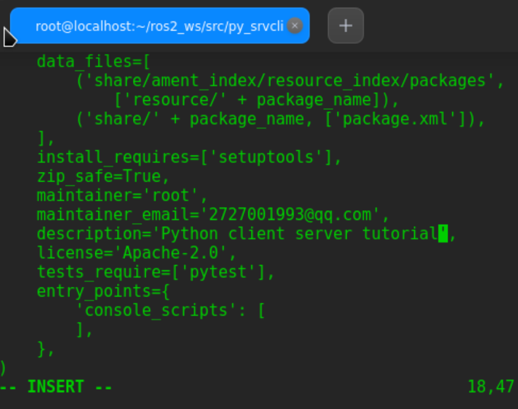

# 创建包
`cd ~/ros2_ws/src`  
`ros2 pkg create --build-type ament_python --license Apache-2.0 py_srvcli --dependencies rclpy example_interfaces`  


### 更新依赖
```
<description>Python client server tutorial</description>
<maintainer email="you@email.com">Your Name</maintainer>
<license>Apache License 2.0</license>
```


### 修改setup.py
将以下信息添加到setup.py
```
maintainer='Your Name',
maintainer_email='you@email.com',
description='Python client server tutorial',
license='Apache License 2.0',
```


# 编写服务端节点

`cd ros2_ws/src/py_srvcli/py_srvcli`    
`vi service_member_function.py` 

粘贴代码到此文件中  
*代码*
```
ffrom example_interfaces.srv import AddTwoInts

import rclpy
from rclpy.node import Node


class MinimalService(Node):

    def __init__(self):
        super().__init__('minimal_service')
        self.srv = self.create_service(AddTwoInts, 'add_two_ints', self.add_two_ints_callback)

    def add_two_ints_callback(self, request, response):
        response.sum = request.a + request.b
        self.get_logger().info('Incoming request\na: %d b: %d' % (request.a, request.b))

        return response


def main():
    rclpy.init()

    minimal_service = MinimalService()

    rclpy.spin(minimal_service)

    rclpy.shutdown()


if __name__ == '__main__':
    main()
```
   


### 检查代码
查看代码逻辑    

### 添加setup.py文件
在entry_points出修改    
`'service = py_srvcli.service_member_function:main',`   


 

# 编写客户端节点

`touch ros2_ws/src/py_srvcli/py_srvcli/client_member_function.py`   
`vi ros2_ws/src/py_srvcli/py_srvcli/client_member_function.py`  
*写入以下代码*
```
import sys

from example_interfaces.srv import AddTwoInts
import rclpy
from rclpy.node import Node


class MinimalClientAsync(Node):

    def __init__(self):
        super().__init__('minimal_client_async')
        self.cli = self.create_client(AddTwoInts, 'add_two_ints')
        while not self.cli.wait_for_service(timeout_sec=1.0):
            self.get_logger().info('service not available, waiting again...')
        self.req = AddTwoInts.Request()

    def send_request(self, a, b):
        self.req.a = a
        self.req.b = b
        return self.cli.call_async(self.req)


def main():
    rclpy.init()

    minimal_client = MinimalClientAsync()
    future = minimal_client.send_request(int(sys.argv[1]), int(sys.argv[2]))
    rclpy.spin_until_future_complete(minimal_client, future)
    response = future.result()
    minimal_client.get_logger().info(
        'Result of add_two_ints: for %d + %d = %d' %
        (int(sys.argv[1]), int(sys.argv[2]), response.sum))

    minimal_client.destroy_node()
    rclpy.shutdown()


if __name__ == '__main__':
    main()
```


### 理解客户端代码逻辑

### 修改setup.py文件
再次打开CMakeLists.txt，使文件内容如下：    
```
entry_points={
    'console_scripts': [
        'service = py_srvcli.service_member_function:main',
        'client = py_srvcli.client_member_function:main',
    ],
},
```


# 构建并运行代码
终端1运行：  
`colcon build --packages-select py_srvcli`    


`source install/setup.bash` 
`ros2 run py_srvcli service`     

终端2运行：  
`ros2 run py_srvcli client 2 3`        
终端2输出:  
`[INFO] [minimal_client_async]: Result of add_two_ints: for 2 + 3 = 5`  

    


返回到运行服务节点的终端。 您将看到它在收到请求时发布了日志消息、收到的数据以及发回的响应：
```
[INFO] [minimal_service]: Incoming request
a: 2 b: 3
```
 

**complete!!**

