# 创建功能包  
在本文中，将在自己的包中创建自定义的.msg和.srv文件，然后在另外的包中使用它们，这两个包应该在同一个工作空间中。  
本文将使用在前面文章中创建的*pub/sub*和*service/client*包，请确保处在*ros2_ws/src*目录下，然后运行以下命令创建一个新包: 
```
ros2 pkg create --build-type ament_cmake tutorial_interfaces

```
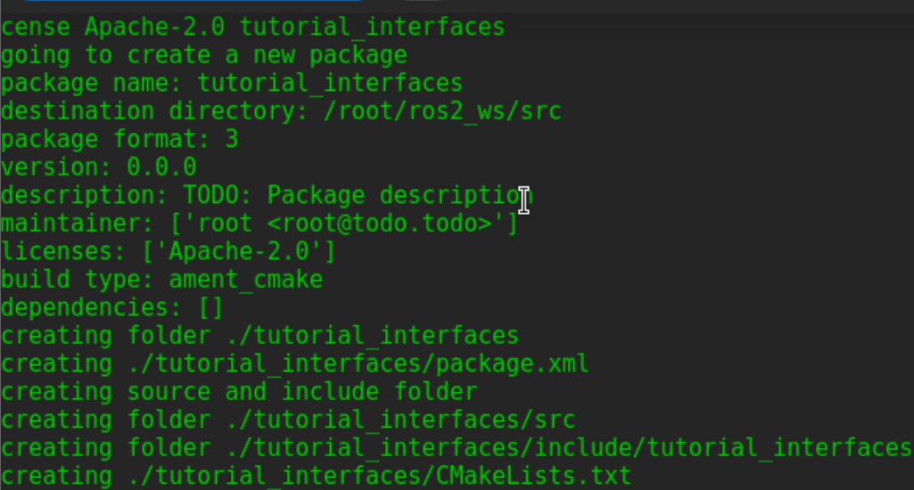  

*tutorial_interfaces*是新包的名称。注意，它是一个CMake包，目前还没有办法在纯Python包中生成.msg或.srv文件。但是，可以在CMake包中创建自定义接口，然后在Python节点中使用它。   
将.msg和.srv文件保存在自己的包中是一种很好的做法。在ros2_ws/src/tutorial_interfaces目录下创建： 
```
mkdir msg
mkdir srv
``` 

# 创建自定义消息文件  
## 自定义msg文件
在*tutorial_interfaces/msg*文件夹下，创建一个名为*Num.msg*的新文件，用一行代码声明它的数据结构：     
`int64 num` 
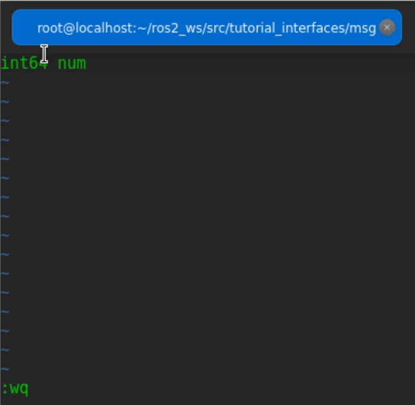

## 自定义srv文件
在*tutorial_interfaces/srv*文件夹下，创建一个名为*AddThreeInts.srv*的新文件，并声明他的请求和响应结构： 
```
int64 a
int64 b
int64 c
---
int64 sum

```
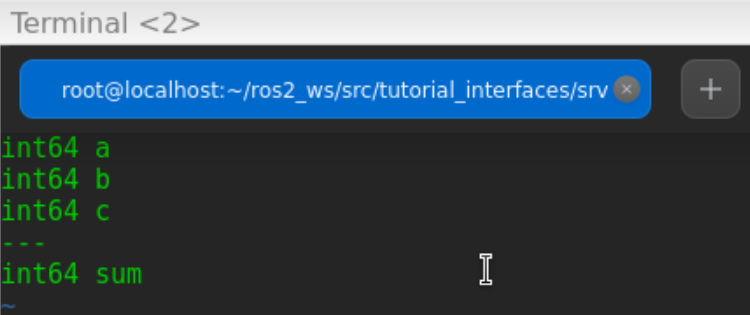

## 修改CMakeLists.txt
要将自定义的接口（interface）转换成基于语言的代码（如C++和Python），以便它们可以在这些语言中使用，请将以下代码添加到CMakeLists.txt中: 
```
find_package(rosidl_default_generators REQUIRED)
rosidl_generate_interfaces(${PROJECT_NAME}
  "msg/Num.msg"
  "srv/AddThreeInts.srv"
 )
```
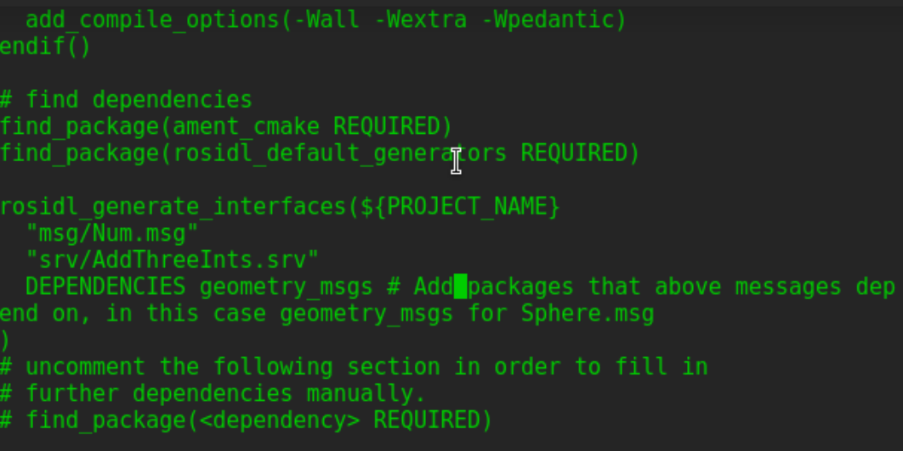 

# package.xml
因为接口依赖于*rosidl_default_generators*来生成基于语言的代码，所以需要声明对它的依赖关系。将以下行添加到*package.xml*中：  
```
<build_depend>rosidl_default_generators</build_depend>

<exec_depend>rosidl_default_runtime</exec_depend>

<member_of_group>rosidl_interface_packages</member_of_group>

```
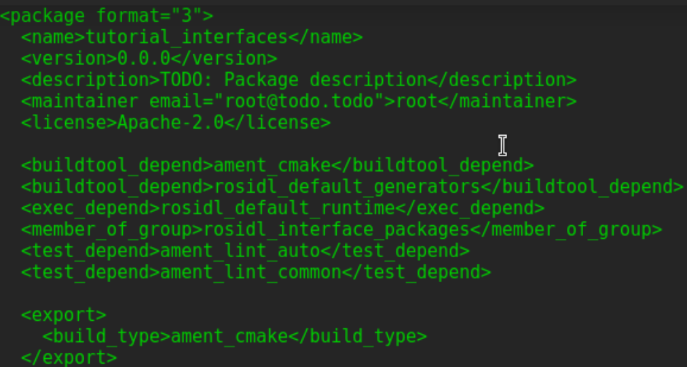 

# 编译 tutorial_interfaces包
在工作空间的根目录(~/ros2_ws)中，运行以下命令:  
`colcon build --packages-select tutorial_interfaces`  
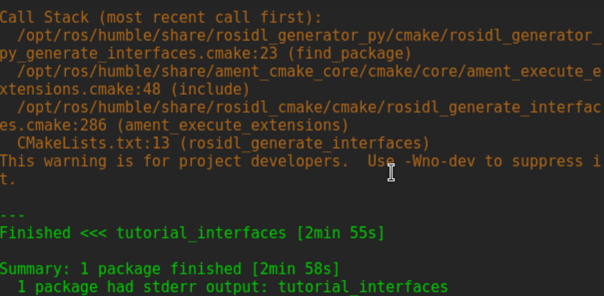    

# 验证msg和srv的创建
打开新终端，在ros2_ws下运行： 
`. install/setup.bash`    
可以使用*ros2 interface show*命令确认接口创建工作:    
`ros2 interface show tutorial_interfaces/msg/Num`   
  

运行：  
`ros2 interface show tutorial_interfaces/srv/AddThreeInts`    
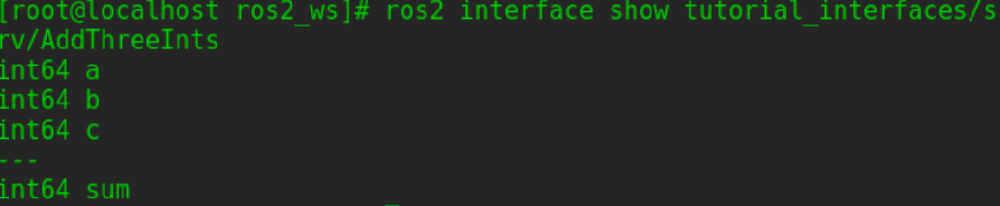 

# 测试新接口
使用在前面的文章中创建的包，对节点、CMakelist和package文件进行一些简单的修改，就可以使用新的接口。  

## 使用pub/sub测试Num.msg
对前面创建的发布节点进行修改（~/ros2_ws/src/cpp_pubsub/src/publisher_member_function.cpp）。  
*Publisher:*
```
#include <chrono>
#include <memory>

#include "rclcpp/rclcpp.hpp"
#include "tutorial_interfaces/msg/num.hpp"     // CHANGE

using namespace std::chrono_literals;

class MinimalPublisher : public rclcpp::Node
{
public:
  MinimalPublisher()
  : Node("minimal_publisher"), count_(0)
  {
    publisher_ = this->create_publisher<tutorial_interfaces::msg::Num>("topic", 10);    // CHANGE
    timer_ = this->create_wall_timer(
      500ms, std::bind(&MinimalPublisher::timer_callback, this));
  }

private:
  void timer_callback()
  {
    auto message = tutorial_interfaces::msg::Num();                               // CHANGE
    message.num = this->count_++;                                        // CHANGE
    RCLCPP_INFO(this->get_logger(), "Publishing: '%d'", message.num);    // CHANGE
    publisher_->publish(message);
  }
  rclcpp::TimerBase::SharedPtr timer_;
  rclcpp::Publisher<tutorial_interfaces::msg::Num>::SharedPtr publisher_;         // CHANGE
  size_t count_;
};

int main(int argc, char * argv[])
{
  rclcpp::init(argc, argv);
  rclcpp::spin(std::make_shared<MinimalPublisher>());
  rclcpp::shutdown();
  return 0;
}
```
*Subscriber:*
```
#include <memory>

#include "rclcpp/rclcpp.hpp"
#include "tutorial_interfaces/msg/num.hpp"     // CHANGE
using std::placeholders::_1;

class MinimalSubscriber : public rclcpp::Node
{
public:
  MinimalSubscriber()
  : Node("minimal_subscriber")
  {
    subscription_ = this->create_subscription<tutorial_interfaces::msg::Num>(          // CHANGE
      "topic", 10, std::bind(&MinimalSubscriber::topic_callback, this, _1));
  }

private:
  void topic_callback(const tutorial_interfaces::msg::Num::SharedPtr msg) const       // CHANGE
  {
    RCLCPP_INFO(this->get_logger(), "I heard: '%d'", msg->num);              // CHANGE
  }
  rclcpp::Subscription<tutorial_interfaces::msg::Num>::SharedPtr subscription_;       // CHANGE
};

int main(int argc, char * argv[])
{
  rclcpp::init(argc, argv);
  rclcpp::spin(std::make_shared<MinimalSubscriber>());
  rclcpp::shutdown();
  return 0;
}
```
修改CMakeLists.txt:
```
#...

find_package(ament_cmake REQUIRED)
find_package(rclcpp REQUIRED)
find_package(tutorial_interfaces REQUIRED)                         # CHANGE

add_executable(talker src/publisher_member_function.cpp)
ament_target_dependencies(talker rclcpp tutorial_interfaces)         # CHANGE

add_executable(listener src/subscriber_member_function.cpp)
ament_target_dependencies(listener rclcpp tutorial_interfaces)     # CHANGE

install(TARGETS
  talker
  listener
  DESTINATION lib/${PROJECT_NAME})

ament_package()

```
在*package.xml*中添加：    
`<depend>tutorial_interfaces</depend>`    
接着，编译整个包：   
`colcon build --packages-select cpp_pubsub` 
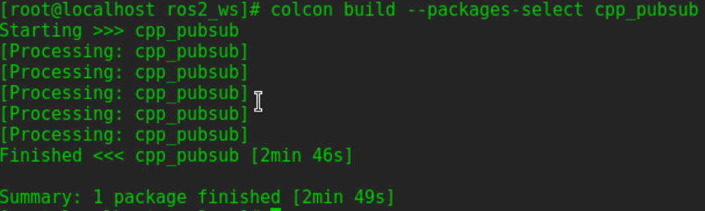 

打开新终端，source ros2_ws , 并运行:    
`ros2 run cpp_pubsub talker`   
`ros2 run cpp_pubsub talker`     
因为Num.msg只传递一个整数，所以它应该只发布整数值，而不是之前发布的字符串:    
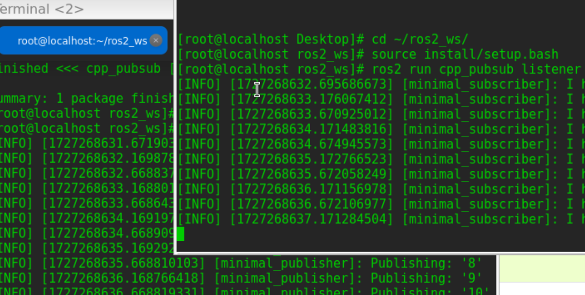   

## 使用service/client测试
对前面创建的发布节点进行修改（~/ros2_ws/src/cpp_srvcli/src/add_two_ints_server.cpp）。  
```
#include "rclcpp/rclcpp.hpp"
#include "tutorial_interfaces/srv/add_three_ints.hpp"     // CHANGE

#include <memory>

void add(const std::shared_ptr<tutorial_interfaces::srv::AddThreeInts::Request> request,     // CHANGE
          std::shared_ptr<tutorial_interfaces::srv::AddThreeInts::Response>       response)  // CHANGE
{
  response->sum = request->a + request->b + request->c;                                       // CHANGE
  RCLCPP_INFO(rclcpp::get_logger("rclcpp"), "Incoming request\na: %ld" " b: %ld" " c: %ld",   // CHANGE
                request->a, request->b, request->c);                                          // CHANGE
  RCLCPP_INFO(rclcpp::get_logger("rclcpp"), "sending back response: [%ld]", (long int)response->sum);
}

int main(int argc, char **argv)
{
  rclcpp::init(argc, argv);

  std::shared_ptr<rclcpp::Node> node = rclcpp::Node::make_shared("add_three_ints_server");  // CHANGE

  rclcpp::Service<tutorial_interfaces::srv::AddThreeInts>::SharedPtr service =                 // CHANGE
    node->create_service<tutorial_interfaces::srv::AddThreeInts>("add_three_ints",  &add);     // CHANGE

  RCLCPP_INFO(rclcpp::get_logger("rclcpp"), "Ready to add three ints.");      // CHANGE

  rclcpp::spin(node);
  rclcpp::shutdown();
}

```
对前面创建的发布节点进行修改（~/dev_ws/src/cpp_srvcli/src/add_two_ints_client.cpp）。 
```
#include "rclcpp/rclcpp.hpp"
#include "tutorial_interfaces/srv/add_three_ints.hpp"        // CHANGE

#include <chrono>
#include <cstdlib>
#include <memory>

using namespace std::chrono_literals;

int main(int argc, char **argv)
{
  rclcpp::init(argc, argv);

  if (argc != 4) { // CHANGE
      RCLCPP_INFO(rclcpp::get_logger("rclcpp"), "usage: add_three_ints_client X Y Z");      // CHANGE
      return 1;
  }

  std::shared_ptr<rclcpp::Node> node = rclcpp::Node::make_shared("add_three_ints_client"); // CHANGE
  rclcpp::Client<tutorial_interfaces::srv::AddThreeInts>::SharedPtr client =                        // CHANGE
    node->create_client<tutorial_interfaces::srv::AddThreeInts>("add_three_ints");                  // CHANGE

  auto request = std::make_shared<tutorial_interfaces::srv::AddThreeInts::Request>();               // CHANGE
  request->a = atoll(argv[1]);
  request->b = atoll(argv[2]);
  request->c = atoll(argv[3]);               // CHANGE

  while (!client->wait_for_service(1s)) {
    if (!rclcpp::ok()) {
      RCLCPP_ERROR(rclcpp::get_logger("rclcpp"), "Interrupted while waiting for the service. Exiting.");
      return 0;
    }
    RCLCPP_INFO(rclcpp::get_logger("rclcpp"), "service not available, waiting again...");
  }

  auto result = client->async_send_request(request);
  // Wait for the result.
  if (rclcpp::spin_until_future_complete(node, result) ==
    rclcpp::executor::FutureReturnCode::SUCCESS)
  {
    RCLCPP_INFO(rclcpp::get_logger("rclcpp"), "Sum: %ld", result.get()->sum);
  } else {
    RCLCPP_ERROR(rclcpp::get_logger("rclcpp"), "Failed to call service add_three_ints");    // CHANGE
  }

  rclcpp::shutdown();
  return 0;
}

```
修改*CMakeLists.txt*:
```
#...

find_package(ament_cmake REQUIRED)
find_package(rclcpp REQUIRED)
find_package(tutorial_interfaces REQUIRED)        # CHANGE

add_executable(server src/add_two_ints_server.cpp)
ament_target_dependencies(server
  rclcpp tutorial_interfaces)                      #CHANGE

add_executable(client src/add_two_ints_client.cpp)
ament_target_dependencies(client
  rclcpp tutorial_interfaces)                      #CHANGE

install(TARGETS
  server
  client
  DESTINATION lib/${PROJECT_NAME})

ament_package()

```
在*package.xml*文件中添加:   
`<depend>tutorial_interfaces</depend>`    
编译包：  
`colcon build --packages-select cpp_srvcli`  
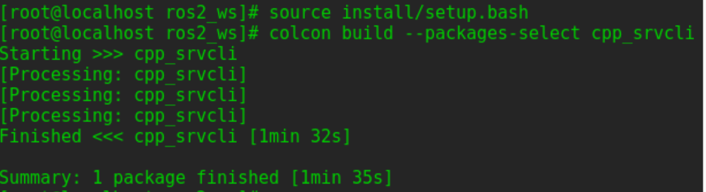 

打开新终端， source ros2_ws , 并运行:    
`ros2 run cpp_srvcli server`    
原终端运行:    
`ros2 run cpp_srvcli client 2 3 1`    
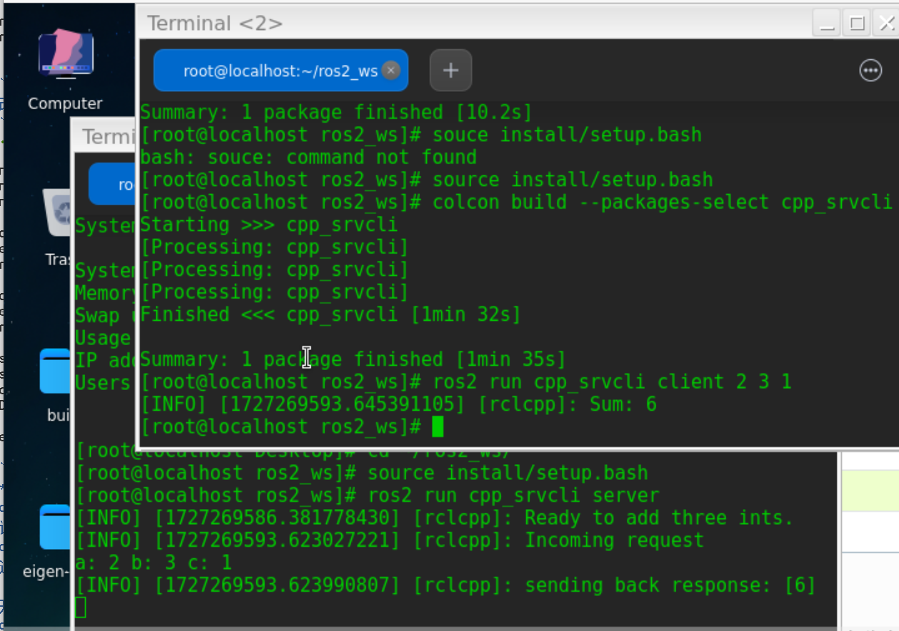 

**complete!!**
