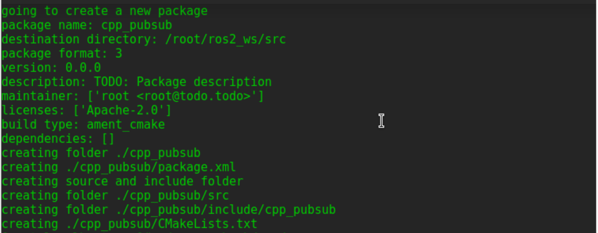
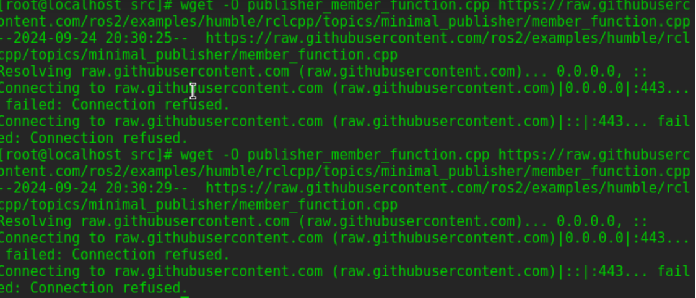
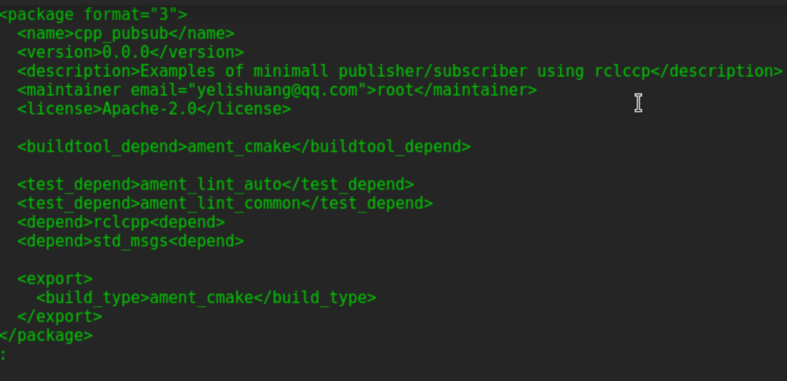
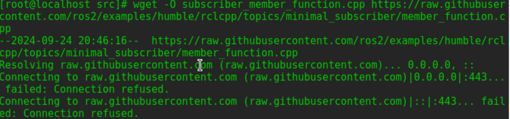
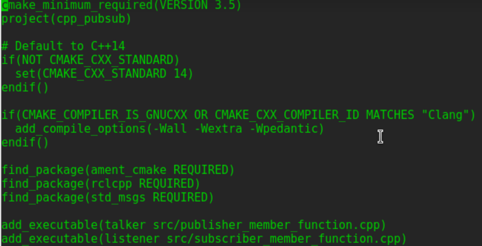
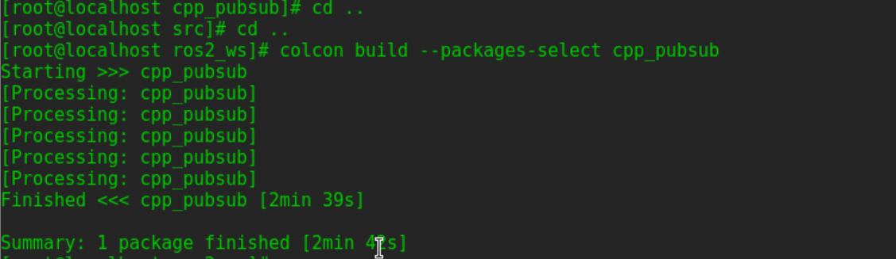
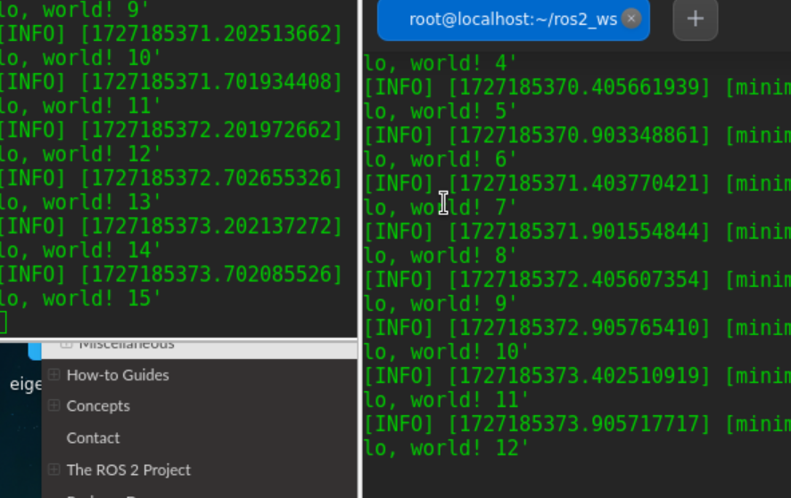

# 创建包并且进入该路径下  
`cd ros2_ws/src`  
`ros2 pkg create --build-type ament_cmake --license Apache-2.0 cpp_pubsub`  
`cd cpp_pubsub/src`  
  

# 编写publisher节点  
### 下载示例talker代码
`wget -O publisher_member_function.cpp https://raw.githubusercontent.com/ros2/examples/humble/rclcpp/topics/minimal_publisher/member_function.cpp`  
**下载无法完成,改为直接创建**	
	
`vi publisher_member_function.cpp`  
*代码文件内容：*  
```
#include "rclcpp/rclcpp.hpp"
#include "example_interfaces/srv/add_two_ints.hpp"

#include <memory>

void add(const std::shared_ptr<example_interfaces::srv::AddTwoInts::Request> request,
          std::shared_ptr<example_interfaces::srv::AddTwoInts::Response>      response)
{
  response->sum = request->a + request->b;
  RCLCPP_INFO(rclcpp::get_logger("rclcpp"), "Incoming request\na: %ld" " b: %ld",
                request->a, request->b);
  RCLCPP_INFO(rclcpp::get_logger("rclcpp"), "sending back response: [%ld]", (long int)response->sum);
}

int main(int argc, char **argv)
{
  rclcpp::init(argc, argv);

  std::shared_ptr<rclcpp::Node> node = rclcpp::Node::make_shared("add_two_ints_server");

  rclcpp::Service<example_interfaces::srv::AddTwoInts>::SharedPtr service =
    node->create_service<example_interfaces::srv::AddTwoInts>("add_two_ints", &add);

  RCLCPP_INFO(rclcpp::get_logger("rclcpp"), "Ready to add two ints.");

  rclcpp::spin(node);
  rclcpp::shutdown();
}
```
### 检查代码  
### 添加依赖  
`cd ros2_ws/src/cpp_pubsub`
`vi package.xml`  
按照前一个教程修改：  
```
<description>Examples of minimal publisher/subscriber using rclcpp</description>
<maintainer email="you@email.com">Your Name</maintainer>
<license>Apache License 2.0</license>
```

然后在 buildtool 依赖项后添加新行，并粘贴与节点的 include 语句对应的以下依赖项：ament_cmake  
`<depend>rclcpp</depend>'  
'<depend>std_msgs</depend>`  


修改CMakeLists.txt， 在 existing dependency 下面，添加以下行：  
`find_package(rclcpp REQUIRED)`  
`find_package(std_msgs REQUIRED)`  
`add_executable(talker src/publisher_member_function.cpp)`
`ament_target_dependencies(talker rclcpp std_msgs)`
`install(TARGETS`
`talker`
`DESTINATION lib/${PROJECT_NAME})`

文件状态结果是这样的：
```
cmake_minimum_required(VERSION 3.5)
project(cpp_pubsub)

# Default to C++14
if(NOT CMAKE_CXX_STANDARD)
  set(CMAKE_CXX_STANDARD 14)
endif()

if(CMAKE_COMPILER_IS_GNUCXX OR CMAKE_CXX_COMPILER_ID MATCHES "Clang")
  add_compile_options(-Wall -Wextra -Wpedantic)
endif()

find_package(ament_cmake REQUIRED)
find_package(rclcpp REQUIRED)
find_package(std_msgs REQUIRED)

add_executable(talker src/publisher_member_function.cpp)
ament_target_dependencies(talker rclcpp std_msgs)

install(TARGETS
  talker
  DESTINATION lib/${PROJECT_NAME})

ament_package()
```
# 写入订阅者节点
`cd ros2_ws/src/cpp_pubsub/src`
`wget -O subscriber_member_function.cpp https://raw.githubusercontent.com/ros2/examples/humble/rclcpp/topics/minimal_subscriber/member_function.cpp`  
任然无法下载
 
直接编辑保存这些
`vi subscriber_member_function.cpp` 
*代码*
```
#include <memory>

#include "rclcpp/rclcpp.hpp"
#include "std_msgs/msg/string.hpp"
using std::placeholders::_1;

class MinimalSubscriber : public rclcpp::Node
{
  public:
    MinimalSubscriber()
    : Node("minimal_subscriber")
    {
      subscription_ = this->create_subscription<std_msgs::msg::String>(
      "topic", 10, std::bind(&MinimalSubscriber::topic_callback, this, _1));
    }

  private:
    void topic_callback(const std_msgs::msg::String & msg) const
    {
      RCLCPP_INFO(this->get_logger(), "I heard: '%s'", msg.data.c_str());
    }
    rclcpp::Subscription<std_msgs::msg::String>::SharedPtr subscription_;
};

int main(int argc, char * argv[])
{
  rclcpp::init(argc, argv);
  rclcpp::spin(std::make_shared<MinimalSubscriber>());
  rclcpp::shutdown();
  return 0;
}
```

确保存在这些文件
```
publisher_member_function.cpp  subscriber_member_function.cpp
```
  

重新打开并在发布者的条目下添加订阅者节点的可执行文件和目标。  
`vi CMakeLists.txt`

添加到CMakeLists.txt

```
add_executable(listener src/subscriber_member_function.cpp)
ament_target_dependencies(listener rclcpp std_msgs)

install(TARGETS
  talker
  listener
  DESTINATION lib/${PROJECT_NAME})
```


# 构建并且运行
终端1运行：`colcon build --packages-select cpp_pubsub`

终端2运行：  
`. install/setup.bash`  
`ros2 run cpp_pubsub talker`  
效果：



talker每 0.5 秒开始发布一次信息消息，listener将开始将消息打印到控制台  
**complete!!**
