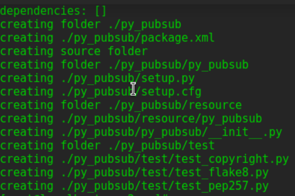
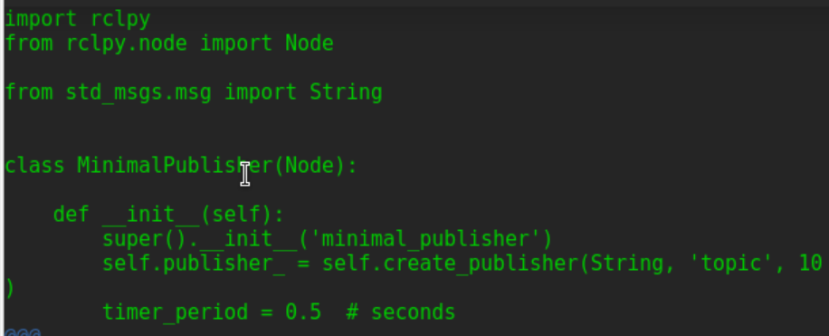
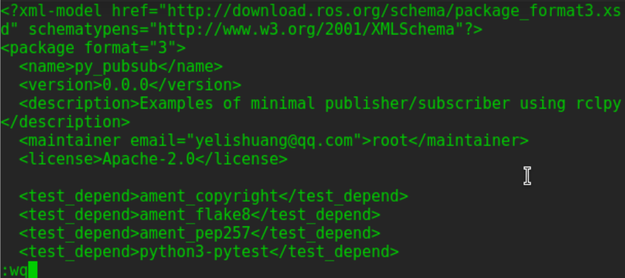
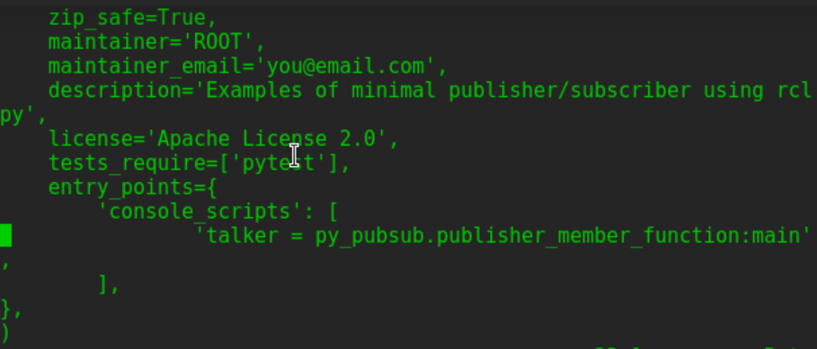
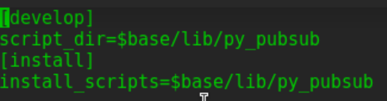
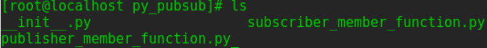
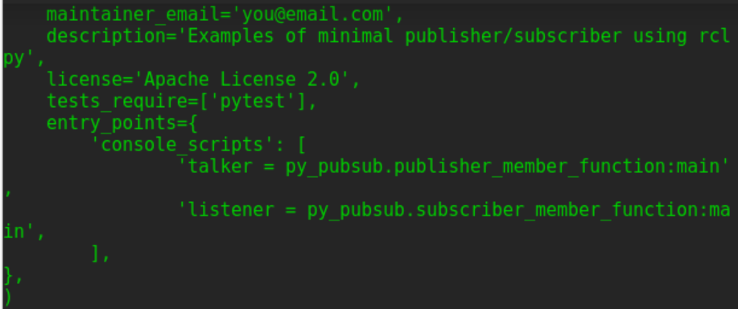
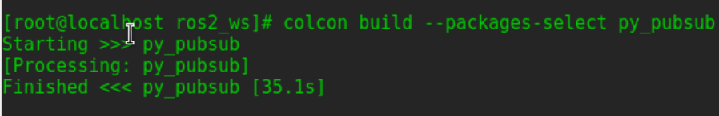
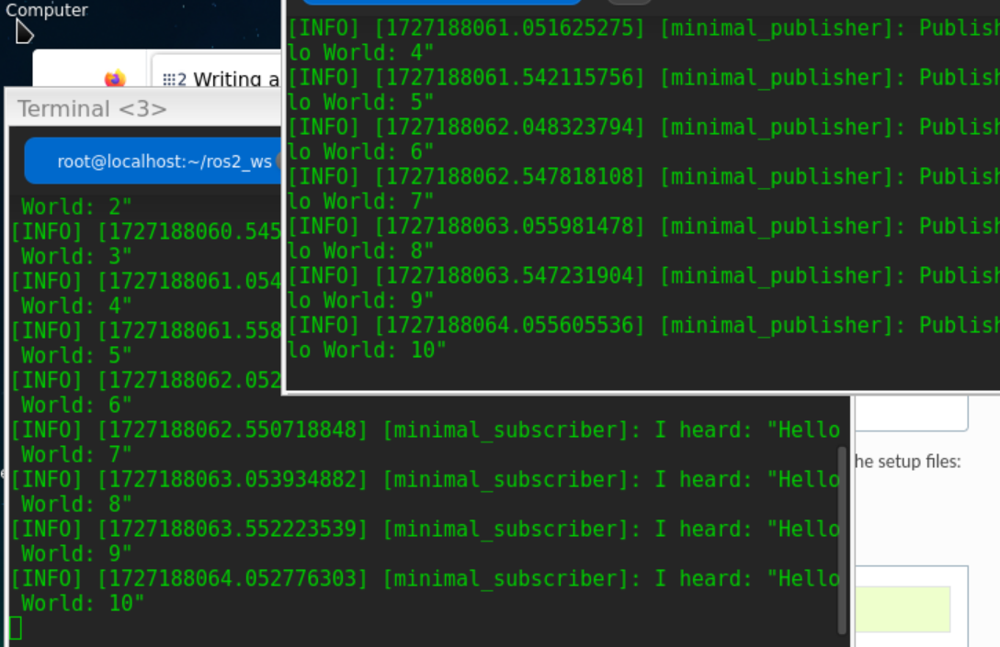

# 创建包         
`cd ~/ros2_ws/src`        
`ros2 pkg create --build-type ament_python --license Apache-2.0 py_pubsub`      
     

# 编写publisher节点     
`cd ros2_ws/src/py_pubsub/py_pubsub`     

### 下载 Talker示例代码：          
`wget https://raw.githubusercontent.com/ros2/examples/humble/rclpy/topics/minimal_publisher/examples_rclpy_minimal_publisher/publisher_member_function.py`  
**任然下载不了**        
### 编辑publisher_member_function.py：  

`vi publisher_member_function.py`         


*代码文本：*      
```
import rclpy
from rclpy.node import Node

from std_msgs.msg import String


class MinimalPublisher(Node):

    def __init__(self):
        super().__init__('minimal_publisher')
        self.publisher_ = self.create_publisher(String, 'topic', 10)
        timer_period = 0.5  # seconds
        self.timer = self.create_timer(timer_period, self.timer_callback)
        self.i = 0

    def timer_callback(self):
        msg = String()
        msg.data = 'Hello World: %d' % self.i
        self.publisher_.publish(msg)
        self.get_logger().info('Publishing: "%s"' % msg.data)
        self.i += 1


def main(args=None):
    rclpy.init(args=args)

    minimal_publisher = MinimalPublisher()

    rclpy.spin(minimal_publisher)

    # Destroy the node explicitly
    # (optional - otherwise it will be done automatically
    # when the garbage collector destroys the node object)
    minimal_publisher.destroy_node()
    rclpy.shutdown()


if __name__ == '__main__':
    main()
``` 
代码截图：       
        

### 添加依赖：  
`vi package.xml`           
   
修改description,maintainer,license标签内容：      
```
<description>Examples of minimal publisher/subscriber using rclpy</description>
<maintainer email="you@email.com">Your Name</maintainer>
<license>Apache License 2.0</license>
```  

在上面几行之后，添加与节点的 import 语句对应的以下依赖项：         
```
<exec_depend>rclpy</exec_depend>  
<exec_depend>std_msgs</exec_depend>
```

 

在ROS 2中，如果你想要将你的节点（node）作为一个可执行的脚本（比如一个Python程序）分发，你可以通过在setup.py文件中添加一个入口点（entry point）来实现。这样，你就可以通过命令行直接运行你的节点了。以下是如何修改setup.py文件来添加入口点的步骤:         
`vi setup.py`       

```
maintainer='YourName',
maintainer_email='you@email.com',
description='Examples of minimal publisher/subscriber using rclpy',
license='Apache License 2.0',
entry_points={
        'console_scripts': [
                'talker = py_pubsub.publisher_member_function:main',
        ],
},
```

        

检查setup.cfg   
```
[develop]
script_dir=$base/lib/py_pubsub
[install]
install_scripts=$base/lib/py_pubsub
```
     

# 订阅者节点       
`vi ros2_ws/src/py_pubsub/py_pubsub`        
`wget https://raw.githubusercontent.com/ros2/examples/humble/rclpy/topics/minimal_subscriber/examples_rclpy_minimal_subscriber/subscriber_member_function.py`      
**任然下载不了**        

### 运行结果与目录格式  
```
__init__.py  publisher_member_function.py  subscriber_member_function.py        
```         
          

代码检查略过，如果想了解订阅者程序运行逻辑可    
`vi subscriber_member_function.py`        

### 添加entry_points    
`vi setup.py`      
修改entry_points如下：  
```
entry_points={
        'console_scripts': [
                'talker = py_pubsub.publisher_member_function:main',
                'listener = py_pubsub.subscriber_member_function:main',
        ],
},
```     
          

# 构建并且运行  
终端1： 
`colcon build --packages-select py_pubsub`      
          
终端2：  
`source install/setup.bash`     
`ros2 run py_pubsub talker`     

运行效果：      
     

talker终端应该每 0.5 秒开始发布一次信息消息,listener将开始将消息打印到控制台.   

**complete!!**
