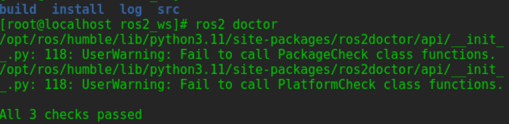
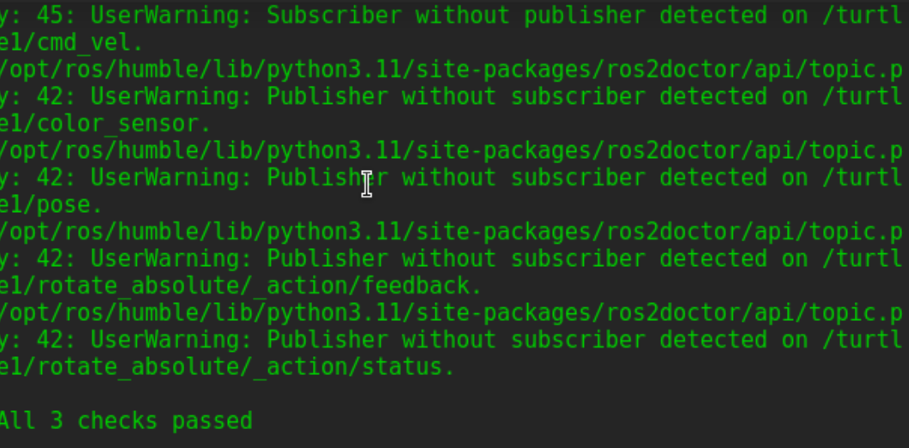
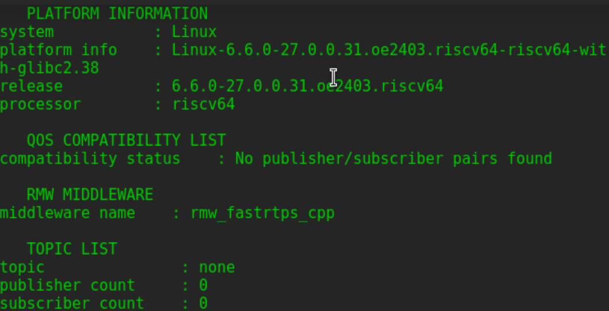

当ROS 2程序没有按预期运行时，可以使用ros2doctor工具检查其设置。 

ros2doctor检查ROS 2的所有方面，包括平台、版本、网络、环境、运行系统等，并警告可能出现的错误和问题原因。 

ros2doctor是ros2cli包的一部分。 

# 检查设置
使用ros2doctor整体检查一般的ROS 2设置。首先，在一个新的终端中source ROS 2，然后输入命令：   
`ros2 doctor`   
这将检查所有的安装模块并返回警告和错误。    
如果ROS 2的设置是没有问题，会看到类似这样的消息：   
`All <n> checks passed` 
 

# 检查系统
还可以检查正在运行的ROS 2系统，以确定问题的可能原因。为了查看ros2doctor在一个正在运行的系统上的工作情况，运行turtlesim：    
`ros2 run turtlesim turtlesim_node` 
`ros2 run turtlesim turtle_teleop_key`  
运行ros2doctor: 
 

# 得到完整的日志
虽然ros2doctor可以知道有关网络、系统等的警告，但使用--report参数运行它将提供更多细节，以帮助分析问题。  

如果得到一个关于网络设置的警告，并且希望确切地找出是配置的哪一部分导致了该警告，此时可以使用--report。  

当需要ROS 2的帮助时，它也非常有用。可以将报告的相关部分复制并粘贴，以便帮助的人能够更好地了解环境并提供更好的帮助。 

要获取完整的报告，在终端中输入以下命令: 
`ros2 doctor --report`  
 

它将返回一个信息列表，其中分为五组：    
```
NETWORK CONFIGURATION   
...

PLATFORM INFORMATION    
...

RMW MIDDLEWARE  
...

ROS 2 INFORMATION   
...

TOPIC LIST
...

```
可以对照运行ros2 doctor得到的警告来交叉检查这里的信息。例如，如果ros2doctor返回了警告：not  fully supported or tested，可以查看报告的ROS 2 INFORMATION部分: 
```
distribution name      : <distro>
distribution type      : ros2
distribution status    : prerelease
release platforms      : {'<platform>': ['<version>']}  
```

# 总结  

ros2doctor会通知ROS 2安装和运行系统中的问题,可以使用--report参数更深入地了解这些警告背后的信息。    
请记住，ros2doctor不是一个调试工具，它不会帮助解决代码中的错误或系统的实现方面的错误。  

**complete!!**

