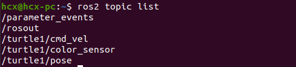
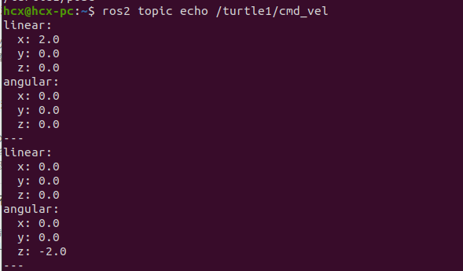
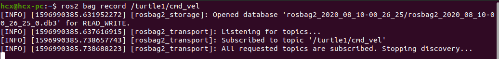

# 在Ubuntu上录制bag

## 初始化
最简单的小乌龟为例，可以录制一个小乌龟运动方向和速度的指令，并在riscv上进行回放
```
ros2 run turtlesim turtlesim_node
ros2 run turtlesim turtle_teleop_key
```

 接下来创建一个新的文件夹，未来保存数据库文件：
```
mkdir bag_files
cd bag_files
```

## 选择话题
ros2 bag可以录制系统中发布的话题数据，所以我们先看下当前系统中有哪些话题：
`ros2 topic list`  



/turtle1/cmd_vel 话题是用来控制海龟运动的，如果监听该话题，并且通过键盘控制小海龟移动，就可以看到速度指令的消息：  


## ros2 bag录制话题数据

ros2 bag录制话题数据的命令是：  
`ros2 bag record <topic_name>`  
该命令会将数据保存在当前终端所在的路径下，所以最好先cd到刚才创建好的目录下，然后运行：  
`ros2 bag record /turtle1/cmd_vel`  
可以看到开始录制数据的日志提示：  


# 在openeuler上回放录制  

ros2 bag录制话题数据的命令是：

`ros2 bag play -l rosbag2_2024_12_09-20-08-31-0.db3`


## 运行点云图1d回放

和运行小乌龟回放命令一致，但是可视化需要Ros2_Rivz,由于这个工具不会使用，只能回放一个订阅，无法显示出点云图全貌，待学习使用Rivz后，补充。


# 关于优化Eigen3

之前的编译过程是通过cmake进行编译，在不通过阅读源码修改源码的基础上，我认为可以通过cmake部分编译指令进行优化Eigen3的运行效率

## 设置优化级别：
使用-O2或-O3优化级别，这些选项会启用更多的优化算法以提高目标代码的运行速度。例如，在CMakeLists.txt中设置：
```
set(CMAKE_CXX_FLAGS_RELEASE "-O3")
set(CMAKE_C_FLAGS_RELEASE "-O3")
```
## 使用-Ofast选项
-Ofast选项会提供更多的优化，包括一些可能影响代码准确性的优化，如-ffast-math，以换取更高的运行速度

## 启用链接时间优化（LTO）
通过在CMake中设置-flto选项，可以在链接阶段进行优化，这有助于进一步减少生成的二进制文件的大小和提高运行速度：
```
set(CMAKE_CXX_FLAGS "${CMAKE_CXX_FLAGS} -flto")
set(CMAKE_C_FLAGS "${CMAKE_C_FLAGS} -flto")
```
## 使用-march=native和-mtune=native选项
可以让编译器生成针对本地处理器最佳指令集的代码，从而提高运行效率
`target_compile_options(your_target PRIVATE -march=native -mtune=native)`

这些优化方式在Eigen3的CMakeLists.txt文件中均有所涉及，但是没有找到具体有关RISC v架构的优化方式，准备尝试结合已有的CMakeList尝试使用指令优化。